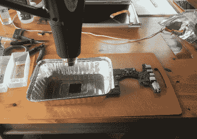

# 让有史以来最好的笔记本电脑起死回生

> 原文：<https://hackaday.com/2017/02/07/bringing-the-best-laptop-ever-made-back-to-life/>

八九年前，苹果公司是世界之巅。iPhone 刚刚革新了手机，苹果还在制造电脑，而这些电脑实际上是可以修复的。对于 2008 年末/2009 年初的 MacBook Pro，iFixit 表示，“多么不可思议的机器。我们对新款 MacBook Pro 拆卸的轻松程度印象深刻。这台机器应该是一种乐趣”。自那以后，苹果已经走过了漫长的道路。

【doc dawning】有一点苹果囤积的问题，经常花 20 美元买这种老式的坏笔记本电脑。大多数情况下，解决方法很简单:需要重新拔插内存，或者类似的事情。他很少遇到不容易修理的机器。在这种情况下，[的解决方案是深入研究热风枪和热管理](http://www.dawning.ca/2017/macbookpro-corpse-reanimations/)。如何让笔记本电脑起死回生？[曙光]告诉你怎么做。

就像旧的 XBox 毛巾黑客一样，在废弃的电子产品中首先要寻找的是破损的焊球。当然，实际上查看破碎的焊球是相当困难的，所以你最好拿出一个热风枪，然后开始做。这正是[曙光]所做的。他聪明地用铝制外卖托盘来引导热量流动，用足够的热量炸开每一个芯片，希望能融化所有的球。

有了它，一台正常工作的 MacBook Pro 就只是一个散热膏的自由应用。从废品堆里的 20 美元到一台能用的电脑，[曙光]做到了。他成功地救活了一台坏掉的电脑。