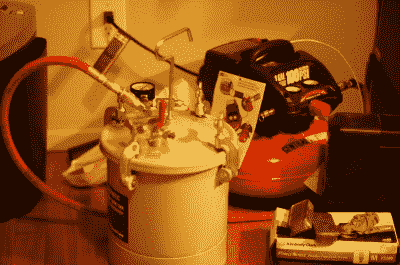

# 用改进的涂料罐进行无气泡树脂铸造

> 原文：<https://hackaday.com/2016/02/05/bubble-free-resin-casting-with-a-modified-paint-tank/>

[thelostspore]正在试验树脂铸造，他发现[需要一个压力铸造室](http://www.instructables.com/id/Bubble-Free-Resin-Casts-with-Modified-Paint-Tank/?ALLSTEPS)来获得清晰的铸件。有商业解决方案出售，而且真的很好。然而，许多黑客都有预算，如果你只是时不时地选角，你就不需要如此花哨的设置。

像这样重新利用设备[在道具制作社区很常见。专业油漆工使用一个装满颜料的加压罐向喷枪输送颜料。这些花盆可以承受 60-80 磅/平方英寸的压力，适合在工作现场使用。通过重新安排一些零件，你可以很容易地得到一个可以容纳 60 磅/平方英寸足够长时间的腔室](http://hackaday.com/2011/12/23/a-vacuum-chamber-from-a-pressure-cooker/)[成功铸造一个零件](http://lcamtuf.coredump.cx/gcnc/)。许多进口商店出售便宜的版本，通常稍小一点，带有低于标准的垫圈，售价约为 80 美元。[thelostspore]买了其中的一个，从盖子上拿掉了进料管，塞住了出口。然后，他在调节器的入口安装了一个快速释放装置。

Alternative pressure casting set-up.

我们使用这个指南来建立我们自己的压力铸造设置。我们没有堵住我们的出口，而是在它的位置放了一个带消声器的球阀，以便在铸件凝固时快速安全地排出铸件。我们建议将内螺纹快速连接接头或其他球阀与外螺纹管件结合使用(如果您的软管末端是内螺纹)。按照指南推荐的方法做并不是超级危险，但这样更安全，而且你可以在不损失压力的情况下断开压缩机与油箱的连接。

剩下的就是测试它了。他倒了一个一模一样的模子，结果出来是透明的！