# 制造一台 3D 打印机，而不是一台令人失望的机器

> 原文：<https://hackaday.com/2016/07/06/build-a-3d-printer-workhorse/>

3D 打印机已经变得难以置信的便宜，你可以花 200 美元买到一台完全可用的设备——甚至不用把钱扔进 T2 众筹的深渊。看看那些仍然购买套件甚至从零开始构建自己的 3D 打印机的人，他们对一台便宜的机器的投资远远超过 200 美元和这么多小时的工作，问题是“你为什么要这么做？”有理由出现。

答案很简单:做得好的 DIY 3D 打印机是坚固耐用的。他们每时每刻都在工作，从不休息，即使:他们是自己取之不尽的备件来源。它们完全具备您构建它们所需要的质量和功能。没有混乱，没有丢失任何东西。然而，DIY 3D 打印机这个术语，在目前普遍接受的用法中，实际上是指:有人建造的第一台也是最后一台 3D 打印机，它通常以[令人惊讶的失望机器](http://runningahackerspace.tumblr.com/post/113272014704/sure-we-have-a-3d-printer)而告终。

这篇文章致力于释放所有这些建筑的全部潜力，并把几乎任何螺杆和胶合板的组合变成车间级的设备。

## 驯服摇晃的框架

摇摇欲坠的 Mendel 螺纹杆框架的时代早已结束，取而代之的是摇摇欲坠的单层 Prusa i3 框架。像样的打印效果需要一个非常坚固的框架，所以尽可能增加支架和稳定器。

 [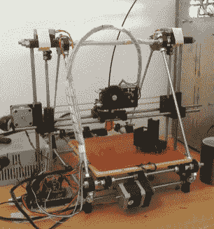](https://hackaday.com/2016/07/06/build-a-3d-printer-workhorse/assembled-prusa-mendel-1/) Prusa Mendel unstabilized ([image source](http://reprap.org/wiki/File:Assembled-prusa-mendel.jpg)) [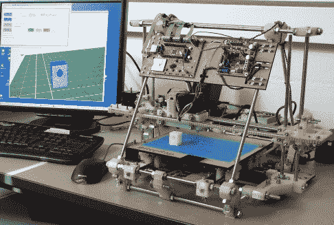](https://hackaday.com/2016/07/06/build-a-3d-printer-workhorse/mendel-3/) Mendel with stabilizing board ([image source](http://reprap.org/wiki/File:Mendel.jpg)) [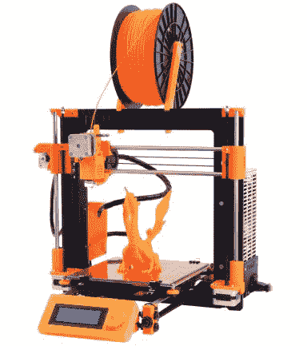](https://hackaday.com/2016/07/06/build-a-3d-printer-workhorse/prusai3-metalframe/) Prusa i3, single sheet unstabilized ([image source](http://reprap.org/wiki/File:Prusai3-metalframe.jpg)) [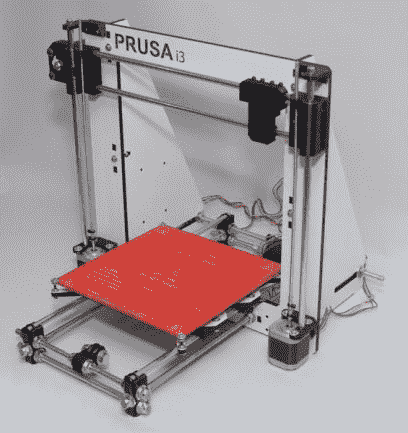](https://hackaday.com/2016/07/06/build-a-3d-printer-workhorse/565px-prusa-i3-wood-in-melamime/) Prusa i3, wood style with stabilizers ([image source](http://reprap.org/wiki/File:Prusa-i3-wood-in-melamime.jpg))

如果你正在用铝型材制作一个立方体样式的打印机，使用角撑来稳定框架。如果你正在建造一个 Prusa i3 变体，确保你要么得到一个带稳定器的框架，要么[稍后添加稳定器](http://www.thingiverse.com/thing:100128)。如果你正在建造一个经典的孟德尔，添加稳定板的交叉支柱。

## 面向 3D 打印零件

聚乳酸是 DIY 3D 打印机 3D 打印部分的可怕材料选择，首先是因为它的低熔点，其次是因为它的脆性。几乎任何材料的性能都会更好，但至少 ABS 的零件可以经久耐用。趁热打印它们——至少 255°C 以获得良好的层间附着力，它们永远不会让你失望。尽管如此:始终保持一套备件，因为你可以。它不必是一个 [3 包](http://hackaday.com/2015/02/10/3d-printering-hobbs-meters-and-3d-printer-reliability/)。

然而，3D 打印零件的绝对精度和表面质量通常不如铝挤压件和它们所附着的板材那样完美。当您使用螺钉将 3D 打印部件连接到平坦表面时，您基本上有两种选择来获得牢固的连接:将螺钉拧得非常紧——这几乎总是会破坏 3D 打印部件——或者使用细砂纸来平整 3D 打印部件的接触表面，以获得两者之间的良好接触。一旦螺钉施加了合理的压力，两个表面之间的静摩擦力就会起作用，并提供对剪切力的高阻力。

 [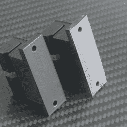](https://hackaday.com/2016/07/06/build-a-3d-printer-workhorse/_mg_0103/) Unsanded left, sanded right, belt holder for Prusa i3\. [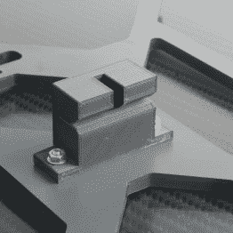](https://hackaday.com/2016/07/06/build-a-3d-printer-workhorse/_mg_0126/) The static friction between flat contact faces provides higher resistance to shearing forces. [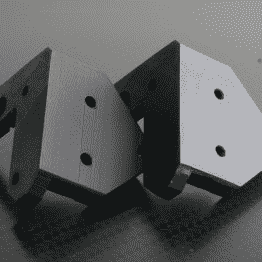](https://hackaday.com/2016/07/06/build-a-3d-printer-workhorse/_mg_0122/) Unsanded left, sanded right, Z-motor mount for Prusa i3 rework.

## 驱动系统

在刚性框架的配合下，各种配置的皮带传动([除了 H-bot](http://www.doublejumpelectric.com/projects/core_xy/2014-07-15-core_xy/) 之外)和主轴传动都可以实现重复精度，在 X 和 Y 方向上超过 FDM 的要求。然而，任何驱动系统的质量和寿命在很大程度上取决于相关部件的质量。偏心滑轮或联轴器，以及引入反冲的部件，是这里最常见的陷阱。研磨皮带齿会导致振动，因此请确保所有皮带都在皮带轮和惰轮轨道的中心运行。使用带凸缘的惰轮或至少垫圈，以防止皮带摩擦打印机的其他部件。

 [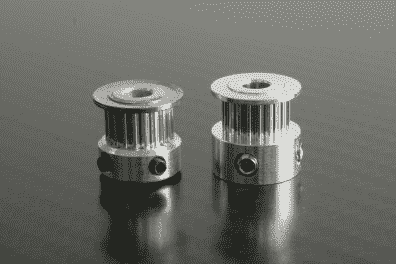](https://hackaday.com/2016/07/06/build-a-3d-printer-workhorse/_mg_0389/) Eccentric, wobbly, low-quality GT2 pulley with backlash (left) / high-quality GT2 pulley (right) [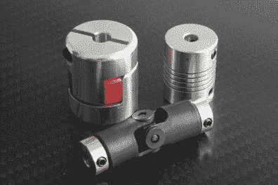](https://hackaday.com/2016/07/06/build-a-3d-printer-workhorse/_mg_0114/) Flex couplings (upper right) work just fine, but their flex affects the positioning accuracy. Cardan joints (bottom) compensate for small offsets without flexing.

对于 Z 轴，值得一提的是，集成 ACME 丝杠轴的步进电机相对于普通的柔性螺纹杆联轴器解决方案的质量提升是微不足道的，甚至在寿命方面也是如此。Z 轴上的不锈钢 M5 螺纹杆可实现出色的打印效果，并可持续使用多年，即使暴露在自动底座调平的稳定压力下。在这种情况下，预算解决方案可能已经足够好了。当然，大而重的打印机组件确实需要合适的丝杠。

## 线性导轨

只要你的构建不超过桌面 3D 打印机的典型尺寸和重量，避免在 X 和 Y 轴上使用线性滚珠轴承，因为它们是一个非常常见的故障点。它们的质量因制造商的不同而有很大差异，即使廉价的镜头在开始时看起来很棒，它们也不会持续很久。3D 打印的塑料碎片，甚至是它们自己组装的碎片，迟早会导致它们堵塞。摩擦，聚合物滑动轴承是这里的出路。它们是自润滑的，免维护的，实际上可以永远使用，至少按照直线球轴承的标准是这样的。它们还提供日本标准兼容外形，可直接替代常用的 LM8UU。

 [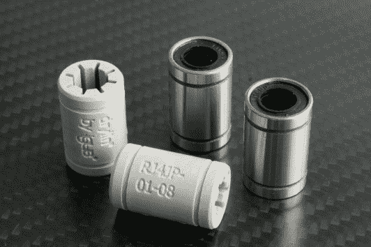](https://hackaday.com/2016/07/06/build-a-3d-printer-workhorse/_mg_0108/) The LM8UU and its tribological counterpart [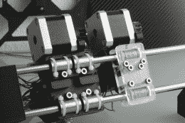](https://hackaday.com/2016/07/06/build-a-3d-printer-workhorse/_mg_0139/) Two Prusa i3 rework X-carriages in comparison: LM8UU (left) and polymeric slide bearings (right) [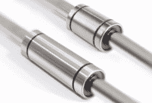](https://hackaday.com/2016/07/06/build-a-3d-printer-workhorse/lm8uu-lm8luu/) Instead of two LM8UU, one LM8LUU is often the better choice.

不要使用多个直线轴承来增加滑架的角度稳定性。几乎每种线性轴承类型都有加长版本，例如，使用 LM8LUU 外形而不是两个 LM8UU。

## 电机和驱动器

[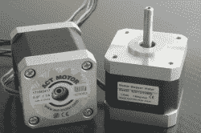](https://hackaday.com/wp-content/uploads/2016/06/mg_0143.jpg)

$3 difference, double printing resolution

即使你的预算有限，也可以考虑使用步进电机，X 轴和 Y 轴的步进角为 0.9 度，而不是 1.8 度。它们可能会让你多花 2 或 3 美元，但它们会让你的机械分辨率翻倍，这一点非常明显。微步进有助于减少振动，但与普遍看法相反，它不会提高有效打印分辨率。以下[尤达](http://www.thingiverse.com/thing:10650)头像的图片非常清晰地展示了质量差异。它们以 0.1 mm 的层高度印刷在完全相同的 Prusa i3 上，来自完全相同的 g 代码，唯一的区别是电机的物理步进角度。

 [](https://hackaday.com/2016/07/06/build-a-3d-printer-workhorse/_mg_0170/) 0.9° stepper motors, 8x microstepping, 3200 pulses/rev, 80 pulses/mm [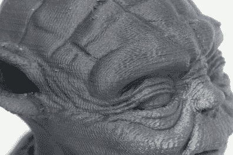](https://hackaday.com/2016/07/06/build-a-3d-printer-workhorse/_mg_0171/) 1.8° stepper motors, 16x microstepping, 3200 pulses/rev, 80 pulses/mm [](https://hackaday.com/2016/07/06/build-a-3d-printer-workhorse/_mg_0179/) 0.9° stepper motors, 8x microstepping, 3200 pulses/rev, 80 pulses/mm [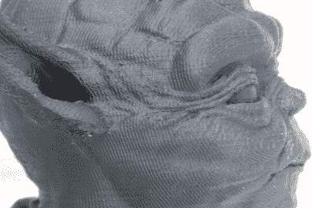](https://hackaday.com/2016/07/06/build-a-3d-printer-workhorse/_mg_0178/) 1.8° stepper motors, 16x microstepping, 3200 pulses/rev, 80 pulses/mm[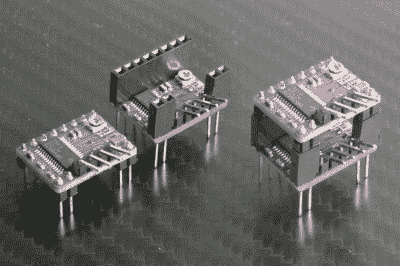](https://hackaday.com/wp-content/uploads/2016/06/mg_0129-comp.jpg)

It’s a dirty hack, but it’s better than driving two motors from a single driver.

步进电机驱动器的额定电流必须能够提供步进电机的额定电流，因为步进电机只能在该电流下提供其最大扭矩。留有 20%的余量，以防止你的司机不断达到极限。即使一些零售商提供 Pololu 风格的驱动模块(即 A4988 和 DRV8825 ),带有(尺寸错误的)散热器和热粘合垫(质量可疑),这些散热器通常弊大于利。将它们排除在外，并坚持 20%的电流裕量，您将始终获得最大扭矩。

除此之外，不要将多个步进电机连接到一个驱动器上，尤其是微型 Pololus。如果你找不到一个合适的端口复制器，每个驱动器都有缓冲电容，一个便宜且完全可用的解决方法是将母接头焊接到一个 Pololu 驱动器上，为电机添加公接头，然后在上面再装一个。

## 控制器板

3D 打印机控制器板的具体选择主要取决于您在纯功能方面的个人需求。如果你想要一个即插即用的机器，在任何环境下都能正常工作，避免克隆基于 Arduino 的主板或其他使用廉价 usb 到串行桥替代品的产品，如 CH340/CH341。它们最终可能会起作用，但对所有主要操作系统的长期即插即用驱动程序支持可能是值得购买的，因为它最终会成为用户体验的一部分。

## 热敏电阻和热电偶

了解您的元件，仅使用带有可靠数据手册的温度传感器。否则，测得的温度只是一个稍微好一点的猜测。确保传感器与加热床或加热块有良好的热耦合，以允许温度控制器保持温度稳定。热复合是这里的出路。NTC 热敏电阻通常无法承受打印某些工程塑料所需的 300°C 以上的温度，你会被热电偶锁定。除此之外，无论您是用 EPCOS NTC、Vishay NTC、Semitec NTC 还是焊头 K 型热电偶来测量加热床和加热器的温度，都没有关系，它们都足够精确。

## LCD 控制器

[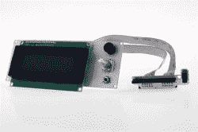](https://hackaday.com/wp-content/uploads/2016/06/800px-smart_adapter_9.jpg)

ReprapDiscount SmartController (by Reprapdiscount, [image source](http://reprap.org/wiki/File:Smart_Adapter_9.jpg))

带有 SD 读卡器的 LCD 控制器将您的 3D 打印机变成一个独立的工厂。带有非图形显示的经典 RepRap Discount SmartController 绝对适用于大多数配置。周围有一些克隆产品在与提供的 RAMPS 适配器一起使用时工作得很好，但其中一些产品的连接器列翻转了 180 度，因此当您将它们连接到带有显示面板专用 EXT 端口的电路板时要注意，例如 RUMBA。

大多数固件为普通 LCD 控制器提供的点击和滚动菜单可能有点混乱，使用起来不太满意，但这可以很容易地解决，我们将在这篇文章的后面讨论。

## 八字印刷

一个装载了 [OctoPrint](http://octoprint.org/) 的 Raspberry Pi，甚至可能带有一个 LCD 触摸屏，大大提高了稀疏 LCD 控制器的可用性和生产率。它允许您通过无线方式将 g 代码直接从切片机发送到打印机，并允许您通过舒适的用户界面方便地控制您的打印机。然而，它确实给机器增加了几个故障点。虽然 SD 卡和微控制器之间的 SPI 连接非常可靠，但几乎可以肯定的是，你迟早会体验到冰冻的树莓派或悬挂的八字形。这种情况仍然很少见，但是如果你使用 OctoPrint 将 g 代码流式传输到打印机，一定要添加

```
M85 S30; activate 30-second idle timeout
```

在启动 g 代码的最开始，激活空闲超时

```
M85 S0; deactivate idle timeout
```

在结束 g 代码的最后，再次将其禁用。30 秒的超时将终止打印机并关闭所有加热器，以防 OctoPrint 主机在打印按计划完成之前冻结或停止发送命令。

## 霍滕德

在 280 的印刷温度下，ABS 层结合非常牢固，使得印刷大型、坚韧的 ABS 模型在第一次尝试时不会开裂和翘曲。全金属热端是这里的出路，因为 PEEK 绝缘体和 PTFE 衬垫到达熔化区后，在低得多的温度下开始降解。因此，使用全金属加热头和至少 40W 的墨盒来快速加热。确保打印头安装牢固。

## 挤压机

鲍登挤出机确实有一定的反冲，但这不一定是一个问题时，打印 ABS，PLA 和尼龙。然而，1.75 毫米的柔性材料变体，如(此处插入独特的术语)Flex，与鲍登挤出机非常不兼容，甚至极其麻烦。如果你打算用这些，使用直接驱动挤出机。即使使用直接驱动挤出机，也要确保长丝通过鲍登管输送到挤出机，鲍登管安全地连接到线轴支架上的管接头。由于在打印过程中拉力会不可预测地使打印头偏转，在这种装置中，薄线性导轨上的挤压机将材料直接从卷轴上拉下，通常会产生不良结果。

[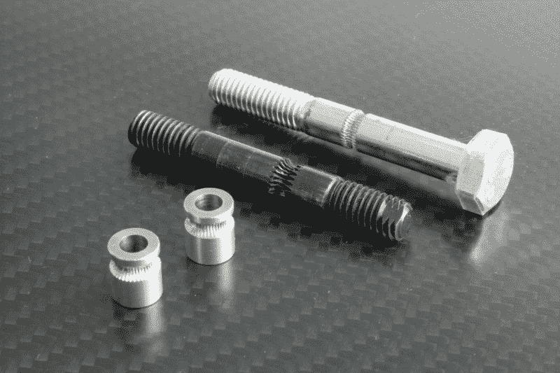](https://hackaday.com/wp-content/uploads/2016/06/mg_0118.jpg)

Go for hardened steel and sharp teeth. The MK8 drive gear and the black hobbed bolt shown above are just examples. Most regular hobbed bolts (right) wear out after the first meters and suffer from filament slip.

大多数 3D 打印挤出机组件，如 Wade 的挤出机或 AirTripper 的 Bowden 挤出机，与您可以购买的更贵的挤出机一样好用。对于挤压的一致性和可靠性来说，最重要的因素是驱动齿轮。选择高质量的硬化钢驱动齿轮或滚花螺栓，有锋利的齿和良好的抓地力。

## 加热床

长时间的加热时间是生产率的杀手，为了快速达到温度-在 3 分钟左右，一个常规的 PCB 加热床需要大约 1+W/cm²(6.5 W/in²)的功率密度。为了在正常条件下达到 110 (230 华氏度)，加热床应该提供大约 0.3 瓦/厘米 ² 的最小功率密度(2 瓦/英寸 ² )。如果你想打印的材料，如 ABS，需要一个较高的床温度，考虑到相对于其大小的加热床的必要瓦数。

由于铜走线和电路板材料的热膨胀不均匀，单面 PCB 加热板往往会上下跳动，这会导致表面光洁度受到带状图案的影响。动画非常清楚地展示了这个问题:

[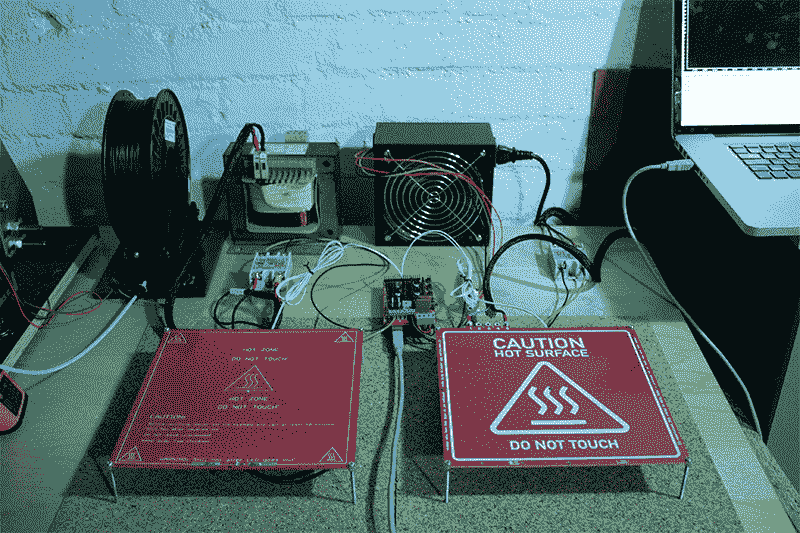](https://hackaday.com/wp-content/uploads/2016/06/230vs24ani.gif)

Single-sided PCB heated bed (left) / Double-sided PCB-heater (right)

由于高质量的印刷依赖于几十微米的 Z 定位精度，即使很小的温度波动也会导致单面 PCB 加热器产生不必要的伪影。使用双面 PCB 加热器或其他不受此问题困扰的替代产品(即附着在固体铝片上的硅胶加热垫)，以及调谐良好的 PID 控制回路。

现代加热床，如 Prusa MK42，通过用不均匀的功率密度来补偿不均匀的热损失，实现了更均匀的温度分布，这对于使大型结构在其拐角处粘附到构建板非常有帮助。在任何情况下，始终使用直接连接到加热床底部中心的热切断保险丝。

[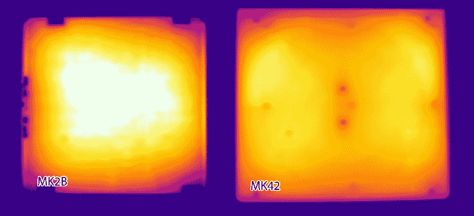](https://hackaday.com/wp-content/uploads/2016/06/heatbeds1.jpg)

Thermal image of legacy Prusa MK2B (left) and new Prusa MK42 (right) (by Josef Prusa, [image source](http://prusaprinters.org/original-prusa-i3-mk2-release/))

加热床必须牢固地安装在它所在的框架或支架上。不要使用带有不稳定弹簧的松动调节螺丝来安装它们，因为它们会严重影响打印质量。理想情况下，用螺栓将加热床固定得尽可能直，并使用自动调平进行微调。

## 封闭建造室

将您的打印机封装在盒子中可以防止通风，保留的热量使您可以从 ABS 打印更大的对象，而失真更少。外壳本身可以是任何东西，从一个足够大的盒子或一个漂亮的丙烯酸版画。只要热量留在里面，它就会工作。将打印机的电子设备放在加热的构建室外面，以防止电机驱动器和电源过热。请注意，主动加热的建造室也需要主动冷却的热沉。

[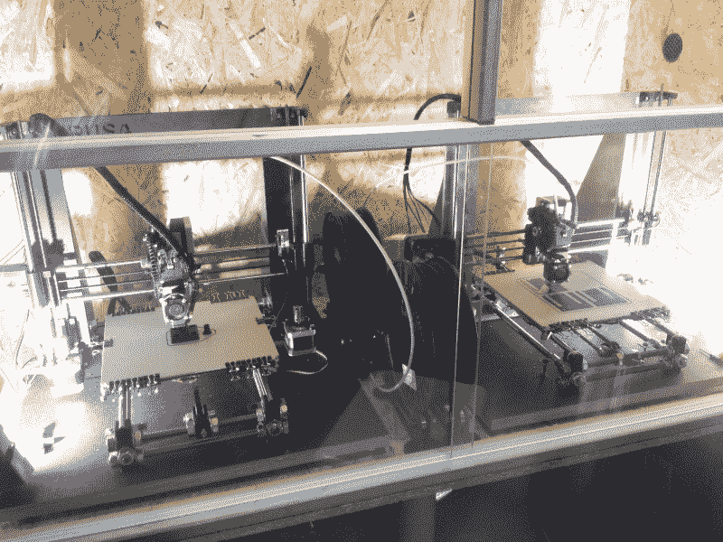](https://hackaday.com/wp-content/uploads/2016/06/terrarium.jpg)

Dual enclosed build chamber with glass sliding doors from a $50 OSB terrarium, because, why not?

不要在加热床的底部添加隔热材料，因为这会减少总的热量输出。没有过多隔热的被动加热建造室仅通过保留来自加热床的热量就可以容易地达到大约 40℃或更高。通过确保外壳可以在不拆卸整个设备的情况下拆卸，使维护变得容易，嗯，一扇门会很好。无论如何，避免通风。当打印 ABS 和 HIPS 时，即使是一个临时的外壳或一个小柜子也比没有好。

## 印刷表面

普通的窗玻璃板或镜子确实能够承受高温，但在 110 摄氏度的高温下，最轻微的撞击都会让它们粉碎。如果您在玻璃上打印，这种玻璃非常适合 PLA 和 PET(-G)等材料，请使用硼硅酸盐玻璃。对于印刷 ABS、HIPS 以及 PLA，聚醚酰亚胺(PEI)印刷表面被公认为最佳选择。ABS 在打印过程中非常牢固地粘在上面，但在打印后仍然会脱落。HIPS 和 PLA 效果一样好。

[](https://hackaday.com/wp-content/uploads/2016/06/mg_0195.jpg)

From right to left: 1/8″ glass fiber reinforced PEI plate, 1/4″ Garolite plate, Prusa MK2 heated bed, Makertum MK1 heated beds

然而，PEI 不仅是一种昂贵的材料，每公斤的价格高达数百美元，而且供应不足，这导致薄 PEI 粘合膜的使用增加。这些薄膜确实提供了同样出色的粘附力和印刷体验，但非常脆弱，容易损坏。对于重型车间使用，使用 1/8" PEI 板代替。它可能会稍微贵一点，但会永远耐用，一旦磨损，甚至可以在数控铣床上翻新。为了获得平整的印刷表面，PEI 板必须稳定，最好借助耐热转移胶带将其粘合到硼硅酸盐玻璃或铝板上。

不要使用只有一层 PEI 或 Kapton 薄膜的加热铝印版。铝的高导热性超过了将接触层保持在一定温度的目标，并加热整个印刷物体至通常变得太软而不能支撑自身的程度。

值得一提的是，尼龙最著名的印刷表面仍然是 Garolite(又名。Tufnol)。尼龙可以很好地粘附在上面，甚至更大的尼龙部件也可以可靠地印在 Garolite 上。

## 自动基座调平/自动网式基座调平

虽然经典的伺服部署探头总是工作得足够好，但用于自动平台调平的最通用、最精确和最可靠的传感器类型是非接触式电容距离开关。许多构建，尤其是带有金属构建板(即 Prusa MK42)或载体的构建，仍然使用感应传感器，但这些传感器会忽略非金属印刷表面(如一片玻璃、PEI 或 Garolite ),并且只对底层金属板做出响应。当然，这可以用偏移来解释，但偏移很少是恒定和一致的。除此之外，所有非接触式距离开关都具有一定的精度，通常相对于可调触发距离约为 10%。以较短的触发距离安装它们，最好是 1 或 2 毫米，以获得最大的精度。当然，任何传感器都需要牢固地安装在打印头上，以便准确探测。

## 固件

有几个很棒的固件项目，其中最著名的是 Marlin 和 Repetier。马林和 Repetier 在配置方面有着截然不同的方法。Marlin 从 GitHub 存储库中克隆了两个有良好文档记录和注释的配置文件，一个用于基础设置，另一个用于高级设置。相比之下，Repetier 使用一个网站，让你在一个图形 web 界面中编写固件设置，并下载预先配置的源代码。这些资源也包含配置文件，但是它们不如 Marlin 的对应文件记录得那么好。

谈到特性和功能，Marlin 提供的功能较少，但它是一个坚如磐石的高度可配置和可靠的平台，值得一台重型 3D 打印机使用。相比之下，Repetier 提供了许多实验功能，包括但不限于用于颜色混合的虚拟挤出机。这是探索更奇特的 3D 打印应用前沿的理想固件。虽然，并不是它所有的丰富特性都有很好的文档记录，如果你只是在寻找一些干净可靠的车间使用的东西，这肯定会带来麻烦。

## 温度控制算法

只有稳定的温度才能让您打印出没有条纹和伪像的高质量模型。简单的开关式温度控制开关不能提供必要的温度稳定性。获得稳定的加热床温度的最简单和最好的方法是 PID 控制回路，Marlin 和 Repetier 都提供这种选择。他们还提供了一个 [PID 自动调节程序](http://reprap.org/wiki/G-code#M303:_Run_PID_tuning)，可以消除温度曲线中的任何波动，而不会影响加热时间或过度调节。Repetier 还提供了另一种死区控制算法，在许多情况下同样有效。然而，死区时间控制回路的准确性和有效性取决于有效死区时间和控制回路的轮询/更新间隔的比率。这导致大功率加热元件的温度稳定性差，而大功率加热元件恰好具有几十毫秒的死区时间。用 PID 就好。

## 混乱的 LCD 控制器菜单

带有激活显示支持的标准 Marlin 或 Repetier 固件使得几乎每个控制选项都可以通过滚动和点击菜单来使用。它是完整的，但也是杂乱的，让您在移动轴之前浏览四个级别。

[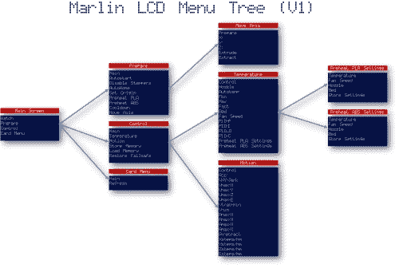](https://hackaday.com/wp-content/uploads/2016/06/menu_marlin.jpg)

The Marlin menu (simplified, by open-electronics.org, CC-BY-SA, [image source](http://www.open-electronics.org/autonomous-printing-with-your-reprap/))

对于车间使用，实际上只需要一小部分条目。只需删除固件源代码中不必要的条目。在 Marlin 的源代码中，这可以很容易地通过注释掉 ultralcd.cpp 中不必要的项目来实现。

```
/* DISABLING "CONTROL" MENU
 MENU_ITEM(submenu, MSG_CONTROL, lcd_control_menu);
 */
```

您也可以简化移动菜单以跳过进给速度选择:

```
/* DISABLING ORIGINAL MOVE MENU
static void lcd_move_menu() {
  START_MENU();
  MENU_ITEM(back, MSG_PREPARE);

  if (_MOVE_XYZ_ALLOWED)
    MENU_ITEM(submenu, MSG_MOVE_10MM, lcd_move_menu_10mm);

  MENU_ITEM(submenu, MSG_MOVE_1MM, lcd_move_menu_1mm);
  MENU_ITEM(submenu, MSG_MOVE_01MM, lcd_move_menu_01mm);
  //TODO:X,Y,Z,E
  END_MENU();
}
*/

// ADDING CLUTTER-FREE MOVE MENU
static void lcd_move_menu() {
  START_MENU();
  move_menu_scale=0.1;
  MENU_ITEM(back, MSG_PREPARE);

  if (_MOVE_XYZ_ALLOWED){
    MENU_ITEM(submenu, MSG_MOVE_X, lcd_move_x);
    MENU_ITEM(submenu, MSG_MOVE_Y, lcd_move_y);
    MENU_ITEM(submenu, MSG_MOVE_Z, lcd_move_z);
  }
  END_MENU();
}
```

## 防火

很少见，但是 3D 打印机能火。使用固件提供的安全功能，但不要完全依赖它们。普通 MOSFETs 和固态继电器通常会在导通状态下发生故障，从而导致发热失控，造成灾难性后果。热切断保险丝是 1 美元的组件，但它们能够很好地防止跑道加热床把你的车间变成一个弹坑。

[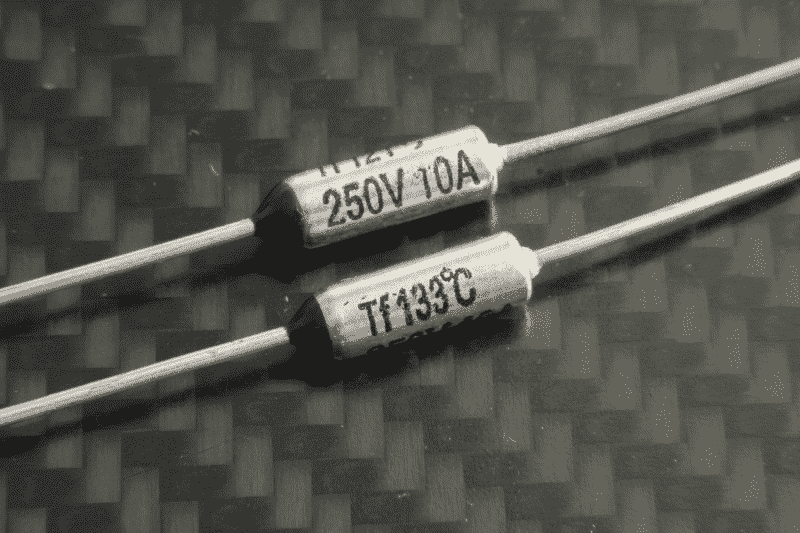](https://hackaday.com/wp-content/uploads/2016/06/mg_0150.jpg)

This $1 component is priceless. Use thermal cutoff fuses.

## 外部因素

### 不间断打印

如果您的主电源线不稳定，或者如果高感应功率设备碰巧在同一车间打开-例如，便宜的手持等离子切割机-从 UPS(不间断电源)操作您的打印机是一个好主意。在打印过程中，即使是短暂的停电也会破坏打印，在这种情况下，一个小型廉价的 UPS 将帮助您解决问题。

### 灯丝质量

显然，制造优质细丝比用螺旋钻将颗粒送入加热的物体中要复杂一些。它需要精确的测量和一个闭合的反馈回路，以保持较低的容差。我在廉价、低质量的长丝中发现的长丝缺陷包括截留的气泡、性质、颜色和直径的变化。我甚至发现了一个 ABS 的卷轴，中途褪色成 PLA。所有这些都无助于可靠的高质量打印，如果一半的打印失败，它甚至不便宜。因此，确保你得到一个好的灯丝，基准你的机器的能力。

## 额外的一英里

DIY 打印机的一大优势是维护。备件和文档的可用性使之成为可能，但在机器上工作也应该是有趣的。整洁的布线、电缆导管以及打印机上电压和信号的一致颜色代码将为您节省大量时间、挫折和魔法烟雾，只要您在最初制造机器一两年后需要重新检查机器的内部。

我希望你喜欢这份从 20 多种独特的 3D 打印机构建中获得的经验汇编。大多数开源项目都有详细的组装手册，但是忽略了使机器成为一个伟大的、可靠的、有趣的车间设备的细节。这篇文章很长，但有望填补足够的空白，使任何 DIY 3D 打印机项目获得成功。也必然是不完整的，所以在评论区补充自己的发现吧！