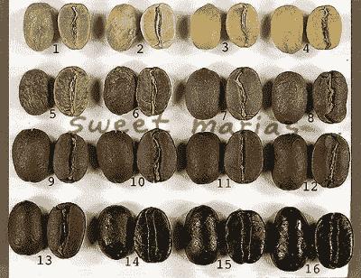
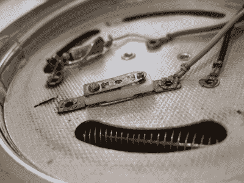

# 以令人满意的低价打造一台出色的咖啡烘焙机

> 原文：<https://hackaday.com/2018/01/23/build-an-excellent-coffee-roaster-with-a-satisfyingly-low-price-tag/>

烘焙咖啡有很多神秘色彩，但最终它变得再简单不过了。取一串豆子，均匀加热，在烧焦之前停下来。[剩下的就是细节了](https://legacy.sweetmarias.com/library/how-to-roast-your-own-coffee)。

咖啡烘焙机也是如此。最原始的烘焙技术包括在平底锅或炒锅里搅拌咖啡豆，以防止底部烧焦。这很好，但是没有伸缩性。工业滚筒烘烤器加热一个内部有脊的旋转滚筒，就像水泥搅拌机一样，以保持咖啡豆在经过煤气炉时不断运动。流化床烘烤器使用强大的热气流旋转咖啡豆，同时均匀地烘烤它们。但底线是，咖啡烘焙师需要在可控的热源上搅动咖啡豆，使它们尽可能均匀地烘焙。

几天前，我的 DIY 咖啡烘焙机断气了，我立即订购了必不可少的替换零件，一个热空气爆米花机，以避免一场真正的危机:没有咖啡！在我重建的时候，我想我应该拍些照片，分享我对这个主题的了解。所以，如果你对烘焙咖啡感兴趣，想把爆米花机做成烘焙机，或者只是想看看一台完全价值工程化的厨房机器，请继续读下去！

## 烘焙咖啡

根据上面的粗略定义，热空气爆米花机是一种流化床(爆米花)烘烤机。事实上，只要稍加修改就能打败温度限制恒温器，一个普通爆米花机就能成为一个不错的家庭烘焙器。一旦你做了这个简单的修改，如下所述，协议会非常简单:带着烘焙器和一些青豆出去，打开它。加入豆子，直到它们不再在底部打转，然后取出一些，让它们再次慢慢打转。坐下来，看，闻，但最重要的是，听。

 当豆子加热到超过水的沸点时，它们会开始变成肉桂色，并发出像爆米花一样的声音，原因完全一样:蒸汽使豆子裂开。这个阶段在烘焙术语中被称为“T3”第一声“T4”，取决于你有多少豆子，这个声音可以很大。豆子也将开始脱去它们的皮，谷壳，散发到空气中，蒸汽将开始散发出好闻的味道，而不仅仅是豆腥味。你会知道什么时候你碰到了第一个裂缝。(你也会意识到为什么要在户外做这件事。)

之后，会有一段安静的时间，咖啡豆会继续升温，颜色会随着焦糖化而变深。在烘烤快结束的时候，它们会发出一种非常小的声音，叫做“第二次破裂”。这是咖啡豆中的纤维基质分解，你会看到微小的圆形碎片从咖啡豆中飞出，甚至可能开始看到一些烟雾。在这里，豆子表面有一层光滑的油脂涂层。我倾向于在第二次破裂的第一个迹象时停下来，喝浓缩咖啡，但也有人喜欢更深的。关掉爆米花机，把豆子扔进漏勺冷却。

你的第一次家庭烘焙咖啡体验将是革命性的，与新鲜烘焙的差异相比，烘焙的深度、速度甚至混合咖啡的细节都显得苍白无力。大约在上个世纪末，一个朋友说服我尝试这种方法，从那以后，我就自己烤豆子了。事实上，我用 3.99 美元的旧货店机器烤了几年，才最终有了进一步控制和改进烤肉的冲动。

## 从波普到烘焙师

爆米花机流化床烘烤器只有两个变量需要控制:搅拌和热量输入。这意味着控制风扇电机和加热器线圈，这两者分别通过固态继电器和坚固的 MOSFETs 非常适合 PWM。如果你想自动烘烤，你还需要一个温度探头深入到旋转的豆子中，以获得反馈。如你所见，即使全力以赴也没那么难。

风扇电机是一个 20-24 V 的 DC 电机，加热器线圈实际上是两个串联运行的线圈，意在脱离电源电压运行。价值工程最聪明的一点是，在将交流电整流成 DC 供电机使用之前，使用线圈作为分压器,线圈毕竟只是电阻。

Old roaster had a bimetallic strip

我见过的所有爆米花机都有一个自动调温器，可以在适合爆米花的温度下关闭加热线圈，遗憾的是，这对于烘焙咖啡来说有点太凉了。恒温器将需要被旁路或移除。恒温器将是一个简单的双金属片，要么连接在加热器上，要么连接在烤筒上。在后一种情况下，只需剪断电线并扔掉恒温器。如果它附着在加热元件上，你可以通过足够用力地弯曲它来击败双金属片，这样无论温度如何，它都会接触。

还有一个热保险丝，防止设备在电机无法将空气推过热线圈的情况下抓住着火的豆子。根据我的经验，这个保险丝有时会烧断，所以你最好现在就用一根结实的铜线把它短路。如果你选择击败热保险丝，我认为我的肮脏的黑客，在这里可见，是足够的解释。那根电线需要压接或简单地紧紧缠绕。不要用焊料——这里会变热。如果你不想自动化你的烘烤器，你已经完成了，你可以把它拧回一起。

请注意，这意味着无论何时加热器打开，您都要负责确保风扇打开。如果你像我一样正在安装温度探头，这没什么大不了的。但是，如果你在没有反馈的情况下运行 popper，你可能希望在严格监督下在防火表面上进行操作——毕竟，我们正在击败一个消防安全机制。

[https://videopress.com/embed/4Pohdey0?hd=1&cover=1&loop=0&autoPlay=0&permalink=1&muted=0&controls=1&playsinline=0&useAverageColor=0](https://videopress.com/embed/4Pohdey0?hd=1&cover=1&loop=0&autoPlay=0&permalink=1&muted=0&controls=1&playsinline=0&useAverageColor=0)