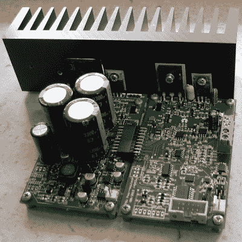

# 为自己打造一款出色的模块化电源

> 原文：<https://hackaday.com/2016/02/06/build-yourself-an-awesome-modular-power-supply/>

你可能认为你已经为你的长凳建立了一个电源。见鬼，我们都是。但是直到你检查了[Denis]的[台式电源构建](http://www.envox.hr/eez/bench-power-supply/psu-introduction.html)，你可能甚至不知道你错过了什么。

[Denis]的设计几乎完全是模块化的，面向中级构建者。它建立在容易获得的零件和通孔元件上。它有一个 Arduino 作为大脑运行，所以当你想调整它的时候，你就可以破解代码。[但是容易并不意味着轻于功能](http://www.envox.hr/eez/bench-power-supply/psu-techology-overview.html)。让我们一起来看看这个构建。

它从一个预调节器开始:一个开关 MOSFET，将电压降低到仅比目标值高几伏。然后是后置调节器，它包括所有微调、DAC 和 ADC 与微控制器的接口，以及一些奇特的功能，如“向下编程器”，可以极快地关闭输出。

在用户端，[丹尼斯]制作了一个非常光滑的电路板，集成了用于控制的 TFT 触摸屏、Arduino 连接和强制性的香蕉插头输出。SPI 总线上有光隔离、一个实时时钟和一大堆好东西。这是他对这个模块的第三次修订，这种精细化的程度是显而易见的。它甚至符合 [SCPI 标准](http://www.envox.hr/eez/bench-power-supply/psu-scpi-reference-manual/psu-scpi-introduction.html)，这意味着您可以使用行业标准协议进行远程控制。

那么，在微控制器的控制下，你会用一个可笑的电源做什么呢？测试电池充电算法？编写测试程序，看看你的设备在电池耗尽时如何工作？我们不知道，但我们知道我们想要一个！