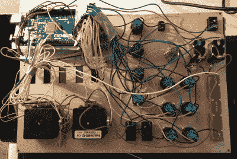

# 构建更好的 Kerbal 空间程序控制器

> 原文：<https://hackaday.com/2018/01/23/building-a-better-kerbal-space-program-controller/>

如果你对太空和到达那里需要什么有哪怕是最短暂的兴趣，你可能已经玩过《克巴尔太空计划》(KSP)。如果你还没有，那么你今天应该留出大约 10 个小时去真正快速地检查一下。别担心，你回来的时候 Hackaday 还会在。现在你需要集中精力建造这些火箭，并建立一个通信卫星网络，这样你就可以脱离低轨道。

对于那些玩过这个游戏的人(或者在玩了规定的 ~~10~~ 、~~12~~16 个小时后再次加入我们的游戏)，你会知道简陋的电脑键盘不太适合在太空中远足。你真的需要一个绝对最小的操纵杆和油门来进行精确的机动，但即使如此，你也要花大量的时间回到键盘上来操作飞行器的各种系统。如果你想要终极的 KSP 控制系统，你需要[跟随【雨果·皮特斯】的脚步，建造你自己的](http://www.instructables.com/id/KerbalController-a-Custom-Control-Panel-for-Rocket/)。对我们来说幸运的是，他写了一份非常详细的关于构建 KSP 控制器的指南，即使你不想克隆他的，这份指南也应该是有用的。

Wiring switches and buttons to the Arduino.

在最基本的层面上，构建 KSP 控制器包括将一系列开关和按钮连接到微控制器，如 Arduino 或 Teensy，并将这些转换为游戏理解的 USB HID 按键。这在某种程度上工作得很好，但是有局限性，因为这只是一种单向的通信方法。对于他的控制器，[【Hugo】使用了 KSPSerialIO](https://github.com/hugopeeters/KSPSerialIO) ，这是 KSP 的一个插件，允许游戏和你的控制器之间的双向通信，在控制器的面板上实现速度和燃料水平等数字读数。

一旦你如何与游戏对话的后勤问题解决了，剩下的就真的取决于个人了。构建您自己的 KSP 控制器的第一步是决定您希望它做什么。你想开飞机吗？控制一辆漫游者？也许你只是想要一个空间站的主控面板。在 KSP 你可以建造很多东西，控制器上的布局、输入和显示应该完美地反映你的游戏风格。

[Hugo]配备了一个相当通用的面板，但确实花费了相当多的额外时间来连接一些光滑的 LED 条形图，以显示他的飞船上不同系统的资源水平。这是一个额外的步骤，对于这样的构建来说并不是严格要求的，但是一旦你看到它，你将很难不想把它放在你自己的面板上。他还花钱让面板和表壳经过专业的激光切割和蚀刻，这无疑给了它一种抛光的感觉。

在 Hackaday，我们已经介绍了相当多的[定制 KSP 控制器](https://hackaday.com/2017/05/04/mission-control-for-kerbal/)。KSP 玩家和黑客之间的重叠似乎异常高，但是当然一个让你[建造和飞行你自己设计的装置](https://hackaday.com/2015/06/10/quadrotor-control-systems-and-kerbal-harriers/)的游戏听起来确实像是[会对我们的胃口](https://hackaday.com/2015/03/20/hacklet-39-the-kerbal-way-of-doing-things/)。