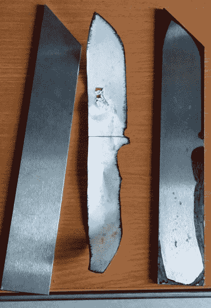

# 手工打造一把刀就像你想象的那么难

> 原文：<https://hackaday.com/2018/06/07/building-a-knife-by-hand-is-just-as-hard-as-you-think/>

卡尔·萨根曾经说过:*“如果你希望从零开始做一个苹果派，你必须首先发明宇宙。”*换句话说，术语“划痕”实际上是一种相对的东西。苹果是你种的吗？你种小麦是为了做面粉吗？顺便问一下，你的风车放在哪里？考虑到卡尔的话，我们假设我们不能说[弗兰纳吉尔]真正从零开始建造了这把不可思议的刀，毕竟他在亚马逊上订购了钢板。但我们认为已经很接近了。

 他很友好[地记录了《T4》这部史诗般的巨作，包括(至关重要的)他一路走来犯下的错误。虽然没有一个错误大到足以破坏项目，但他提到了几个他浪费时间和金钱试图走捷径的例子。即使在家里制作自己的刀不在你的夏季项目清单上，我们打赌在这个制作日志中有一些东西你可以从中学习。](https://imgur.com/a/RYcwNck)

那么如何制造一把小刀呢？缓慢而有条不紊地，如果[弗兰纳吉尔]写的东西有任何暗示的话。它从一张纸上的刀的草图开始，然后它的轮廓被转移到一片工具钢上，除了一个永久的标记之外没有任何外来的东西。然后用角磨机沿着轮廓打磨出最终刀的大致形状。

从那里，这个过程几乎完全是用手工文件完成的。这里[弗兰纳吉尔]给出了他最重要的建议之一:不要在工具上省钱。他买了他能买到的最便宜的一套锉刀，并为此付出了代价:他说，仅仅完成刀的一面就花了 14 个小时。一旦他切换到更高质量的文件，其余的工作进行得更快。

在锉平并打磨刀坯后，将其放入炭火中硬化，然后在 200°C(~ 400°F)的烤箱中加热回火 4 小时。最后，安装手柄(官方称为“秤”)，并采用劳动强度大大降低的木工方法完成。最终的结果是一个华丽的同类标本之一，[弗兰纳吉尔]理所当然地非常自豪。

如果你担心这个过程看起来对你来说有点太快太简单，不要担心。如果你想在离树更近的地方开始做苹果派，你可以走比尔赫德路线，用你的旧水槽做一个熔炉。