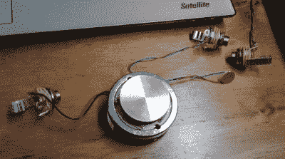

# 以低廉的成本构建平板混响

> 原文：<https://hackaday.com/2018/03/23/building-a-plate-reverb-on-the-cheap/>

对于那些不在空闲时间用实验音效创作音乐的人来说，平板混响本质上是一个扬声器。它只是碰巧，从设计上来说，是一个相当差的。与传统扬声器使用纸盆作为振膜不同，你可能会猜到，平板混响使用的是金属板。当板随着源音频振动时，一组压电拾音器将其转换为输出。最终结果是，音频馈入板混响出来一个很好的回声效果。

 尽管相对简单，一个平板混响也要花费数千美元。它们太贵了，以至于大多数人只是在软件中模拟这种效果。但不一定非要这样。[Sammartino]和一位音频工程师朋友最近提出了一份详细的指南，介绍如何建造一个平板混响，其成本约为市售型号的 10%。

结构相当简单。搭建一个木架，四周安装八个挂钩。使用吉他弦将盘子悬挂在这些挂钩之间，吉他弦将盘子固定得很紧，但又有足够的弹性随着曲调振动。另一个板连接在框架的中心，以支持电子设备:一个振动板的换能器，两个压电拾音器将其转换为音频信号，一对插孔和一些电线将它们连接在一起。

对于 DIY 平板混响的不同体验，[看看我们在 2013 年](https://hackaday.com/2013/10/14/build-a-diy-plate-reverb/)讨论过的这个。如果你想买比*大一点*，[的东西，我们也能满足你的需求](https://hackaday.com/2012/11/28/100-meter-spring-reverb-makes-us-hear-satanic-voices/)。