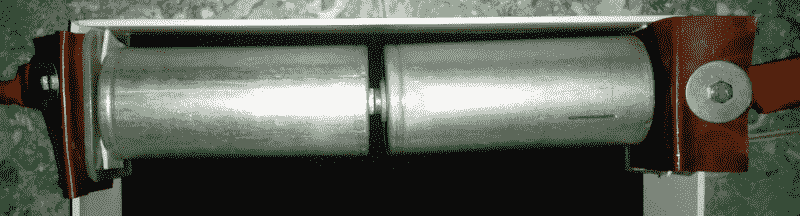
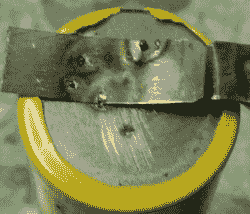
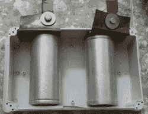

# 建造便携式太阳能点焊机:几乎实用！

> 原文：<https://hackaday.com/2018/03/15/building-a-portable-solar-powered-spot-welder-nearly-practical/>

上一次，我们讨论了如何为一个 3000 法拉的超级电容储存和充电，以制造一个太阳能便携式点焊机。从那以后，我对充电电路做了一些改进，并让它运行起来。概括地说，充电器使用 DC-DC 降压转换器将一系列 DC 电压转换为 2.6 V。尽管它可以提供最大 5 A 的电流，但如果允许的话，超级电容器将消耗更多的电流。


Capacitor charge current decreases with time as the capacitor charges. Source: [Hyperphysics](http://hyperphysics.phy-astr.gsu.edu/hbase/electric/capchg.html)

在一些失败的尝试后，我通过将降压转换器输出通过一个回收的[功率 MOSFET](http://en.wikipedia.org/wiki/Power_MOSFET) 解决了这个问题。一个备用节点 MCU 模块提供脉宽调制输出，该输出在受控时间段内开启 MOSFET，以限制充电电流。这很好，但恒压充电器真的不是给电容器充电的正确方式。由于电容器极板在充电时会产生电压，恒压充电器的电流输出最初很高，但最终会下降到非常低的水平。

为了让它更像一个恒流充电器，并且缺少检测电阻，我将输出连接到 NodeMCU 上的 ADC 引脚。它测量超级电容器两端的电压，随着充电期间电压的增加，NodeMCU 会增加 MOSFET 允许电流通过的时间。换句话说，随着电容器充电，它增加了占空比。请注意，我使用的固件只支持整数数学，这就是为什么我没有在代码中除以 1.6:

```

pwm.setup(1, 1000, 900)
pwm.start(1)

function set_charge_rate()
val = adc.read(0)
duty = 800 - (val/2 + val/9)
pwm.setduty(1, duty)
end

tmr.alarm(1, 3000, 1, function() set_charge_rate() end)

```

这种方法效果更好，但是充电速度仍然低于 2.1 伏以上的水平。为了加快速度，我只是将占空比增加到高于该点的固定值:

```

pwm.setup(1, 1000, 900)
pwm.start(1)

function set_charge_rate()
val = adc.read(0)
if val &lt; 635 then duty = 800 - (val/2 + val/9) print (val) print (duty) pwm.setduty(1, duty) elseif val &gt; 634 then
duty = 180
print (duty)
pwm.setduty(1, duty)

else
end
end

tmr.alarm(1, 3000, 1, function() set_charge_rate() end)

```

在最后一次修改后，充电速度大大提高，相关部件会变热，但并不令人担忧。我将 DC-DC 转换器的输出设置为 2.6 V，并且能够毫无问题地将电容器充电到 2.5 V 以上。

既然充电器令人满意，是时候添加电极了。我有一些大型铜环终端，这是正确的大小为一些钢螺栓我躺在周围。将电线压入这些需要相当多的锤击，但连接非常牢固。对于布线，我使用三相电源电缆，将所有三根电线连接在一起，制成一根粗电缆。

[](https://hackaday.com/wp-content/uploads/2018/03/insulated-cables_thumbnail.png) 我用螺栓将环形端子固定在超级电容器支架的铜板上，并固定在两根短而细的实芯电线上，这些电线就是电极。虽然难看，但这给了电极良好的移动性。很容易将它们应用到金属板等物体上。最后，在有暴露的铜的地方，我使用热缩管作为绝缘。

到目前为止，一切都很顺利，所以我给它充了电，拿了一个备用锂电池和一些 tab 线，试了一下。当我使用电极时，tab 线上的一个小点很快变黄变热，没有火花。我很快就把它们拿掉了…而耳片线一点也没粘上。无论我如何尝试，我都无法让它焊接到位，尽管它确实能很好地加热我接触电极的任何材料，而设备本身的任何部分都不会变得特别热。感觉就像它几乎不起作用，这有点令人沮丧。如果时间太长，它确实很好地消除了 tab 线:

事后看来，有几件事我从一开始就可以做得更好。最重要的是，我应该使用这两个电容来制作一个 5.4 V、1500 F 的电容组。由于我不知道超级电容器的内阻(我曾错误地猜测在 30mω左右)，我应该是在悲观方面犯了错误。看看[这个使用超级电容器焊接铜](http://hackaday.com/2011/11/06/diy-spot-welder-can-join-anything-together-even-copper/)的工作建筑，他们已经使用了四个同样大小的超级电容器！所以我给两个电容都充了电，用砂纸把电极打磨干净，然后把它们串联在一个盒子里进行快速测试。

[](https://hackaday.com/wp-content/uploads/2018/03/series-supercap_bright.png)

这是多么大的不同啊！当电极接触到 tab 线时，它们像预期的那样发出轻微的火花，而不是仅仅加热金属，金属就焊接到位了。当然不是最好的焊接，但经过一些练习，我认为它可以使用。(实际的焊缝是左边的那些点。标签在之前的尝试中被损坏。)

[](https://hackaday.com/wp-content/uploads/2018/03/weld_thumbnail1.png) 因此，虽然这在 5.2 V 的充电电压下工作，但我怀疑在 7.8 V 下使用第三个电容会更好。但一个问题仍然存在:为什么有些构建似乎只使用一个超级电容就能工作得很好？我怀疑这些没有品牌的电容器没有通过质量控制，被卖到灰色市场。高于预期的内阻或低于声称的容量并非不可能，并且肯定会影响点焊机的性能。经验教训:对于点焊机，使用正品零件。我有点想打开它，希望看到里面有一个更小的电容器和一堆沙子。也就是说，对于 4 美元来说，这将是太阳能传感器涓流充电系统的一部分。

如果做不到这一点，这些有问题的部分将会成为极好的压舱物或可怕的砂锅。欢迎您的项目建议！



Separators to be added later.

无论如何，是时候把它放在一个更好的盒子里，使它便于携带，并附上太阳能电池板。这被证明是令人耳目一新的简单。我去买了一个更大的防水塑料盒来装超级电容器。它们就像大型 AA 电池一样排列。

我买了一些[开槽角钢](http://en.wikipedia.org/wiki/Slotted_angle)。这几乎是我最喜欢的建筑材料，它或多或少放大了 [Meccano](http://en.wikipedia.org/wiki/Meccano) 。一个有趣的事实是，正是 Meccano 的存在阻止了开槽角钢的一般专利，这使得它在世界范围内得到效仿。我见过用它建造的建筑。

我建造了一个钢架来安装太阳能电池板，并包含所有的部件。这使得它可以用橡皮筋绑在摩托车上或作为背包佩戴——灵感来自[Joe Kim]的第一篇文章的艺术。太阳能电池板是一个 10 瓦、18 伏的单晶装置，我把它放在身边，以便在过去每周都会发生的长时间停电期间为设备充电(电网现在好多了)。

在阳光下，充电时间更多地受到充电控制器(在软件中)的限制，而不是太阳能电池板输出的限制。在 5 A 的指定限制下，它只是运行过热。作为一种折衷，每个电容都有自己的充电电路，从 1 V 到实际电压只需 15 分钟。

总的来说，它是有效的……但是称之为惊人的实用有点言过其实。使用三个或四个更小的品牌超级电容器的更适中的构建可能会工作得更好，充电更快，更轻，更小，更便宜……对于需要在断电时焊接电池片的人来说，可能达到商业可行性的边缘。或者我可以干脆放弃便携性和太阳能，用微波变压器来制造点焊机。