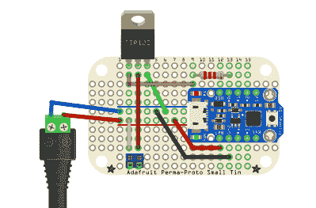
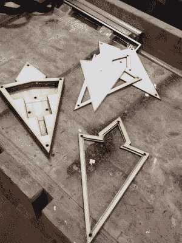

# 构建 Skyrim 任务标记

> 原文：<https://hackaday.com/2017/11/23/building-a-skyrim-quest-marker/>

我在做一个 Skyrim 任务标记。你可能知道这是什么，即使你从来没有玩过这个游戏。当游戏中的角色或地点与任务相关时，会有一个箭头浮在上面，这样你就不会错过了。如果是一本书，书上有箭头。如果是一个人，它会浮在那个角色的头上。这是我想要重新创造的任务标记。

我坐在我的素描本前，画出了基本参数。我想让它和通常浮在上面的人类/精灵/兽人的头部成比例。我最后从上到下用了大约 9 英寸。就厚度而言，任何明显的维度都是不好的，因为游戏元素只存在于二维空间中。也就是说，我将在现实世界中重新创造这个东西，发光二极管，丙烯酸树脂，胶合板和其他东西都需要放在里面。

我决定把它做得大约 1.25 英寸厚，如果我选择的话，这将包括足够的空间来放置 9V 电池，加上原型板和微控制器。

### 设计电子设备

 在我最终确定尺寸之前，我必须设计电路。最初我看了 Adafruit 的背光 LED 面板，但我觉得它太难适应外壳的尖角部分，无论是物理上还是光分布上。相反，我用了一串[冷白色发光二极管](https://www.adafruit.com/product/887)，不能单独寻址，只需要电源和 GND 点亮。然而，从电池上看，发丝太亮了。幸运的是，这条项链是可控制的，所以我在 85 分钟的时候用了一个水果饰品来使它变暗。

我选择了 TIP-120 进行切换，[这是我们自己的【Adam Fabio】](https://hackaday.com/2015/08/17/you-can-have-my-tips-when-you-pry-them-from-my-cold-dead-hands/)极力推荐的一个零件。电源将是我的壁瘤；如果我要把它带到野外，我可以在围栏里放一块 9V 的电池——那里有空间——但我想这次我只会把它放在家里。

### 设计外壳

 我决定让我的设计灵活一些。我打算用激光切割机从八分之一英寸的材料上切下每一层标记。正面将有一个挡板将丙烯酸固定在适当的位置，而背面只是一块空白的胶合板。未知数量的内部层(如我设计的)将决定标记的整体厚度。

我打开了 Inkscape，开始设计图层。我在一个 Inkscape 文件中做了所有的事情，每一层都与设计中的一个相似层相对应。

更接近激光，当我对项目的最终参数有一个很好的感觉时，我会在一系列 12”x12”Inkscape 画布上分布图层，我会直接从这些画布上打印。这将允许我削减一些填充项目的未使用部分的董事会，因为我很便宜。

最上面的边框很简单——它应该看起来很特别。我从网上放了一张 GIF 图片到 Inkscape 并跟踪了它。我复制了那一层，并制作了底板，这基本上只是一个填充版的边框。发光部分需要乙烯基材料，并用某种挡板固定住。还需要一个 LED 板，在 LED 板下面需要一个小电路板的空间。

我最后把整个东西做了 10 层厚:从顶部开始:外圈；然后是丙烯酸树脂和它的载体，它们紧贴在一起——我不想让任何光线从侧面漏出。第三层是一个“下边框”，它将丙烯酸树脂提升了 1/8 英寸，因为 LED 灯条被一个小塑料“山”覆盖。第四，LED 板，涂成白色，上面贴着 LED 灯条。

我认为这四层是项目的顶层。接下来的六层是底部，由五个相同的层组成，构成了电子舱，背板也有一个电源孔，也安装了原型板。每层厚 1/8 英寸，总厚度为 1.25 英寸——不算太差。它有点偏重。(顺便说一下，[你可以在项目页面](https://hackaday.io/project/27908-skyrim-quest-marker)找到 Inkscape 文件。)

### Lasering

T2 激光的前十五分钟简直是地狱，因为我把所有的设置都弄清楚了。但是一旦我把所有的东西都拨进去了，就变得轻而易举了。

将这些层分成 12 英寸×12 英寸的片，每片两层。所以我导入了 1”x2”的矩形，上面有马的形状，你可以在右边看到它们。我们在我的游戏组里用这些来装马，有一个人坐在上面，表示他或她已经骑上了马。

一旦我调到我最喜欢的设置，激光效果就非常好。木材的质量比我习惯的要低一个档次，我觉得胶水只是稍微有点难熔之类的。尽管如此，大部分零件都非常完美。

我最担心的是丙烯酸。我在亚马逊上找到了一些半透明的白色丙烯酸树脂。我以前从未用过它，也不清楚(抱歉)它有多半透明，所以看都没看就买了。此外，我在 12 英寸 x12 英寸的纸上有足够的空间进行 3 次裁剪，所以我想尽快得到正确的设置。

它的效果比我想象的要好。黑客空间的某人在激光切割室的白板墙上写下了速度和功率的最佳比率——15 速度，8 功率。为了确保万无一失，我试了两遍，但结果很完美，而且像魔咒一样滑到位。

### 建筑

 我把底部的六层粘在了 hackerspace 里，还有丙烯酸的两层载体。我所需要做的就是给它上漆，加上电子设备，然后把它栓在一起。

最初，我设想在某种背带里放一个电池组，用一根涂黑的 PVC 管把标记吊在头顶上。在我第一次运行这个项目时，似乎有很多问题需要解决，所以我把这个想法转换成了一个使用壁灯的桌面版本。

当我制作电子产品原型时，我想到我可能对这个小饰品有点可笑——如果它不需要被 PWMed 呢？哦，但确实如此。LED 灯带在最大亮度下运行非常明亮，这种冷白色具有 klieg 灯的所有微妙之处。他们肯定需要被淘汰。

该条带有 3M 粘合背衬，这很好，但是，最容易接触到的焊盘位于底部，因为顶部覆盖着一层塑料泡沫，即使用锋利的刀也很难切掉。

对于未来的发展，我计划换一个 ESP，并将其用作 Twitter 警报。此外，围栏设计仓促，缺乏一定的修饰。例如，我想在最上面的三层使用锁紧螺母从后面固定前挡板，这样它就不会露出那些侵入性的插座头，或者至少以某种方式嵌入它们。

但总的来说，我很高兴第一次尝试就能让外壳工作得这么好。在经历了无数次从“悲惨的失败”到成功的激光项目后，也许我开始找到窍门了！[查看 Hackaday.io 上的项目页面](https://hackaday.io/project/27908-skyrim-quest-marker)。