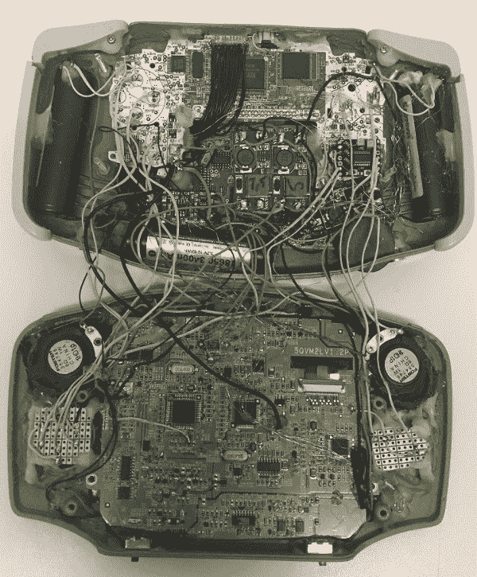

# 建立一个超大的游戏男孩前进

> 原文：<https://hackaday.com/2017/12/21/building-a-supersized-game-boy-advance/>

除非你真的仔细看上面的图片，否则你可能不会意识到你看到的不是一个普通的游戏机进展；这也是重点。尽管它保留了标志性的任天堂掌上电脑的外观，但由[Akira]制造的这个版本对于成年人的手来说是超大的。它有多大？给你一个概念，屏幕是 5 英寸，相比之下，原来的屏幕是 2.9 英寸。

 与我们最近报道的大多数便携式游戏不同，这款大 GBA 不是由树莓 Pi 驱动的。在内部，它包装了一个真正的 GBA 主板，它被连接到一个原本用于 PlayStation 的便携式屏幕上。

尽管这可能有点低估了事情，因为将原始屏幕的圆形 PCB 变成 GBA 的矩形意味着必须将其切掉，并用跳线重新创建迹线。最初的屏幕 CCFL 背光不得不以电池寿命的名义消失，取而代之的是来自任天堂 DSi XL 的背光系统。

但是,(阿基拉)从哪里得到一个巨大的 GBA 案例呢？不，它不是 3D 打印的。这实际上是一个硬携带的情况下，出售给 GBA。携带箱显然没有子弹槽或按钮开口，所以这些部分是从捐助者 GBA 箱嫁接而来的。因此，尽管系统整体比原来大得多，但 D-Pad、面板按钮和背面的墨盒插槽都是正常的 GBA 尺寸。

GBA XL 真的是爱的劳动；浏览构建日志，你可以看到[Akira]实际上早在 2014 年就开始了这个项目，但它一直被搁置，直到更多的研究可以完成如何将所有期望的功能打包到最终设备中。

虽然这可能是历史上最准确的制作更大的游戏机的尝试，但它肯定不是第一次。似乎有一种对[将典型的口袋游戏系统变成完全相反的](https://hackaday.com/2015/05/25/the-biggest-game-boy-ever/)的迷恋。

 [https://www.youtube.com/embed/Z_DMZSiM5AQ?version=3&rel=1&showsearch=0&showinfo=1&iv_load_policy=1&fs=1&hl=en-US&autohide=2&wmode=transparent](https://www.youtube.com/embed/Z_DMZSiM5AQ?version=3&rel=1&showsearch=0&showinfo=1&iv_load_policy=1&fs=1&hl=en-US&autohide=2&wmode=transparent)

