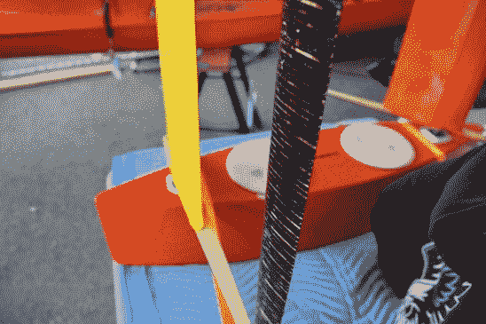
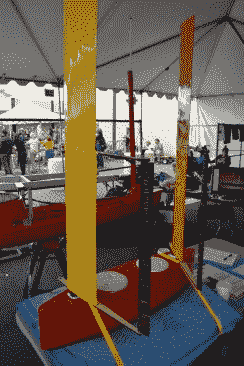

# 建造一大群自主远洋船

> 原文：<https://hackaday.com/2016/06/17/building-a-swarm-of-autonomous-ocean-boats/>

Hackerboat 项目有一种坚韧不拔的感觉。它没有华而不实的营销，人们拿着钱排着队从一楼进入，也没有华而不实的名字(我一会儿会谈到)。它确实有一个专门的黑客团队，他们正在构建原型来解决一些真正的大挑战。在海上作业对设备要求很高，尤其是电子设备。时间和毅力让这个团队和他们的项目走得更远。

 [https://www.youtube.com/embed/fo3aTvX2JhI?version=3&rel=1&showsearch=0&showinfo=1&iv_load_policy=1&fs=1&hl=en-US&autohide=2&wmode=transparent](https://www.youtube.com/embed/fo3aTvX2JhI?version=3&rel=1&showsearch=0&showinfo=1&iv_load_policy=1&fs=1&hl=en-US&autohide=2&wmode=transparent)

我第一次见到[[皮尔斯·尼科尔斯](https://hackaday.io/rocketgeek)]是在周五海湾地区创客节的海鲜饭上。他邀请我们去他的摊位，他也提到有点偏僻。我周六找过他，但没有成功，但那天晚上在 Hackaday 聚会上又碰到了他。最后，星期天，在我离开博览会的路上，我们联系上了——他们把他藏在外面，我把他归类为“中途飞行器”。不难看出为什么，谁会带着 18 英尺长的皮艇来到他们的 Maker Faire 展台？

这艘二手双人皮艇是自主船项目的主要原型。最初的设想是作为一个机器人飞行器环绕地球，该团队已经将他们的里程碑调整为一组增量目标。目前，皮划艇有由电池驱动的电力推进。太阳能的概念验证已经完成(用一个架子来固定已经就位的太阳能电池板),但是最终的布线仍然需要进行。手动模式工作得相当好，改进计划以及功能扩展，通过途径点导航和基于摄像机的障碍回避来增加自主性。

当最终被释放到海洋中时，这些漂浮机器人将会完成什么？一个设想是包括一个足够高的桅杆来安装相机和传感器，以增加观看范围。有了这种覆盖，一组船只可以仔细检查一个区域以收集研究数据，或者作为自主搜索船只。

  Steering fin for the wingsail  Scale prototype for using wingsails

环球航行的梦想并没有消亡，只是在一个更长的时间线上。这个小组正在研究一个小规模的独立原型。这包括[两个巨大的翼形桅杆，它们充当船帆](https://hackaday.io/project/8522-hackerboat/log/38614-sail-power)来推动也将成为自主飞行器的东西。这些被称为自动翼帆，因为它们有一种机制，可以让翅膀朝着自己喜欢的方向推动船只。当太阳在头顶上时，太阳能发电系统非常好，但是离赤道越远，你对太阳的期望就越小。这使得在好望角和合恩角航行成为一个冒险的提议。

你可以看到这是一个雄心勃勃的项目。很高兴看到人们对此很感兴趣，而且像[皮尔斯]这样有奉献精神的团队成员正在四处宣传。他住在西雅图，这次采访是在旧金山地区——对于大型原型来说，这是一次长途跋涉。这个月，他还带着原型去 Toorcamp 做了一次展示。

如果你不是造船者，你仍然可以提供帮助。Hackerboat 这个名字与其说是一个名字，不如说是一个项目代号，因为 Hacker Boat 公司已经存在，并且从 20 世纪早期就开始制造 Hacker-Craft。你为这个项目起了一个吸引人的名字吗？