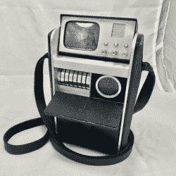

# 建造一个配得上史波克先生的三录仪道具

> 原文：<https://hackaday.com/2018/03/19/building-a-tricorder-prop-worthy-of-mr-spock/>

我们都经历过。你想组装一个合适的*星际迷航:原始系列*登陆派对道具组，但你在市场上能找到的 TOS 三录机只不过是价格过高的玩具。想象一下带着一个塑料三录仪向塞斯特斯三世传送信号的尴尬。Metrons 甚至不会为这样一场糟糕的比赛而烦恼。

 对*星际战舰*道具的状态不满，【院长 O】决定自己动手。他从 Diamond Select Toys 购买了一台 TOS 三录仪，并着手[对其进行修改，使其更接近星际舰队的标准](https://www.therpf.com/showthread.php?t=284708)。玩具上任何涂有金属银的东西都被机械加工的铝制复制品取代，增加了一些急需的重量。他甚至装饰了控制器和显示器。

首先，[Dean]将三录仪拆下来，分离出所有的银色塑料部件，并找到足够接近所需尺寸的铝原料。这最终成为侧面的 0.125”板，和水平分隔的 0.500”条。为了制作侧板，他将原来的塑料部件放在铝上，用冲头在安装孔上做标记，然后用砂带打磨器对它们进行整形。

[Dean]然后放入一个屏幕更精确的云纹盘，并尽可能地为按钮获取真正的表冠(就像节目中使用的道具一样)。在一个特别大胆的举动中，他甚至在表冠的中心钻孔，为 led 照明安装塑料光管。

去年，我们看到一个制作人员将树莓皮塞进了同一个钻石精选三录仪玩具中，效果非常好。现在有人只需要结合这两个项目，他们将有最光滑的三录仪在阿尔法象限。