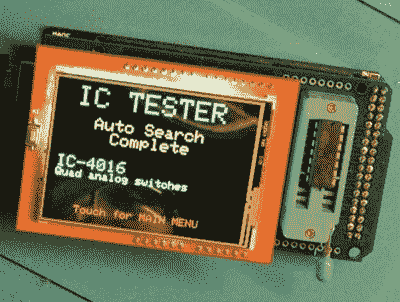

# 花费 25 美元构建一个 Arduino 智能 IC 测试仪

> 原文：<https://hackaday.com/2018/02/15/building-an-arduino-smart-ic-tester-for-25/>

毫无疑问，你可以用传统万用表做很多事情；它可以说是你工作台上最强大的工具。但是你在黑客和逆向工程的兔子洞里走得越深，你的测试和诊断设备就越奢侈。对于我们中的一些人来说，这只是一个令人讨厌的游戏现实。对其他人来说，这是购买甚至制造一些高度专业化设备的借口。我们让你猜猜我们在 Hackaday 属于哪一组。

 【阿克谢·巴韦贾】显然是第二组的成员。他最近出版了一本关于[建造一个非常精巧的智能集成电路测试器](http://www.instructables.com/id/Smart-IC-Tester/)的指南，总成本不到 25 美元。无论你是试图识别一个未知的芯片，还是在将你的最新部件安装到你的成品中之前，从中国的慢船上验证它们是否真的工作，这个 25 美元的工具最终可以为你节省大量的时间和麻烦。

[阿克谢]向读者介绍他的 IC 测试器的组件和装配，它以 Arduino Mega 2560 的屏蔽的形式出现。他设计和制造的定制 PCB 支持 20 针 ZIF 插座以及 2.4 英寸 TFT 触摸屏。屏幕上有一个集成的微型 SD 插槽，这很重要，因为你需要 SD 卡来保存芯片数据库。

将待测 IC 插入 ZIF 插座后，用户可以让测试仪尝试自动识别芯片，或者手动输入要查找的器件号。Arduino 和芯片 ID 数据库[的源代码在 GitHub](https://github.com/akshaybaweja/Smart-IC-Tester) 上，供任何希望为该设备的测试增加更多硬件的人使用。

好的测试设备的重要性怎么强调都不为过。在像这种 IC 测试仪这样的高度专业化的设备和示波器这样的经典仪器[之间，用不了多久，你的工作台上就会摆满各种奇怪而奇妙的设备。](https://hackaday.com/2016/09/20/ask-hackaday-help-me-choose-a-scope/)

 [https://www.youtube.com/embed/3HR50B6i4KY?version=3&rel=1&showsearch=0&showinfo=1&iv_load_policy=1&fs=1&hl=en-US&autohide=2&wmode=transparent](https://www.youtube.com/embed/3HR50B6i4KY?version=3&rel=1&showsearch=0&showinfo=1&iv_load_policy=1&fs=1&hl=en-US&autohide=2&wmode=transparent)

