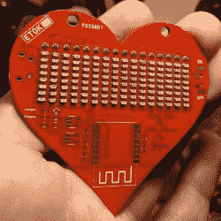

# 艰难地建立徽章

> 原文：<https://hackaday.com/2018/05/01/building-badges-the-hard-way/>

一个黑客如何向他最亲爱的人表白他的爱？[Nitesh Kadyan]为他的女士打造了这款超赞的 LED 吊坠——[LED BLE 爱心项链徽章](https://hackaday.io/project/114144-led-ble-hearty-necklacebadge)。

以今天的黑客标准来看，硬件相当普通。ATMega328p 承担了大部分繁重的工作。HM-11 BLE 模块提供了与 Android 移动应用程序的连接。两个 74HC595 移位寄存器驱动 16 列红色 led，一个 ULN2803 从 8 行吸收电流。电源部分包括 320mAh LiPo 的充电器和 BLE 模块的 LDO。所有器件均为 SMD，无源器件大多为 0603，包括 128 个 led。

128 LEDs soldered wrong way around

[Nitesh]没有为他的第一批电路板制作模板，所以所有的部件都是手工精心焊接的，而不是在回流炉中。在他的第一块电路板上，他把所有的 LED 都焊反了。他的顽强和耐心值得称赞。

ATmega 上的 Arduino 代码也非常简单。所有字符都以 8 个字节存储在程序存储器中，在矩阵上占据 8×8 个像素。要显示的字节存储在一个缓冲区中，各列左移的速度足够快，以实现字幕文本效果。Android 应用程序是通过修改谷歌提供的演示 BLE 应用程序构建的。固件、Android 应用程序和 KiCAD 设计文件都存放在他的 [Github 仓库](https://github.com/niteshkadyan/Hearty-LED-Necklace-Badge)中。

[Nitesh]现在正在制造更大一批这样的徽章，将它们带到一年一度的喜马拉雅山黑客大会上。定于本月晚些时候，你必须在[邮件列表](https://hillhacks.in/mailinglist/)上注册了解详情，如果你想获得这些徽章中的一个。为了让它更有趣，[Nitesh]在代码中添加了两个游戏——俄罗斯方块和蛇。希望这能激励其他人为徽章创造更多的游戏，比如 Pong。

 [https://www.youtube.com/embed/VLKV05fRfPU?version=3&rel=1&showsearch=0&showinfo=1&iv_load_policy=1&fs=1&hl=en-US&autohide=2&wmode=transparent](https://www.youtube.com/embed/VLKV05fRfPU?version=3&rel=1&showsearch=0&showinfo=1&iv_load_policy=1&fs=1&hl=en-US&autohide=2&wmode=transparent)

The [HackadayPrize2018](https://hackaday.io/prize) is Sponsored by:     