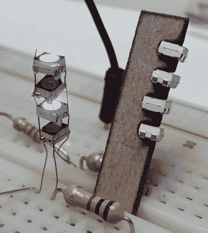

# 打造世界上最小的 RGB LED 立方体

> 原文：<https://hackaday.com/2016/02/05/building-the-worlds-smallest-rgb-led-cube/>

最小的 RGB LED 立方体是什么？一个 1x1 的立方体很简单，但这是一个愚蠢的笑话，我们以前听过。不，要建造最小的 LED 立方体，你必须将 64 个 RGB LEDs 塞进一立方英寸，[就像[Hari]用他的微型 LED 立方体做的那样](https://www.youtube.com/watch?v=ywCWjVl3m2g)。

A single column of Charlieplexed LEDs. Note the resistor for scale.

有人可能会认为单独可寻址的 RGB LEDs 是这么小的 LED 立方体的最佳选择。其他任何东西都会把发光二极管藏在一堆电线后面。这与[Hari]的 LED 立方体不同——他使用标准的表面贴装 RGB LEDs。但是他是怎么把这些联系起来的呢？

整个建筑的灵感来自一个更早的项目，查理立方体。这个 LED 立方体，就像[Hari]的一样，使用 Charlieplexing 将一列 LED 的所有连接浓缩到只有四条线。重复 16 次，然后[哈里]为自己建造了一个微小的、一英寸见方的 glowey goodness。

立方体本身是用在奥什帕克的 Eagle and fabbed 设计的 PCB 背板建造的。led 由 Arduino Nano 驱动。如果你想建造自己的，或者你是死虫焊接的受虐狂，你可以在[Hari]的 [hackaday.io 项目页面](https://hackaday.io/project/8560-the-worlds-tiniest-4x4x4-rgb-led-cube)上找到所有的设计文件。

 [https://www.youtube.com/embed/ywCWjVl3m2g?version=3&rel=1&showsearch=0&showinfo=1&iv_load_policy=1&fs=1&hl=en-US&autohide=2&wmode=transparent](https://www.youtube.com/embed/ywCWjVl3m2g?version=3&rel=1&showsearch=0&showinfo=1&iv_load_policy=1&fs=1&hl=en-US&autohide=2&wmode=transparent)

