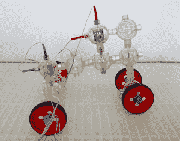
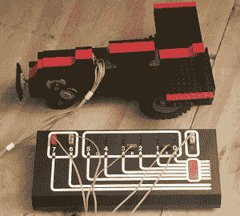

# 以 20 世纪 80 年代的方式构建你的机器人

> 原文：<https://hackaday.com/2016/11/25/building-your-bots-the-1980s-way/>

今天，有许多套件可供那些希望尝试生产简单的计算机控制机器人的爱好者使用。伺服系统和激光切割丙烯酸树脂的小混合物，Arduino，Raspberry Pi 或 Beaglebone 等板可以很容易地安装到其上。

然而在 20 世纪 80 年代，这个市场还没有得到充分的服务。当时许多 8 位机器的巨大尺寸意味着它们不能被集成到你的机器人中，并且与它们的接口比现代对应的易于使用的 GPIOs 更具挑战性。那时，对于建造者来说，小型机器人的机械硬件并不是容易和廉价包装的东西，这使得建造一个物理机器人平台本身成为一项重要的任务。

[Jeffery Brace]和[Evan Koblentz]为 IEEE Spectrum 撰写了他们在 10 月份纽约世界创客大会上的工作，[只用 20 世纪 80 年代可用的组件和计算机制作了一对小型机器人](http://spectrum.ieee.org/robotics/diy/building-8bit-bots)。

Charlie the robot

[Charlie]是一个基于 [Capsela 构造系统](https://en.wikipedia.org/wiki/Capsela)的机器人，这是一个由包含不同功能的轴、齿轮和电机的互锁塑料球组成的玩具。Capsella 有一个[机器人车间套件](https://en.wikipedia.org/wiki/The_Robotic_Workshop)，它具有 Commodore 64 接口，通过这种方式控制[查理]的三个电机。它包括一个 ROM，用额外的命令扩展 Commodore BASIC，使机器人易于控制。

Artie the robot, with Dacta box in foreground

与此同时，[Artie]是一个乐高机器人，使用了 [Dacta TC 标志](http://brickset.com/sets/952-2/TC-logo-Activity-Book-Box-Set)，这是一个面向教育市场销售的套件，当时可用于 PC 和 Apple II 的接口。他们有一个 Dacta 控制盒，但没有 Apple II 卡，所以不得不用原型卡上的功能复制品来凑合。顾名思义，这是用 Logo 编程的，并附带了适当的解释软件。

据报道，这两款机器人首先在工作方面取得了成功，然后展示了 20 世纪 80 年代的技术，并为博览会的游客提供了娱乐和参与。

这些年来，我们已经报道了许多乐高机器人，搜索我们的网站将会证实这一点。但这只是我们第二次展示 Capsela 项目，第一次是【2011 年的 Arduino rover】。[Mike]沉思着为什么我们不能更经常地看到 Capsela，今天同样的情绪也是真实的。你有没有一套可以用来做机器人项目的 Capsela 设备？

Via [黑客新闻](https://news.ycombinator.com/item?id=13019090)。