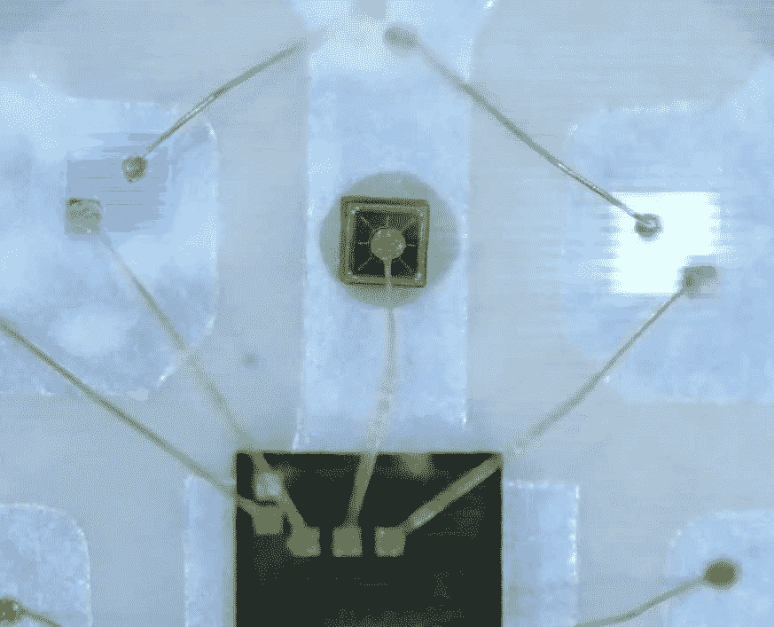
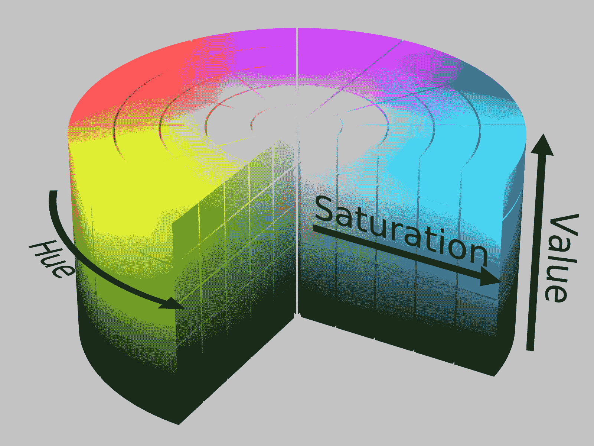
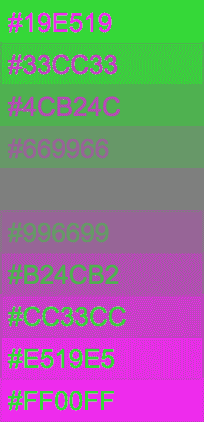
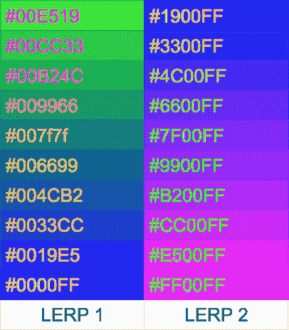
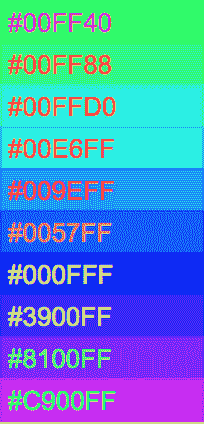

# 光滑的黄油随着单纯疱疹病毒的力量而褪色

> 原文：<https://hackaday.com/2018/06/18/buttery-smooth-fades-with-the-power-of-hsv/>

在固件领域，我们通常用 RGB 来表示颜色。这是一个直观的令人愉快的颜色理论和了解多色发光二极管如何工作的小背景。我们使用的大多数彩色发光二极管实际上不是一个二极管。它们是红色、绿色和蓝色的二极管，紧紧地挤在一起。(虽然有趣的是，非常高端的 led 使用的颜色甚至比这更多，但这是另一篇文章的主题。)当这三种光同时亮起时，发出的光会汇聚成你大脑能感知的单一颜色。适当地，没有板载控制器的 RGB LED 的示意符号通常一起描绘三个分立的 LED。因此，很清楚为什么在代码中将 RGB LED 表示为三个单独的值{R，G，B}是有意义的。但是将固件中的颜色表示绑定到物理系统中，我们会意外地限制自己。

The inside of an RGB LED

上次我们谈到色彩空间，我们了解了在空间上表现色彩的不同方式。关键的见解是，这些被称为色彩空间的模型可以用来使用不同的值组来表示相同的颜色。事实上，分组值本身可以用来描述多维空间坐标。但是那篇文章没有重点。"*如果你能在一个圆筒里表现颜色，那又怎么样*！"我听到你哭泣。“我为什么要在乎？”事实证明，使用 colorspace 可以简化一些常见的固件任务。继续学习吧！

Our friend the HSV Cylinder by [SharkD]

在这篇文章的其余部分，我们将在 [HSV 色彩空间](https://en.wikipedia.org/wiki/HSL_and_HSV)中工作。HSV 将单一颜色表示为色调、饱和度和值的组合。色调以旋转的度数(0 -359)来度量，并设置颜色。饱和度设置颜色的*强度*；移除饱和度会移向白色，而增加饱和度会移向设定的色调。而 value 设置有多少*明度*；值为 0 是黑色，而最大值是最亮最强烈的颜色。这在文字上描述起来有点困难，但是看看左边的插图就明白我的意思了。

所以回到“我为什么在乎？”使用 HSV 可以很容易地制作出最平滑的恒定亮度颜色淡入淡出效果。琐碎。想知道怎么做？增加你的色调。就是这样。只需增加色调，HSV -> RGB 数学会处理剩下的部分。如果你想淡入黑色，调整你的饱和度。如果你想感受真正的恒定亮度或从 led 获得更好的动态范围，[这是另一个话题](https://hackaday.com/2016/08/23/rgb-leds-how-to-master-gamma-and-hue-for-perfect-brightness/)。但是要创建一个简单的颜色渐变，你只需要 HSV 和一个变量。

## 避免奇怪的褪色

A linear interpolation from green to pink

“但是 RGB 掉色容易啊！”你说。"我所需要做的就是淡化 R、G 和 B，然后就成功了！"实际上，它们并不像看起来那么简单。RGB 颜色之间淡入淡出的最简单的方法就是上面描述的线性插值(LERP)。取你的开始和结束颜色，计算每个通道的差异，将这些差异分割成你希望动画持续的尽可能多的帧，然后完成。在每一帧增加或减少适当的切片和你的颜色变化。但是让我们回想一下颜色立方体。通常像这样简单的 LERP 会工作得很好，但是根据开始和结束点的不同，你可能会在褪色的中间得到相当暗淡的颜色。看看亮绿色和热粉色之间的线性褪色。中间是…灰色。灰色！？

那么是什么导致这些奇怪的颜色出现的呢？回想一下 RGB 立方体。通过同时调整红色、绿色和蓝色，我们在空间中的两点之间穿越立方体内部的空间。在绿色/粉色渐变的例子中，插值直接带我们穿过灰色所在的立方体的中心。如果立方体中的每一个点都代表红色、绿色和蓝色的独特混合，那么我们将得到每一种颜色。有些空间的颜色你可能不想在你的 40 米灯带上显示出来。在那个立方体的某个地方是暗褐色的 T2。

但这是可以避免的！你所要做的就是智能地遍历色彩空间。在 RGB 中，这可能意味着一次调整一个或两个通道，并试图避免穿过立方体中部的荒地。对于样品从绿色到粉色的褪色，我们可以将其分成两部分；从绿色到蓝色的渐变，然后从蓝色到粉红色的渐变。看看右边分开的 LERP，看看它看起来怎么样。不算太坏，对吧？至少不再有灰色了。但这是一个相当复杂的方式让一个无聊的褪色工作。幸运的是，我们已经知道更好的方法。

A LERP in HSV

这种褪色在 HSV 里看起来怎么样？只有一个通道可以插值——色调。如果我们将两个样本 RGB 值转换成 HSV，我们在{120，100%，100%}开始时得到亮绿色，在{300，100%，100%}结束时得到粉红色。我们要在它们之间加减吗？这实际上并不重要，尽管通常您可能希望尽可能快地进行插值(在这种情况下，您希望遍历最短的距离)。值得注意的是，0 和 359 是相邻的，因此溢出或下溢度数计数器以行进最短的绝对距离是安全的。在绿色/粉色的情况下，从 120 向上计数到 300 和从 120 向下计数到 300(通过 0)一样快。假设我们向上数，它看起来像左边的数字。不错吧。那些柔和的灰色被活泼的蓝色所取代。

像这样使用 HSV 还有其他一些好的副作用。一个是，只要你不在乎改变亮度，有些动画可以非常节省内存。每个像素只需要一个字节！虽然这确实会阻止你显示黑白，所以你需要一个或两个额外的字节(不是每个色彩空间都是完美的)。改变单个参数也使得试验[非线性缓和](https://easings.net/)来调整如何接近颜色设定点变得容易，这可以产生一些好的效果。

如果你想尝试 HSV，[这里有几个我过去用过的文件](https://gist.github.com/borgel/d9a8bc11aeb5e0005d8320026c46f6f7)。不保证效率或准确性，但我已经建立了数百个设备使用它们，事情似乎工作正常。

这里还有一个补充，那就是颜色是一个非常复杂的话题。这篇文章仅仅是对色彩理论的一个最简单的探讨，并没有解决关于伽玛/CIE 校正、个别颜色的表观亮度等一系列问题。这是我需要改进我的 RGB 闪光灯，而不是发明一个新的潘通。如果精确的颜色对你来说是一个有趣的话题，深入挖掘并告诉我们你学到了什么！