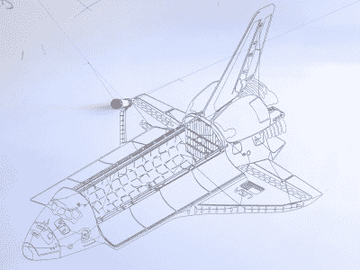
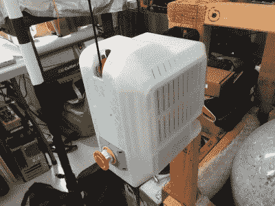

# 有线电视机器人，站起来！宇宙的主宰就在眼前

> 原文：<https://hackaday.com/2017/10/20/cable-bots-arise-domination-of-the-universe-is-at-hand/>

人们看到的大多数数控机器人包括皮带和导轨、龙门架、丝杠、直线轴承等等。这些组件需要一个刚性的底盘来支撑它们，防止它们在制造过程中晃动，增加设计的不完美性。因此，规模必然很小——业余爱好者的机器人大多只有橱柜大小。它们的刚性轴通常是直角坐标。

这种常见配置的一个例外是 delta 机器人。Deltas 可能是最炫的 CNC 机器人，它移动三个臂上的末端效应器，这三个臂移动到构建包络中的任何位置。很多这样的机器人在承担轻负载时都非常快速和精确，它们被用作取放机器之类的东西。delta 机器人也是并联机器人，这并没有什么坏处，这意味着电机一起工作来移动末端执行器，一个电机拉动，而匹配的电机拉动。

但是，虽然笛卡尔数控机器人是坚固的工作母机，而德尔塔是飞重的赛马，当你想去巨大的时候，两者都不能真正削减它。就简单性和规模而言，没有什么能打败有线机器人。

## 有线机器人

电缆机器人使用由卷轴安装的电机拉动的电线或绳子，其尺寸仅受安装电机的空间和所用电缆的抗拉强度的限制。当琴弦绷紧时，你可以获得惊人的精确度。为什么不呢？它们不是电脑控制的马达吗？只要您的运动链通过解开另一根电缆(例如)来说明末端效应器在一个方向上的运动，您就可以在很宽的范围内非常精确地控制末端效应器。

以下是一些有趣的有线电视机器人，它们引起了我的注意。

### Skycam

 忘记仅仅是房间大小— [Skycam](https://en.wikipedia.org/wiki/Skycam) 是体育场大小有线电视机器人的品牌领导者。如果你看过任何一场 NFL 比赛，你都会看到摄像机机器人在头顶上呼啸而过，通过安装在万向架上的摄像机跟踪特写镜头。

每个卷轴都由自己的计算机控制，两个操作员的控制装置围绕着一个 Linux 盒子。600 磅的电缆是凯夫拉尔护套光纤和铜，除了移动相机模块(“梁”)外，这些电线还传输电力和数据。3.4 千瓦的电机配备了编码器，确保 1/100 英寸的分辨率。

如果有什么能告诉你有线电视机器人的规模疯狂扩大，那应该是 Skycam。下一步是什么？城市大小的有线电视机器人？世界尺寸的数控？

### 特拉梅尔·哈德森极谱仪

 另一种极端的方式是两步绘图机器人，有时被称为 polargraphs 或悬挂式 v 绘图仪。它们由一对带卷轴的步进电机组成，卷轴控制着垂下的绳子，底部有一个装有笔的模块。重力提供了张力，使得极谱仪能够做出惊人精确的线条。

尽管 Trammel 的结果很好，但它实际上是一个非常简单的装备；该项目使用 TinyG CNC 控制器，在 NYC 电阻器处有两个随机步进器。polargraph 的工具架可以用比用活页夹连接伺服系统的 sharpie 更复杂的工具来制作——伺服系统的喇叭简单地推回工作表面并将笔从其上提起。然而，他甚至做得更简单，他的工具只是一个 3D 打印的干擦记号笔套筒——没有提升机构，所以图纸总是包括钢笔移动过的杂散线。查看 Trammell 的网站，关注 [Polargraph 项目](https://trmm.net/Polargraph)，以及 [Flickr](https://www.flickr.com/photos/osr/sets/72157663504344334) 和 [GitHub](https://github.com/osresearch/polargraph) 上的资产。

本帖中的图片由 hack aday regular[Trammell Hudson]创作。他的简化 polargraph 使用 3D 打印的笔杆，没有升降机构——g 代码只是要求笔从一点画到下一点，即使这会导致杂散线。[Trammell]已经探索使用他的 drawbot 制作数学建模图案，如空间填充 [Gosper](https://en.wikipedia.org/wiki/Gosper_curve) 和[希尔伯特曲线](https://en.wikipedia.org/wiki/Hilbert_curve)，可视化[洛伦兹吸引子](https://en.wikipedia.org/wiki/Lorenz_system)，甚至[绘制正弦波](https://www.flickr.com/photos/osr/25704864994/in/album-72157663504344334/)。我最喜欢的是墙壁大小的[巴黎地图](https://www.flickr.com/photos/osr/35097876840/in/album-72157663504344334/)。

尽管[Trammel]的成果很大，但它相当简单；该项目使用 TinyG CNC 控制器，在 NYC 电阻器处有两个随机步进器。事实上，极化图可以非常简单。它的工具架可以用比用活页夹将伺服系统连接到它上面更复杂的工具来制作——伺服系统的喇叭简单地推回工作表面，并将笔从它上面提起。查看[Trammell]的网站，关注 [Polargraph 项目](https://trmm.net/Polargraph)，以及 [Flickr](https://www.flickr.com/photos/osr/sets/72157663504344334) 和 [GitHub](https://github.com/osresearch/polargraph) 上的资产。

### Scanlime 的 Tuco 传单

 【弥迦伊丽莎白斯科特】的猫【屠库】，显然需要自己的机器人来保持一个镜头聚焦在他的猫科荣耀上。这是一个叫 Tuco Flyer 的绞盘机器人。

[Micah]在 YouTube 上的视频集中展示了她在机械和电子工程方面的专业知识，加上许多小照片，所以一个 3D 打印的电缆机器人飞行摄影装置正是合适的选择。

这个项目包括很多很棒的细节，比如她翻新的相机万向架和从头开始的绞盘，其中一个可以在右边看到。在许多情况下，她将电子产品储存在基础设施内，从而打造出一个非常优雅的建筑。

这个项目看起来并没有处于“空中移动阶段”,所以请在 [Hackaday.io](https://hackaday.io/project/25939-tuco-flyer) 上关注这个项目，以跟上最新的发展。

### 对抗重力的并联机器人

几天前，我们提到了另一项正在进行的工作，arcus 3D T1，这是一台 3D 打印机，它使用张紧的电缆来移动工具架，与 polargraph 的工作方式非常相似，但却是三维的。基于[飞行的 SkyDelta](http://reprap.org/wiki/TriDPrinting.com_Flying_SkyDelta) reprap 模型，[达人]的打印机使用步进驱动电缆来移动工具架。

工具架由于一个“超重力杆”而保持低水平，这是一个一码长的钢杆固定它；否则它会徒劳地四处飞。这突出了一个事实，即重力作为张力元件是使电缆机器人如此简单的一部分——否则你需要更多的电缆在末端执行器上拉*下来*。

但是如果你这样做了会发生什么呢？我还没有见过很多业余爱好者级别的项目涉及 6 电机电缆机器人，但有一些商业产品，它们非常简单，难以置信的快，而且非常精确。我想通过分享一个疯狂的有线电视机器人项目，CableEndy，来结束这篇文章。这是[Andrej Rajnoha]在布尔诺理工学院的硕士论文，它包含了一些非常疯狂的规格——仅举几个例子，它将工具架加速到 10 G，精度为 1 mm。

 [https://www.youtube.com/embed/sytyQvUXN8Q?version=3&rel=1&showsearch=0&showinfo=1&iv_load_policy=1&fs=1&hl=en-US&autohide=2&wmode=transparent](https://www.youtube.com/embed/sytyQvUXN8Q?version=3&rel=1&showsearch=0&showinfo=1&iv_load_policy=1&fs=1&hl=en-US&autohide=2&wmode=transparent)

【SkyCam photo by [Despeaux](https://en.wikipedia.org/wiki/Skycam#/media/File:Skycam_Husky_Stadium.jpg) ，CC BY-SA 3.0。特拉梅尔哈德森的照片使用许可。]

朋友们，在评论里分享你们喜欢的有线机器人 pr0n 和项目吧。