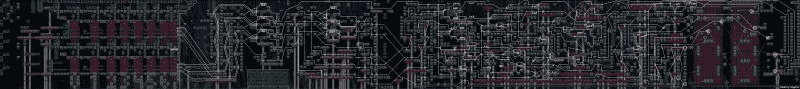

# 超级马里奥关卡内置计算器。妈妈咪呀！

> 原文：<https://hackaday.com/2016/02/10/calculator-built-in-super-mario-level-mamma-mia/>

大多数人使用超级马里奥制作工具来制作超级马里奥游戏关卡。[Robin T]决定尝试一些不同的东西:[建造一个工作计算器](https://www.reddit.com/r/MarioMaker/comments/44b7cd/a_3bit_binary_adding_machine_with_decimal/?sort=new)。几百个小时后，他创造了杂乱混沌计算器，绝对名副其实。这个[超级马里奥关卡](https://supermariomakerbookmark.nintendo.net/courses/705C-0000-01B3-FE78)包含的是一个 3 位数字计算机，它可以将 0 和 7 之间的两个数字相加，所有这些都是由游戏提供的各个部分构建而成的。为了使用它，玩家通过在网格中跳跃输入两个数字，然后他们坐下来，享受马里奥被带到这个过程的过程，直到它最终在一个片段显示中吐出答案。

它不会赢得任何超级计算机奖，因为把两个数字相加需要大约两分钟。但它仍然是一个令人难以置信的令人印象深刻的构建，并显示了一个专门的黑客可以用一些简单的工具和一两个多刺的外壳做什么。

 [https://www.youtube.com/embed/rCTGXUNg2fE?version=3&rel=1&showsearch=0&showinfo=1&iv_load_policy=1&fs=1&hl=en-US&autohide=2&wmode=transparent](https://www.youtube.com/embed/rCTGXUNg2fE?version=3&rel=1&showsearch=0&showinfo=1&iv_load_policy=1&fs=1&hl=en-US&autohide=2&wmode=transparent)

[Robin]在一篇长长的 Reddit 帖子中解释了整个奇妙的创造，详细介绍了他如何使用各种蘑菇和弹跳部件来创建一个二进制转换器、四个加法器、一个整数除法器和一个输出答案的段显示和解码器。他还整理了一个解释逻辑流程的巨大图表(点击查看大图，但要小心；大约 6000 像素宽)。

他还涵盖了他发现的一些问题，例如由于游戏创作者的限制，他只能做 3 位，以及他如何调试这个怪物(剧透:他实现了检查点，以便他可以触发它的一部分，而不必等待每个测试)。

感谢[euqinimod]的提示！