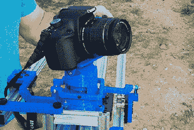

# 摄像机滑动装置以机械方式平移和倾斜摄像机

> 原文：<https://hackaday.com/2017/07/05/camera-slide-pans-and-tilts-camera-mechanically/>

相机滑块是一个流行而简单的项目——只是一个线性滑块、一个步进器和某种控制器。添加倾斜和平移轴增加了复杂性，直到你有三个电机，一个控制器，可能还有一个相当强大的电池组来运行一切。为什么不用一个完全机械的云台相机滑块来简化，把那些笨重的东西留在家里呢？

 对运动控制进行编程的方式不止一种，【Enza3D】的设计使用可调节轨道通过两个运动轴来移动装有万向支架的云台。一个轨道垂直调节以控制倾斜，而另一个轨道相对于滑块向内和向外调节以控制平移。手臂骑在每个轨道上，并连接到万向节，以在两个维度上旋转相机，同时它沿着手动曲柄滑动。它非常聪明，拍出了一些干净、动态的照片，如下图所示。

我们的诡辩是，“程序”只是线性的，因为控制轨道是铝挤压的直线长度；在我们看来，某种灵活的控制轨道可能会使拍摄更有趣。[Enza3D]已经[充分记录了版本](https://docs.google.com/document/d/16V7NBwEH660oej-jE6OhFLKzCB_qXhbOIdcMPTIr4Jc/edit)并正在寻求反馈，所以请发表评论。如果你没有 3D 打印机来制作零件，[伍德也可以为滑块](https://hackaday.com/2015/12/26/mostly-wood-motorized-camera-slider/)工作。

 [https://www.youtube.com/embed/XOEy9482jAQ?version=3&rel=1&showsearch=0&showinfo=1&iv_load_policy=1&fs=1&hl=en-US&autohide=2&wmode=transparent](https://www.youtube.com/embed/XOEy9482jAQ?version=3&rel=1&showsearch=0&showinfo=1&iv_load_policy=1&fs=1&hl=en-US&autohide=2&wmode=transparent)

谢谢你的提示，西蒙。