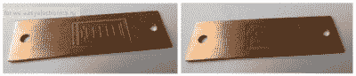

# 你能从头开始建立一个电子墨水显示器吗？

> 原文：<https://hackaday.com/2017/04/12/can-you-build-an-e-ink-display-from-scratch/>

现代展示是迷人的小东西。特别是，现代电子书中采用的 E-Ink 显示器实现了令人着迷的纸张般的对比度和出色的待机功耗。我们中的许多人都曾尝试过 DIY 展示，但却被其中的微型比例所阻碍。驾驶它们已经够难了，但是建造自己的？

[MChel]在构建一个简单的 E-Ink 显示器方面取得了巨大的成功。这个俄罗斯电子论坛上的报道，由谷歌翻译为我们翻译[，概述了在你的家庭实验室中追求这一目标的最大障碍是创建导电层，作为每个像素的电极，并将带静电的墨水颗粒薄层沉积到另一个透明但导电的薄膜上。[MChel]解决方案是从一个破碎的、众所周知易碎的](https://translate.google.com/translate?sl=ru&tl=en&js=y&prev=_t&hl=en&ie=UTF-8&u=http%3A%2F%2Fwe.easyelectronics.ru%2FHomeTech%2Fizgotovlenie-segmentnogo-indikatora-na-elektronnyh-chernilah-v-kartinkah.html&edit-text=)[电子墨水显示器](https://en.wikipedia.org/wiki/E_Ink)中提取一小部分预先沉积的墨水。接下来，[麦克赫尔]没有试图构建一个雄心勃勃的密集电极网格，而是在 PCB 上蚀刻了一个简单的电池指示器。然后用一些 DIY 石墨基导电胶将墨水和电极融合在一起，并用一些仔细但巧妙的环氧树脂铺设技术密封。

The DIY electrodes

结果是工作电池指示器不消耗功率，同时报告任何剩余功率。

家庭酿酒技术越来越具有挑战性和值得称赞的一面，否则就会被认为局限于价值数百万美元的工厂。我们已经介绍过你应该如何着手[制造一些导电玻璃](https://hackaday.com/2017/03/20/diy-conductive-glass-you-could-actually-make/)并将其用于你的[自制液晶显示器](https://hackaday.com/2016/06/17/how-to-make-a-custom-lcd-from-scratch/)。