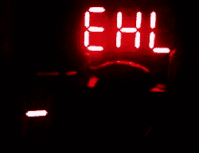

# 精心制作让 DIY 7 段显示器熠熠生辉

> 原文：<https://hackaday.com/2016/09/10/careful-crafting-makes-diy-7-segment-display-shine/>

[MattB]决定[自己动手制作几英寸高的 7 段显示屏](http://www.mjblythe.com/hacks/2016/06/diy-large-seven-segment-display/)，但他有一些特殊要求。他希望形状精确的元素尽可能干净、均匀地发光，没有明显的 led 照明点，也没有明显不均匀的边缘照明。为此，他使用手头的工具和材料，小心翼翼地手工制作每一段。结果和他的理想非常接近！

Two 3mm red LEDs per segment

每个数字都由相同但独立的手工片段组成。每一个都是一块被切成比发光区域稍大的拉长的六边形的丙烯酸。丙烯酸被打磨成磨砂效果，被照亮的区域被遮盖起来，然后在最后一层黑色涂层之前，用白色油漆涂上一层，以促进内部反射。为 led 钻两个孔，移除遮罩以露出照亮的区域，剩下的就是安装它了！

[MattB]遇到的一个问题是，他用于安装的接触水泥导致(廉价的)喷漆在许多部分的背面起泡，破坏了外观，并需要对受影响的部分进行返工。一种光亮的黑色油漆结合少量的接触水泥似乎已经达到了这个效果。这些漂亮模块的最终归宿是什么？他的滑雪球后箱看起来很棒，现在这些都在适当的位置！

有许多不同的 DIY 大型 7 段显示器项目，我们很少看到相同的方法两次。我们已经看到了由堆叠的侧光式丙烯酸面板制成的[透明显示器，使用](http://hackaday.com/2014/01/09/a-transparent-7-segment-display/)[led 封装成环氧树脂](http://hackaday.com/2013/12/03/fabricate-your-own-7-segment-displays/)作为显示段的显示器，甚至还有[端光胶棒](http://hackaday.com/2011/08/25/large-7-segment-display-made-from-glue/)用作显示段。