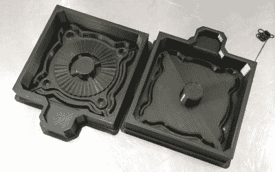

# 从 3D 打印中铸造金属零件和硅胶模具

> 原文：<https://hackaday.com/2018/02/25/casting-metal-parts-and-silicone-molds-from-3d-prints/>

价格相对低廉的家用 3D 打印机的发明，有助于让设计师更接近用于生产原型、样品甚至制造零件的方法。这篇关于如何从 3D 打印硅胶模具铸造金属零件的教程是一个完美的例子，说明当你在家里寻找定制和耐用的金属零件时，3D 打印机是多么有用。

 使用 Ultimaker 2[Matt Borgatti]3D 打印模具设计后，使用 Smooth-On Mold Star 15 铸造模具，该模具可以承受高达 450 华氏度(232 摄氏度)的热量，他指出这是低温金属铸造合金锡铋的理想选择，该合金由 58%的铋和 42%的锡组成，熔点为 281 华氏度

你以前可能听说过由 3D 打印部件创建的模具，但本教程的伟大之处在于作者[Matt Borgatti]真的为你设置了成功。他提供了大量的见解，包括模具制作技术和术语，比如当用金属铸造时，为什么你需要一个设计为模具一部分的井和流道。

你可以复制他的设计或者使用教程来创建自己的设计，这对于初学者来说是一个好的开始，对于已经有 3D 打印模具经验的人来说也是另一种存档的方法。这个帖子也真的是一举两得。你不仅可以获得该方法的详细说明，而且[马特·博尔加蒂]还将他的铸造金属部件用于他设计的[平板包装](https://www.thingiverse.com/thing:2266891) 相机臂 来记录项目，你也可以使用他在 Thingiverse 上找到的文件来构建这些项目。

要创建精密零件的模具，并了解更多关于在铸造过程中使用 3D 打印机作为工具的信息，请查看使用树脂打印机创建更高分辨率模具的方法。

 [https://www.youtube.com/embed/qqqVS_YyWzo?version=3&rel=1&showsearch=0&showinfo=1&iv_load_policy=1&fs=1&hl=en-US&autohide=2&wmode=transparent](https://www.youtube.com/embed/qqqVS_YyWzo?version=3&rel=1&showsearch=0&showinfo=1&iv_load_policy=1&fs=1&hl=en-US&autohide=2&wmode=transparent)

