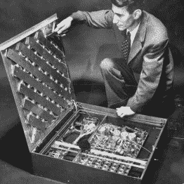

# 数学和电子工程先驱克劳德·e·香农百年诞辰

> 原文：<https://hackaday.com/2016/04/29/centennial-birthday-of-claude-e-shannon-the-math-and-ee-pioneer/>

明天是克劳德·e·香农博士诞生 100 周年。他在工程、通信和计算机科学领域做出了巨大贡献，但他并不是一个知名人物，甚至对该领域的人来说也是如此。然而，他的工作每天都触动我们很多次。将这篇文章发送到你的电脑或智能手机的网络是基于香农博士提出的重要理论而设计的。

香农在密歇根州出生和长大。他毕业于密歇根大学，获得了数学和电子工程学位。他继续在麻省理工学院(MIT)进行研究生学习，并获得了硕士和博士学位。第二次世界大战期间，他为贝尔实验室研究火控系统和密码学，1956 年，他回到麻省理工学院担任教授。

 香农的第一个有影响的贡献是他的硕士论文，该论文将[乔治·布尔](https://en.wikipedia.org/wiki/George_Boole)的布尔代数工作应用于开关电路(当时由继电器组成)。在他的工作之前，没有交换系统分析的正式基础，如电话网络或电梯控制系统。香农的论文发展了使用符号表示法来表示网络，并应用简化规则来优化系统。这些相同的规则后来被翻译成真空管和晶体管逻辑，帮助今天的计算机系统的发展。这篇论文——对继电器和开关电路 的符号分析——完成于 1937 年，随后于 1938 年发表在《美国电气工程师学会会刊*上。*

香农的博士工作延续了同样的思路，将数学应用到一个新的领域，这次是遗传学。他的顾问万尼瓦尔·布什评论说，“我突然想到，正如一种特殊的代数在他的手中很好地处理了接力理论一样，另一种特殊的代数可能会处理孟德尔遗传的某些方面”。香农的工作又一次是革命性的，为群体遗传学提供了数学基础。不幸的是，这比当时的遗传学家更进了一步。尽管随着时间的推移，人们对他的兴趣有所增加，但他的作品却日渐式微。

香农最著名的工作是 1948 年在贝尔实验室工作时发表的一篇文章一种交流的数学理论。我们之前在 Hackaday 上写过这项工作，因为它对我们的许多活动都非常重要。香农工作的第一个方面决定了在一个通信信道上可以传输多少信息、多少比特的理论极限。第二个方面是如何使用纠错码来接近这个极限。电话电路、无线电通信、磁盘读取头数据传输和互联网都受到香农工作的影响。

我要提到的最后一个贡献是[奈奎斯特-香农采样定理](https://en.wikipedia.org/wiki/Nyquist%E2%80%93Shannon_sampling_theorem)。这一点很重要，因为它规定了如何对模拟信号进行采样，以便在不产生混叠的情况下准确再现该信号。如果您使用 Arduino 对 1，000 Hz 的信号进行采样，则样本必须至少是信号速率的两倍，在本例中为 2，000 Hz。当感兴趣的信号不是基于零频率时，该定理给出了一个有趣的结论。例如，100-102 MHz 的 FM 无线电信号可以以 4 Mhz(间隔频率的两倍)采样，以提取 4 Mhz 带宽信号用于解码。

## 黑客

除了他更多的学术成就，Shannon 还在其他领域进行修补或破解。有一点令人困惑的是，到底是他还是人工智能大师马文·明斯基创造了我们现在所说的“无用机器”，但香农称之为“终极机器”。很明显，Shannon 创造了一个可以自动关机的完美版本。

      

Shannon 还造了一只解迷宫的老鼠。同样，构建和概念一样完美。像今天的[老鼠竞赛](https://en.wikipedia.org/wiki/Micromouse)一样，Shannon 的老鼠会在迷宫中学习图案。然后，它可以被放置在迷宫的任何地方，并找到它的终点。老鼠被移动的磁铁从迷宫的“地板”下面驱赶出来。与他的硕士论文相适应的是，计算机制是一大堆继电器。老鼠忒修斯在它出生的那一天受到了新闻界的关注[。](http://cyberneticzoo.com/wp-content/uploads/2010/04/Shannon-Maze-PopSci_Mar19521.pdf)

 [https://www.youtube.com/embed/vPKkXibQXGA?version=3&rel=1&showsearch=0&showinfo=1&iv_load_policy=1&fs=1&hl=en-US&autohide=2&wmode=transparent](https://www.youtube.com/embed/vPKkXibQXGA?version=3&rel=1&showsearch=0&showinfo=1&iv_load_policy=1&fs=1&hl=en-US&autohide=2&wmode=transparent)

国际象棋和杂耍是香农最喜欢的活动，所以他将自己的天才用于创造机器版本。他创造了一个会玩杂耍的机器人和一个基于接力赛的棋手。他对自动化棋手的分析是最先解决这个问题的方法之一。

香农在晚年与阿尔茨海默氏病作斗争，并于 2001 年去世。不幸的是，他没能活着看到或理解他的所有成就——尤其是他的工作的影响是如何随着信息时代的诞生而放大的。