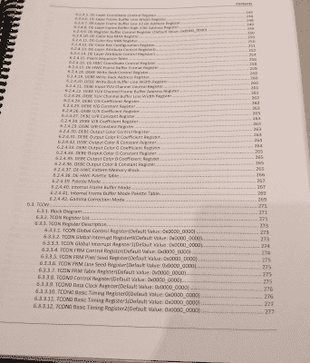
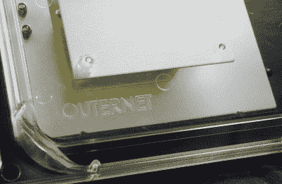
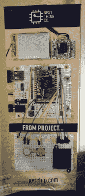
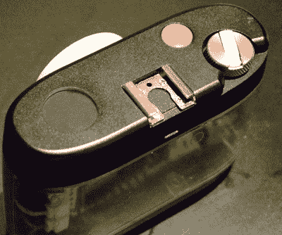

# CES2017:完整的注册文件。

> 原文：<https://hackaday.com/2017/01/08/ces2017-complete-register-documentation-for-the-c-h-i-p/>

去年 10 月，广受欢迎的 C.H.I.P .平台[的制造商 Next Thing Co .发布了 C.H.I.P. Pro](http://hackaday.com/2016/10/12/nextthingco-introduces-c-h-i-p-pro-gr8-system-on-module/) ，这是一个非常强大的小型 Linux 系统。C.H.I.P. Pro 的目标是成为一个项目或产品的大脑，类似于早在树莓派出现之前的远古时代的 Gumstix 板。

与 C.H.I.P. Pro 一起推出的是一个奇妙的小装置。GR8 模块是一个完整的片上 Linux 系统，具有 ARM Cortex-A8 处理器和 256 MB RAM，所有这些都在一个相对较小的 BGA 芯片上。这是一个嵌入式部件，它给任何硬件都提供了一个 Linux 大脑。

在发布 C.H.I.P. Pro 和 GR8 模块时有数据表，但数据表只能到此为止。在一个模块上使用 Linux 系统，你真正需要的是一本大部头的书，里面充满了对寄存器和所有硬件细节的描述。在本周的 CES 上，Next Thing Co .带来了所有人都一直在要求的东西:他们在 GR8 模块上使用的核心的无 NDA 的完整注册文档。这是 400 页的螺旋装订的善良，将告诉你如何用这个芯片做任何事情。

The GR8 datasheet and register documentation

A selection from the table of contents

### 对产品使用 C.H.I.P

当 C.H.I.P .第一次发布的时候，人们很容易认为它是一个对树莓派的流行沾沾自喜的董事会。然而，Next Thing Co .并没有从 C.H.I.P .开始——他们从围绕 Raspberry Pi 计算模块构建的动画 gif 相机 [Otto](https://www.kickstarter.com/projects/1598272670/meet-otto-the-hackable-gif-camera) 开始。Otto 是成功的，但是计算模块有点贵，所以 Next Thing Co .将注意力转向构建旧 Gumstix 板的现代廉价版本。

C.H.I.P. Pro 和 GR8 是这项工作的巅峰之作，已经有几家公司将其用于生产。在 Next Thing Co. suite 上，他们展示了由 C.H.I.P. Pro 驱动的 Outernet 基站的新版本，以及无线、蓝牙、Airplay 和 Spotify 连接的转盘 [TRNTBL](https://trntbl.co/) 。

A new version of the Outernet base station will use the C.H.I.P. Pro

Trntbl is a wireless turntable, powered by the C.H.I.P. Pro

This is all you need to build Otto with the C.H.I.P. Pro

The Otto camera, redesigned to use the C.H.I.P. Pro

为了说明在产品中使用惠普 Pro 有多容易，Next Thing Co .的人移除了 Otto 的 Pi 驱动内部，并用惠普 Pro 取而代之。里面东西不多，只有电池、相机模块和一些零碎东西。这对于任何想要开发一款需要运行 Linux 的相对较快的芯片的产品的人来说都是一件好事，Next Thing Co .的东西让这变得很容易。