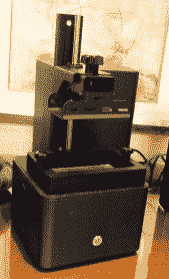
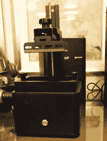
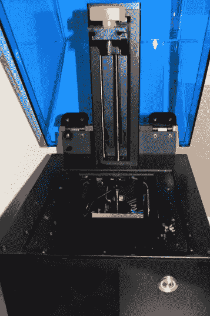
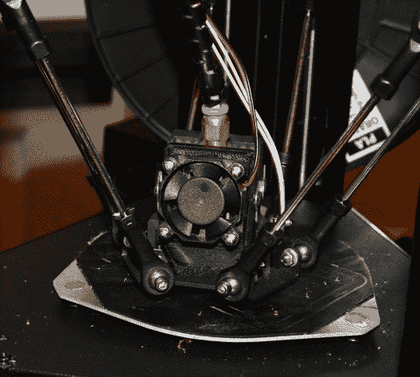
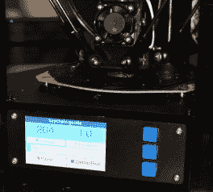
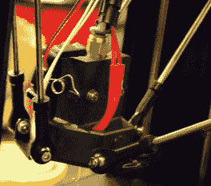
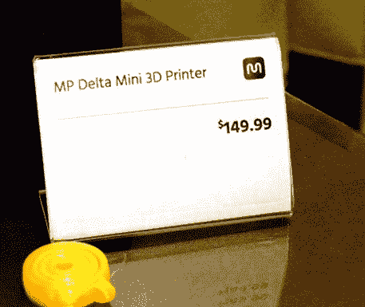
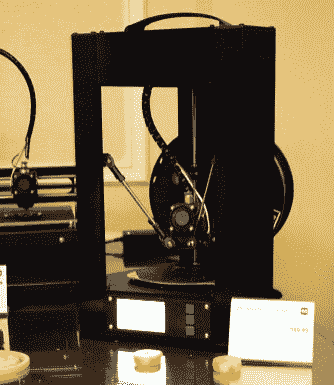

# CES2017: Monoprice 推出 3D 打印机扩展系列

> 原文：<https://hackaday.com/2017/01/07/ces2017-monoprice-unveils-expanded-line-of-3d-printers/>

在去年的 CES 上，Monoprice 推出了一款 200 美元的 3D 打印机。最初对这台打印机的期望一般。我的好奇心占了上风，去年夏天，我拿起其中一台打印机进行评测。[垄断价格的 MP Select Mini 实际上是非凡的](http://hackaday.com/2016/06/13/review-monoprice-mp-select-mini-3d-printer/)，而不仅仅是“价格非凡”。这台机器向世界展示了一台最便宜的打印机能有多好。未来看起来很棒。

你可能会认为垄断无法超越这台伟大的小机器的成功。你就错了。本周，Monoprice 宣布了一批新的和升级的打印机。有些是树脂。有些很大。一个售价 150 美元。

### 小 SLA

去年，Monoprice 宣布了一种小型的、特别便宜的树脂打印机。它从未发布过，而且有一个很好的理由:它运行得不是很好。Monoprice 回到绘图板，提出了一个全新的设计，使用一个微型 2k 显示器和 UV LEDs。样本打印质量令人难以置信，这台机器将与开放树脂，虽然买方将推出自己的廉价树脂线。微型 SLA 将于 4 月份推出，而且价格相对低廉。

        

### 大 SLA

Monoprice 的全称是“MP Maker Prism Professional SLA 树脂 3D 打印机”,是 Monoprice 对 Form 1 和其他专业级树脂打印机的回应。大型树脂打印机使用激光和电流计，而不是 DLP 或 LCD。它很大，具有巨大的构建量，将于下个月上市，价格约为 3500 美元。

    

### 专业细丝打印机

如果你现在跳到垄断价格，你会注意到他们真的有“好、更好、最好”的市场细分，三种打印机的价格分别为 200 美元、400 美元和 600 美元。巨大的 SLA 打印机表明他们已经准备好进入专业市场，对于细丝打印机，他们提供 MP 系列商用 3D 打印机(据工程师称，或 3Mill)。这是一台可以打印 400 毫米立方体的打印机，售价 800 美元。

### 便宜的那些

去年最突出的打印机是 MP Select Mini，在过去的几个月里，它进行了一些升级。这款 200 美元的打印机的下一个版本将支持 E3D hotend out of the box，改进的挤出机电机和驱动系统，更加封闭的细丝路径，更好的零件冷却，以及社区的许多其他改进。他们还把它涂成黑色。MP 精选迷你 V2 将于 4 月发布。

但是一台改进的 200 美元的打印机不是你来这里的原因，对吗？你是来买 150 美元的三角打印机的。是的，它在那里，它的工作，样本打印看起来很棒，我无法引起足够大的转移，以拆卸它在买方价格套件。

小三角洲使用 NEMA 17 发动机，似乎足够强大。电子设备是最初的 MP Select Mini(带 WiFi 的 32 位 ARM)附带的电路板的略微改进版本，打印机具有至少十几个点的自动调平功能。150 美元的打印机能有多好？我们将在四月份找到答案。

          

### 垄断价格在这里做什么

在过去一年左右的时间里，3D 打印社区已经认识到了买方垄断的能力，可以推出许多非常棒、非常昂贵的 3D 打印机。然而，抱怨者抱怨道，任何人都可以这样做，如果你只是给中国的打印机重新贴标，然后把它们的集装箱运到太平洋彼岸。这并没有恰当地反映出买方垄断在这里的实际行为。

我有机会与 Monoprice 负责 3D 打印机产品的家伙交谈。虽然这些机器是翻新的打印机，但它们不仅仅是从一家你从未听说过的中国公司购买打印机。是的，基本型号 200 美元的打印机看起来像一个 [Malyan M200](http://malyansys.com/en/?page_id=315) ，但控制板据称有一些自己的调整。

我认为，这就是 Monoprice 的整个商业模式:他们拿走已经在生产的东西，让制造商添加一些特殊的调整，然后把一个集装箱运到洛杉矶港口。以单一价格电缆为例，他们会找到一家电缆制造商，要求他们添加更好的应变消除或编织包裹，并购买一批电缆。因此，垄断价格成为挑选任何一种计算机电缆的最佳场所。

那是制造业吗？我认为是这样的，尽管把所有事情都一笔勾销非常容易。有些人实际上对 Monoprice 的 3D 打印略知一二，他们正在使用他们可用的工具和系统将一些优秀的打印机推向市场。