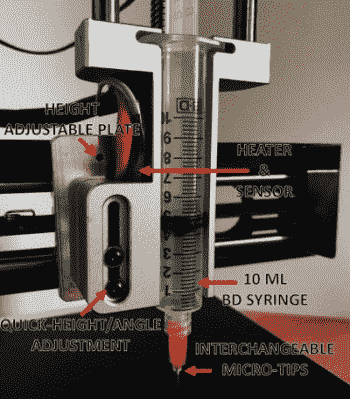

# 便宜的 3D 打印机制造更便宜的生物打印机

> 原文：<https://hackaday.com/2017/10/15/cheap-3d-printers-make-cheaperer-bioprinters/>

如果你错过了，3D 打印机的价格已经创下历史新低。硬件很大程度上是标准化的，软件几乎完全是开源的，所以最终有人会开始廉价淘汰这些东西是有道理的。现在有许多价格低于 300 美元的 3D 打印机，有些甚至低于 200 美元。实际上，这是这些机器能买到的最便宜的了。

一家名为 3D Cultures 的初创公司最近开始利用这些廉价的高精度三维运动平台的可用性，通过[采用现有的消费者 3D 打印机来提供他们的组织划线生物打印机](http://3dcultures.com/index.php/product/3d-bioprinter/)。有些人可能称之为欺骗，但我们看到了它的真实面目:成本和研发时间的巨大节约。既然别人已经为你设计好了，为什么还要自己设计运动学呢？

尽管 3D 文化试图通过在原始标志上贴标签来掩饰 C-3PO 的水平，但组织划线机的供体机器显然是一台 [Monoprice Select Mini，毫无疑问是初学者打印机之王](https://hackaday.com/2016/06/13/review-monoprice-mp-select-mini-3d-printer/)。当然，最大的变化来自挤出机和热端的移除，取而代之的是一种可以加热和按压标准注射器的装置。

在非常基础的层面上，生物打印的执行方式与普通的 3D 打印完全相同；这仅仅是材料的不同。虽然 3D 打印使用熔融塑料，但生物打印是用藻类或胶原蛋白等有机材料完成的。在 Tissue Scribe 中，传统的 3D 打印机 hotend 已经被装满要打印的有机材料的注射器所取代，该注射器由 NEMA 17 步进电机和 8 毫米丝杠缓慢推动。

曾经用来熔化塑料的加热元件和热敏电阻仍然在这里，但是现在用来加热用来固定注射器的金属框架。从理论上讲，这些改变只需要对固件校准做一些调整就可以了。坦率地说，这非常有意义，而且肯定比我们见过的早期自制生物打印机的尝试要容易得多。

我们不会对纸巾抄写员 999 美元的价格发表评论，除了说在生物打印机领域，这只是小钱。尽管如此，似乎不可避免的是，有人将建立和记录他们自己的螺栓生物挤出机，因为 3D 文化已经表明它是多么简单，所以他们可能会发现自己在不久的将来被削弱。

如果所有这些关于热挤压胶原蛋白的讨论让你感兴趣，[我们已经在](https://hackaday.com/2014/03/18/mrff-3d-bioprinting/)[新兴的生物打印领域](https://hackaday.com/2015/10/28/printing-soft-body-tissue/)看到了一些优秀的资源，这些资源可能会正合你的胃口。

 [https://www.youtube.com/embed/zAT9PWhQxs0?version=3&rel=1&showsearch=0&showinfo=1&iv_load_policy=1&fs=1&hl=en-US&autohide=2&wmode=transparent](https://www.youtube.com/embed/zAT9PWhQxs0?version=3&rel=1&showsearch=0&showinfo=1&iv_load_policy=1&fs=1&hl=en-US&autohide=2&wmode=transparent)

