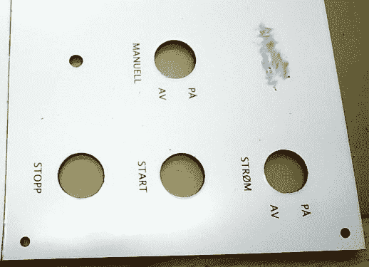

# 廉价的 Dibond 铝前面板

> 原文：<https://hackaday.com/2018/06/17/cheap-front-panels-with-dibond-aluminium/>

今天，个人黑客的生产能力真的是令人难以置信。即使是低端的激光雕刻机也可以蚀刻你的 PCB，而且不需要顶级的 3D 打印机就能做出好看的外壳。随着这些(相对)便宜的机器的广泛使用，房屋建筑商可以在相当微薄的预算下生产出令人印象深刻的一次性设备。即使是小批量生产也不是完全不可能。但对于一款专业外观的设备来说，还有一个令人沮丧的困难:一个好看的前面板。

 现在，如果你的激光足够强，可以雕刻(最好是切割)铝片，那么你已经基本上解决了这个问题。但对于我们这些拿着廉价进口二极管激光器的人来说，在一块金属上获取文本和图像可能相当棘手。[在 Hackaday.io 上，[oaox]展示了一种经济高效的方法，使用提供 Dibond 铝的打印服务为您的设备制作金属前面板](https://hackaday.io/project/156519-dibond-aluminium-front-panels)。这种复合材料由两层薄铝和实心聚乙烯芯组成，是专为标牌设计的。通过各种在线服务，你可以在一张预先切好的底胶纸上印上你想要的任何东西，而不用花很多钱。

正如[oaox]所解释的，第一步是使用像 Inkscape 这样的软件包将你要发送到打印机的图像组合在一起。关键是在你的软件中正确定义 Dibond 板的大小，并在这些范围内工作，否则一旦完成的部分回到你的手中，布局可能看起来不像你期望的那样。在将文件发送到生产环境时，避免 JPEG 等有损压缩格式也很重要，因为它会将文本变成一团乱麻。

当你拿回床单的时候，你需要做的就是在上面打孔。由于塑料核心，Dibond 很容易切割和钻孔，只要你花时间。[oaox]使用阶梯钻钻孔，较大的开口使用小型顶部锯。最终的结果看起来很棒，而且从全局来看，几乎不费吹灰之力。

但是要花多少钱呢？环顾网上，我们的报价低至 7 美元，做一个全彩色 4×4 英寸的 Dibond 面板，一个网站提供的 12×12 面板价格为 20 美元。对于一个小批量生产，你可以把几个图形拷贝放到一个更大的面板上，然后用带锯把它们切割下来；这可能会使单位价格降到只有几美元。

我们已经看到了一些专业外观前面板的巧妙尝试，从透明胶片上的[喷墨打印](https://hackaday.com/2014/04/08/designing-a-front-panel-for-a-diy-project/)到核选项和[激光切割薄胶合板](https://hackaday.com/2018/06/13/vcf-east-cactus-retro-because-it-wants-to-be/)。这是社区[多年来一直在努力解决的问题之一](https://hackaday.com/2009/08/19/etch-aluminum-control-panels/)，但至少看起来我们终于有了一些像样的选择。