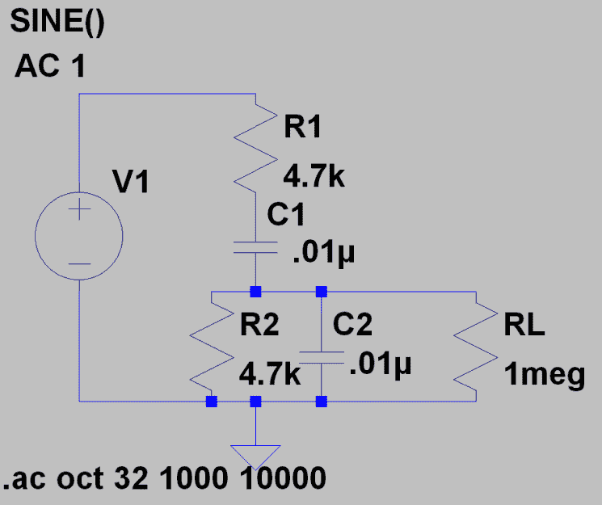
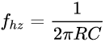
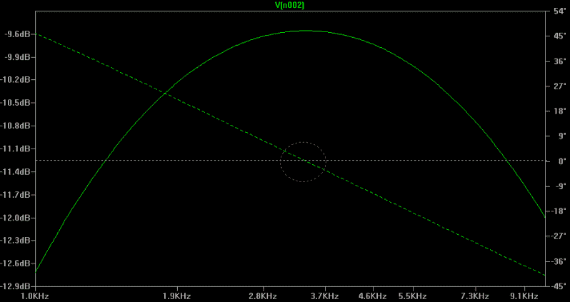
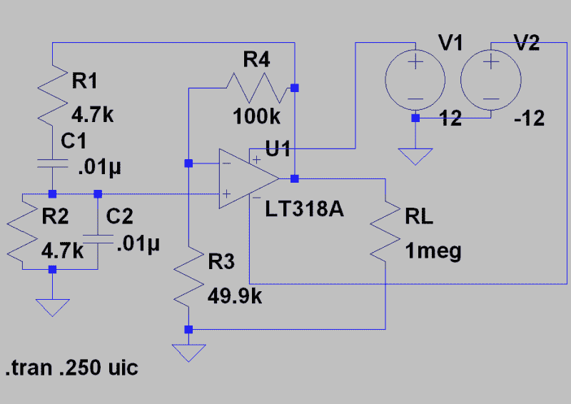
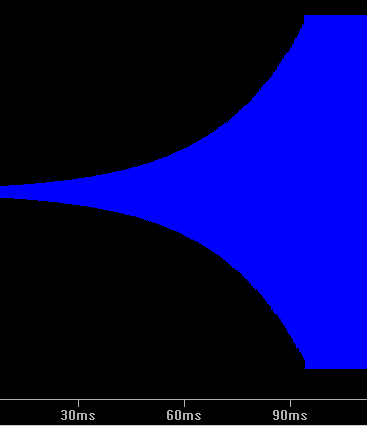
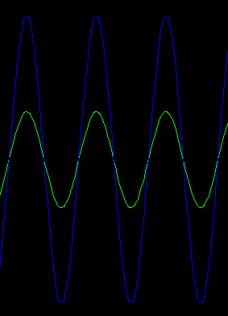

# 电路 VR:振荡电桥

> 原文：<https://hackaday.com/2018/04/27/circuit-vr-oscillating-bridges/>

在 Circuit VR 中，我们将讨论一个电路，并研究如何使用 LT Spice 进行仿真。这次我们来看看一种常见的低频振荡器，称为文氏电桥振荡器。

是什么使振荡器振荡？如果放大电路的输出信号反馈到其输入端的量相同，且同相，则电路将会振荡。这就是[巴克豪森判据](https://en.wikipedia.org/wiki/Barkhausen_stability_criterion)。在这里，我们将研究振荡器在仿真中的工作原理，并深入了解反馈过多和过少时会发生什么。

具体来说，我们来看看文氏电桥振荡器，这是一种非常简单的设计，起源于 1891 年，是一种测量阻抗的方法。现代版本增加了一些额外的特性，但是让我们从最简单的实现开始，一步步来。

## 基础

如果你考虑一下巴克豪森标准，很明显我们会在振荡器中间放一个放大器。有道理。如果没有放大，信号最终会消失。你可以把振荡器想象成一个放大器，以某一频率不断放大其输出——有点像电子永动机。当然，额外的能量来自放大器，所以没有物理定律被打破，只要有外部电源，它就会运行。

我们的电路将由一个放大器和一个滤波电路组成。与其他一些使用反相放大器的振荡器不同，文氏电桥使用同相放大器。将信号反相相当于增加 180 度相移，这意味着滤波器网络需要额外增加 180 度，以匹配输入和输出相位。使用文氏电桥时，放大器是同相的，因此我们需要一个零相移的滤波器电路。让我们看看结果如何。

## 建立工作关系网

 考虑一下这个原理图(可以从 [GitHub](https://github.com/wd5gnr/circuitvr) 下载`wien-network.asc`)。使用 Spice，注意`V1`只是一个占位符，告诉分析代码在哪里扫描频率。`RL`当然只是一个负载电阻，并不影响电路的运行。

`R1`和`C1`构成高通滤波器。在低频时，`C1`会倾向于阻断信号。`R2`和`C2`组成低通滤波器。在高频时，`C2`将接近对地短路。这意味着组合网络充当带通滤波器。最大信号将出现在`C1`的电抗与`R1`的值相同的频率上。由于我使用了所有相同的值，这将是相同的频率，其中`C2`的电抗与`R2`的值相同。

如果电阻和电抗在某一频率下相等，那么在同一频率下相移为零是有道理的。你可以相当快速地计算: 

不过，我们可以通过在 Spice 中构建电路并对其进行交流分析来简化这一过程:

白线对应于零度相位，虚线轨迹线穿过红色圆圈。请注意，这也对应于最大信号传输。数学和曲线显示零相移频率约为 3.4 kHz。

但请注意，这里的增益约为-9.6 dB，输出信号约为输入信号的 1/3。我们需要将放大器增益设置为大约 3，以对此进行补偿。(你想快速复习一下分贝吗？)采用这种滤波器拓扑结构，无论使用什么样的 R 和 C 值，零相移增益始终为 1/3，放大器增益始终需要大于 3。

## 等等，什么？

从图表中读出一个数字固然不错，但让我们快速推导出滤波器增益。你可以把`R1` / `C1`和`R2` / `C2`看成复阻抗。在我们关心的频率下，我们知道`C1`(和`C2`)的[电抗](https://hackaday.com/2017/06/15/imaginary-ac-circuits-arent-really-complex/)会是 4.7kω。该电路成为一个分压器，其中`R1` / `C1`为“顶部”元件，`R2` / `C2`为底部元件。让我们称这些元素为 Z1 和 Z2。

Z1 将等于`R1`的平方和`C1`的电抗平方之和的平方根，这实际上是 4700 平方的两倍(记住`C1`的电抗在谐振时是 4700)。因此 Z1 约为 6.6kω。

Z2 更棘手，因为它们是并行的。有几种方法可以考虑，但我喜欢取 4700 的倒数，平方那个，乘以 2 然后取平方根。所以 Z2 约为 3.3kω。

顶部为 6.6kω、底部为 3.3kω的分压器将得出 3.3 / (6.6+3.3) = 3.3 / 9.9 = 1/3。如果你是一个代数高手，你可以[象征性地算出这个](https://www.wolframalpha.com/input/?i=1%2Fsqrt(2*(1%2Fr)%5E2)%2F(1%2Fsqrt(2*(1%2Fr)%5E2)%2Bsqrt(2*r%5E2)))并且发现只要阻力为正，答案总是 1/3。

## 增强

 增加一个 3 倍放大器很容易。实际上，你只需要多一点点增益就能克服电路中的其它损耗。(参见来自 [GitHub](https://github.com/wd5gnr/circuitvr) 的`wien-osc.asc`)。)

`R1` / `C1` / `R2` / `C2`网络与之前相同，但现在有一个运算放大器设置为同相放大器。增益由 R3 和 R4 设定。R3 应该约为 50K，增益为 1 + R4/R3，也就是 3。对于 49.9K 值，增益只是稍微多一点。实际上，请记住，元件容差和温度也会影响数值。

有两件事你必须小心，使这个模拟正确。首先，你需要一个有噪声的真实运算放大器模型，这样振荡才会开始。还有其他方法可以引入噪声，但使用实用的运算放大器模型通常可以解决这个问题。

另一件事是你需要在。tran 模拟卡。没有这一点，分析仪计算出一个稳定的电容初始状态，你不会得到振荡。这些东西是必要的，因为模拟器组件太完美了。

 有趣的是，信号开始很小，每次通过环路都会变大一点，直到 90 毫秒后变得平稳。然而，让我们在振荡器启动后放大。请注意，绿色轨迹(运算放大器的+输入)同相，大约 1/3 的输出信号为蓝色。尝试一下，选择绘图窗格菜单上的 View | FFT，查看所需频率和一些相当低的谐波下的输出。因为没有自动增益控制(见下文),所以会有一些削波，但不是很严重，因为在仿真中很容易获得几乎完全正确的放大器增益。

## 如果呢？

在 Spice 中尝试这种方法的好处在于，调整参数并观察会发生什么非常容易。尝试将`R5`改为 50kω。然后把它撞得更高。然后再低一点。你会发现太多的放大会导致失真。太少会导致信号最终减弱。

许多实际设计使用某种非线性器件来动态调整增益。早在 1939 年，惠普的第一款产品 HP 200 a(T1)就有一个绝妙的想法，那就是使用灯泡作为增益调节电路:随着电路中的电压变高，它会变热，电阻增加，从而降低增益。该原理图出现在最初的[专利](https://patents.google.com/patent/US2583649?oq=US+2268872)中。另一种常见配置是使用二极管，使增益在启动时较高，但随后随着信号电平上升而降低。

尝试单独改变`C1`或`C2`。显然，如果你一起改变它们——或者一起改变`R1`和`R2`——你只是调整了频率。

## 下一步是什么？

如果你接受挑战，你能用 FET 或双极性晶体管代替运算放大器吗？请记住，放大器必须同相，并且在目标频率下增益大于或等于 3，并接近 3 以避免失真。

因为运算放大器在较高频率下通常增益有限，所以维恩电桥在较高频率下很少使用。但是您可以尝试模拟许多其他类型的振荡器。然而，几乎所有这些器件都有这种带某种反馈的放大器结构。包括放大器在内的总反馈必须同相，环路周围的总增益必须为 1。在模拟中，真的就这么简单。然而，在实践中，有许多问题，如寄生电容、不必要的非线性和其它问题。然而，模拟可以帮助你弄清楚事情是如何工作的，并使你的设计的实际实现尽可能的容易。