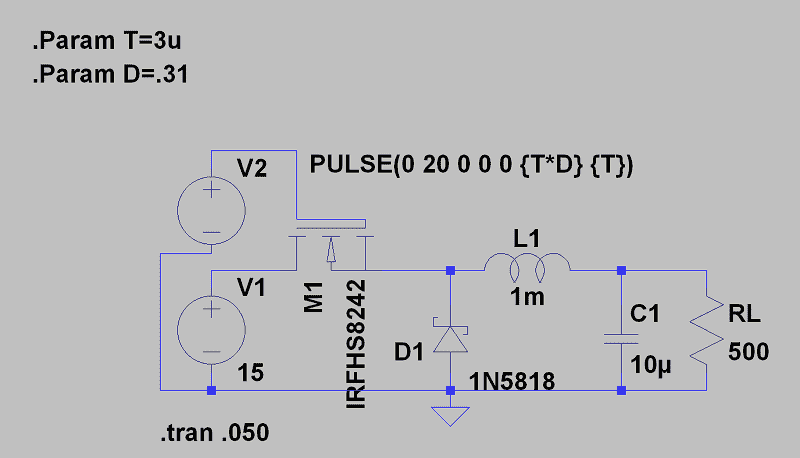
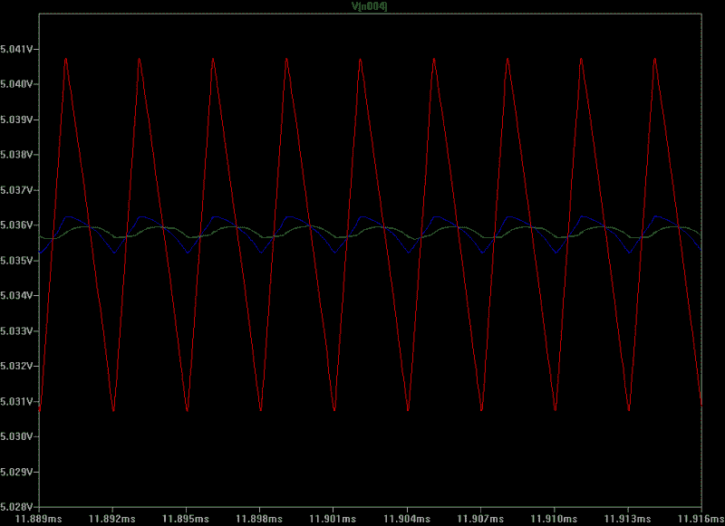
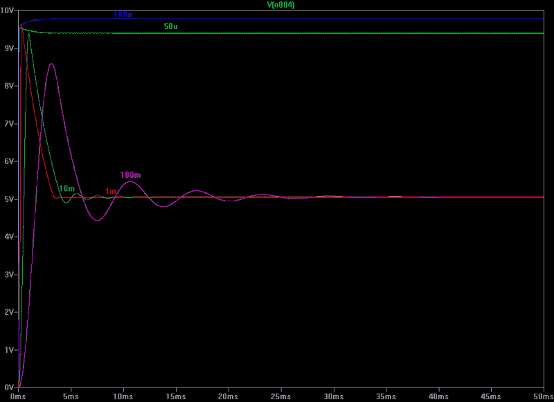
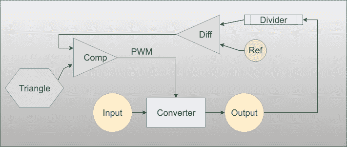
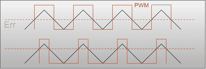

# 电路 VR:简单的降压转换器

> 原文：<https://hackaday.com/2018/07/06/circuit-vr-simple-buck-converters/>

我在没有套件的情况下构建的第一个东西是使用旧 LM309K 的 5 V 稳压电源。这是一个典型的线性稳压器，如 7805。虽然它们很简单，但会以热量的形式浪费大量能量，尤其是在输入电压变高的情况下。虽然仍有一些应用需要线性调节器，但它们正越来越多地被效率更高的开关电源所取代。转辙器是如何工作的？嗯，你买个开关电源 IC，加个电感就搞定了。下课。哦，等等……虽然从成本角度来看，这可能是最好的方法，但那样你真的不会学到很多东西。

在本期《电路 VR》中，我们将讨论一个简单的降压转换器，它是一个开关稳压器，接受较高的电压，产生较低的电压。请注意，第一个不会真正进行规范，但是我们将在以后的文章中添加这一点。像往常一样，我们将使用 [LT Spice](https://hackaday.com/2016/02/26/adding-spice-to-your-workbench/) 来模拟电路 VR 的设计。

有趣的是，LT Spice 专为设计电源而设计，因此它的库中有许多线性技术器件专门用于此目的。然而，我们不会使用比运算放大器更复杂的器件。对于第一遍，我们甚至不会使用它们。

## 它是如何工作的？

电感和电容都是储能器件。特别是，电感器以磁场的形式存储能量，并对通过它的电流变化做出响应。开关降压转换器的理念是对电感电流进行脉宽调制，使其产生所需的电压。输出端还需要一个电容，并且需要一种方法来分流反向电流对地造成的负电压，如肖特基二极管。典型的架构如下所示:

你可以在 [GitHub](https://github.com/wd5gnr/circuitvr/tree/master/buck) 上找到整件事。注意，这里我使用 Spice 电压源作为输入电压，使用脉冲发生器来产生 PWM。可以用参数 T 设置周期，用参数 d 设置占空比，这里我没有做很多逻辑挑选元件。我假装在翻我的垃圾箱，抓起第一个看起来有用的东西。如果你想最大化效率或最小化启动时间或优化其他任何事情，你可能应该更聪明地工作。我选择的频率是任意的——大约 333 千赫。同样，我只是想要一个你可以试验的电路，我们将围绕这个核心构建电路的其余部分。

如果你尝试一下改变 D，你可能会直觉地知道数学分析会告诉你什么。至少在某些工作范围内，输出电压将大致等于输入电压乘以占空比。如果您想要一个 15 V 输入的 5 V 输出，并且您的二极管和其它元件非常完美，则占空比为 1/3。当然，您的二极管会有一些压降，其他元件有寄生元件，所以实际情况是它会有一点偏离 1/3。尝试将二极管模式改为理想模式，看看会产生什么影响，或者尝试硅二极管。你可以看到我有 0.31，非常接近。

 试拆卸二极管。你会看到晶体管源极的电压会变成负值。你马上就会看到改变电感值会有什么影响。尝试改变电容值，并注意其影响——尤其是启动时间。这也是电容的 ESR(有效串联电阻)对电路工作有重大影响的情况之一。如果右击电容，可以增加一点 ESR。试试 1ω，陶瓷电容可以用 1ω，但电解电容不能用 1ω，注意它的影响。起初，你可能认为它没有太大的影响，但一旦输出电压稳定，就放大输出电压。您会看到 ESR 给输出增加了纹波。绿色走线为 0.01ω，蓝色走线为 0.1ω，红色走线为 1ω。

当然，电感和电容也形成一个谐振电路，可以与 PWM 频率相互作用，但现在，我只是“垃圾盒”电路，所以我们将跳过数学。所示元件的频率略低于 2 kHz。尝试将 T 参数设置为 1m (1 kHz)，看看会发生什么。

这个电路的一个好处是晶体管不是开着就是关着。由于 MOSFET 的导通电阻可能非常低，因此不会消耗太多功率。这使得开关比在普通线性电源中使用传输晶体管更有效地工作。当然，开关不一定是 FET，但 FET 工作得如此之好，以至于在现代设计中很少看到其他任何东西。

然而，这确实意味着低导通电阻对于高效工作非常重要。注意，我以高于电源电压的电压驱动栅极，因为我希望该器件具有最大 Vgs。这并不总是必要的，但由于在某些时候源极电压将大致等于漏极电压，这是一个好主意，否则效率将受到影响，或者转换器可能无法工作。在现实生活中，差异可能没有我在这里使用的那么大——可能是一个或两个二极管压降，如果有的话。

同样，这只是为了感受一下电路。在最终设计中，我们可能需要一些电阻来抑制任何高频振荡，并考虑一些其他实际问题。我们可以做出改变来提高稳定性、效率和规模——但可能不是一下子全部做到。例如，增加一个缓冲器有好处，但会降低效率。但现在，这将让我们开始。

## 模式

 注意当我在谈论占空比设置输出电压时，我说“至少有一些工作范围？”这个电路可以在两种不同的状态下工作。一种情况是，电感中的电流会在某一点降至零。这是一种不连续模式，更难处理，因为几乎每个元件都会决定输出电压。

然而，如果电感电流不为零，则输出纯粹是占空比的函数。这通常是你想要的模式，所以你需要一个更大的电感。现在，电感为 1 mH，如果保持稳定，电感电流保持在 5 至 15 mA 之间。比如说，试试 50 μH 电感。下图显示了电感范围为 50 μH 至 100 mH 时的输出电压。可以看到，较低值的电感不在我们想要的工作范围内。

## 为什么停下来？

很多教程就此打住。问题是，这不是一个监管机构。如果输入电压达到 10V，会发生什么情况？还是 20V？问题是 1/3 PWM 占空比仅适用于 15 V，您需要的是一个伺服环路，它将输出电压与某个基准电压进行比较，并根据差值产生 PWM。

一开始这说不通。为了提供 5 V 电源，我需要将其与 5 V 基准电压源进行比较。有两件事需要考虑。首先，制作一个无法处理大量功率的精密基准电压源相对简单。例如，二极管或 LED 压降在很大范围内相当稳定。齐纳二极管也可以工作，但不适合电源应用。你可以比功率调节器更容易地实现低电流基准电压。另一个技巧是使用分压器对输出电压进行采样。因此，在分压器后，您的 5 V 输出可能产生 1.4 V，您可以将其与两个二极管压降进行比较。现在更说得通了。

那么，答案就是算出电压离你想要的有多远。然后，您可以创建一个 PWM 信号来控制晶体管栅极的导通频率。如果输出电压没问题，你不需要做任何事情。如果它不在目标上，你需要改变 PWM 驱动。框图形式:

转换器就是我们之前看到的那部分。分压器是可选的，但应该将预期输出(本例中为 5V)降至基准电压，无论基准电压是多少。差分放大器的输出是误差电压，它与比较器中的三角波混合，以产生正确占空比的 PWM。

## PWM？

如果您想知道三角波和比较器是如何产生 PWM 的，这张图片应该可以让您一目了然:

黑色的当然是三角波。黄色虚线是误差电压。当三角形高于误差电压时，比较器输出(红色)开启。在顶部轨迹中，误差约为中间值，因此输出占空比约为 50%。在底部轨迹中，较高的电压产生较低的占空比。如果你需要反向操作，你可以通过翻转比较器(或翻转你的显示器；我们等)。也就是说，如果当误差电压高于三角波时，比较器变为低电平，将会反转红色方波，使占空比反转。

现在，这又提出了另一个问题:如何产生三角波？有几种方法可以做到这一点。经典的方法是取一个从正到负的方波，然后积分。你也可以利用恒流源以直线方式给电容充电。恒流吸电流也会以同样的方式放电。

您可以看到集成解决方案受欢迎的原因。闭环控制不仅可以调节输入电压的变化，如果基准电压良好，还可以调节元件、温度和负载电流的变化。然而，电路确实有点复杂。也要记住，我是想做一个又快又脏的简单版本。人们使用各种各样的技巧来获得更好的性能——取决于你如何定义性能——我忽略了所有这些，至少现在是这样。但是这使得事情变得更加复杂。

此外，这只是一种拓扑结构。一些降压转换器将使用两个场效应晶体管。有些会根据负载降低开关频率。此外，还有从较低电压升至较高电压的升压拓扑结构，当您无法决定时，甚至还有升降压拓扑结构。

下次我们将进一步充实这个设计。我们最终会看到一个降压转换器。