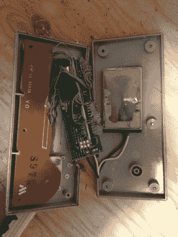

# 最干净的覆盆子酱

> 原文：<https://hackaday.com/2016/01/20/cleanest-rasberry-pi-nes-mod/>

[ModPurist]给我们发来了他的[任天堂红莓派案例 mod](http://www.modpurist.ca/2016/01/nes-raspberry-pi-with-wireless.html) 。在你点击后退按钮之前，这是一个很好的方法，因为它执行得非常好。这实际上是一举两得:他之前[建造了一个无线 NES 控制器](http://www.modpurist.ca/2016/01/wireless-nes-controller-for-pc.html)来完成设置。

 这两个 mod 都是最纯粹意义上的黑客。控制器模块把无线键盘的发送电路板塞进了 NES 控制器。最初的 NES 控制器将按钮读出到移位寄存器中，并通过导线发送出去。那都过去了。[ModPurist]只需将每个按钮连接到发送器 PCB 上，并通过按下按钮来计算出它们在 PC 上对应的按键。简单。

他的[视频中关于构建控制器](https://www.youtube.com/watch?v=qSo5ztaBLFY)的最精彩部分是什么？大约一分钟后，他忘记了自己正在拍摄一段技术操作视频，并在剩下的四分钟里扮演口袋妖怪。那是成功的标志。

然后是 NES 黑客本身。他把所有东西都拆了，加了一个树莓派 2 和一个风扇，让它与电源开关和原来的电视输出一起工作，这就完成了。还是那句话，需要做的不多，但也不少。它看起来正好插在 CRT 显示器上(至少是 C64 的显示器)，毫无疑问，能够在原装 NES 控制器上无线播放很酷。

这也不是[ModPurist]第一次来到 Hackaday，他的[“冷男孩”冰箱变游戏男孩](http://hackaday.com/2015/09/03/mini-fridge-turned-gameboy-puts-hot-games-on-ice/)是一件艺术品。

 [https://www.youtube.com/embed/8UlOLZz6zgE?version=3&rel=1&showsearch=0&showinfo=1&iv_load_policy=1&fs=1&hl=en-US&autohide=2&wmode=transparent](https://www.youtube.com/embed/8UlOLZz6zgE?version=3&rel=1&showsearch=0&showinfo=1&iv_load_policy=1&fs=1&hl=en-US&autohide=2&wmode=transparent)

