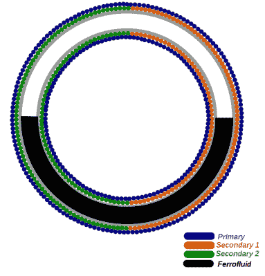

# 来自铁磁流体的巧妙而优雅的倾斜传感器

> 原文：<https://hackaday.com/2016/05/05/clever-and-elegant-tilt-sensors-from-ferrofluid/>

我们先来谈谈倾斜传感器。最简单的倾斜传感器——绝对最简单的——是在一个小金属罐中滚动的几个滚珠轴承。当罐子倾斜时，球滚入一对电触点，完成电路。一滴水银装在玻璃安瓿里，接触几下怎么样？同样的事情。您可以使用更昂贵的倾斜传感器，包括一些基本上是 MEMS 陀螺仪的传感器，但它们都非常相似。对于[Aron]的 Hackaday 奖项目，[他提出了一个倾斜传感器](https://hackaday.io/project/11225-a-new-high-accuracy-tilt-sensor)，它是如此聪明，如此创新，如此优雅，我们被他的创造力惊呆了。

【Aron】不是用电触点或陀螺仪，而是用感应来测量传感器的倾斜度。通过用一个长的铜线初级绕组和几个在不同地方的次级绕组包裹一个管子，[Aron]建立了一个线性可变差动变压器。如果你在这个变压器里插入一根铁棒，初级线圈就会感应出不同的电压。简单，这种设备是一个有效的任何含铁材料的位置传感器。

现在真正的诀窍是:将铁磁流体放入变压器的核心。液体总是找到自己的水平，不同的倾斜会在初级线圈中感应出不同的电压。太棒了。

 线性变压器只能得到一个倾斜传感器，而不能测量 360 度。如果电子管运行良好，环面会运行得更好，引导[阿伦]走向他的下一个伟大发明。

当充满铁磁流体时，这种环形线性可变差动变压器可以测量三百六十度的倾斜，精确度为万分之一(0.0001)度。对于任何倾斜传感器来说，这都是非常好的分辨率，它可以通过一整圈旋转来实现。

我们总是对 Hackaday.io 上的项目感到惊讶，尤其是今年进入 Hackaday 奖的项目。(阿伦)在这里所做的是如此聪明，如此优雅，我们很震惊，我们以前没有看到这一点。最后——除了玩磁铁，铁磁流体还有一个用途。

你可以看看下面[Aron]的 torridal 倾斜传感器的视频演示。

 [https://www.youtube.com/embed/M8crFUp23ZI?version=3&rel=1&showsearch=0&showinfo=1&iv_load_policy=1&fs=1&hl=en-US&autohide=2&wmode=transparent](https://www.youtube.com/embed/M8crFUp23ZI?version=3&rel=1&showsearch=0&showinfo=1&iv_load_policy=1&fs=1&hl=en-US&autohide=2&wmode=transparent)

The [HackadayPrize2016](http://hackaday.io/prize) is Sponsored by:       