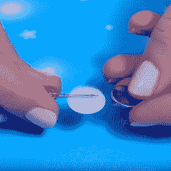

# 聪明的电池架黑客使辉煌的耳环

> 原文：<https://hackaday.com/2017/08/15/clever-battery-holder-hack-makes-brilliant-earrings/>

A ‘googly eye’ with hole for LED leads on one side, slot for coin cell on the other. Black disk for pupil removed.

我们喜欢看到一个东西被有效地用于其预期目的之外的用途，这个 DIY LED 耳环项目就是一个很好的例子。[idunn 女神]喜欢制作由一个小硬币电池供电的发光 LED 耳环的想法，但外壳和电池的电源连接是症结所在。解决办法？经过一些小小的修改后，一只眼睛变得非常完美。

一只眼睛看起来像一个又薄又平的空心塑料灯泡。选择一个比硬币电池稍大一点的，在一端切一个槽，在另一端切一个小洞。LED 引线进入孔中，硬币电池滑入槽中。结果呢？一个用于连接 LED 的轻质电池座，作为奖励，被黑掉的谷歌眼是一个干净和超级光滑的表面，可以很容易地进行绘画或装饰，使其成为设计的一部分。下面嵌入的视频演示了这一过程，并展示了一些样本设计。

 [https://www.youtube.com/embed/Yirj4jibbJA?version=3&rel=1&showsearch=0&showinfo=1&iv_load_policy=1&fs=1&hl=en-US&autohide=2&wmode=transparent](https://www.youtube.com/embed/Yirj4jibbJA?version=3&rel=1&showsearch=0&showinfo=1&iv_load_policy=1&fs=1&hl=en-US&autohide=2&wmode=transparent)

大多数 LED 照明的时尚配件(像这些 [LED 矩阵吊坠](http://hackaday.com/2012/10/12/led-matrix-pendants/))被迫将电池视为一种必要的邪恶，一种需要隐藏的轻微尴尬。令人耳目一新的是，这种解决方案不仅消除了额外的部件，还允许将电池外壳作为设计的一部分。这是以一种不寻常而有效的方式对一个角色的精彩运用。

[via [Solarbotics 博客](https://solarbotics.com/blog/?p=4844)