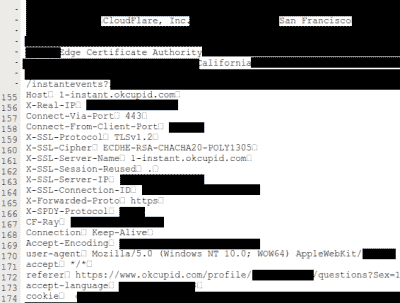

# cloud bleed——您的凭证缓存在搜索引擎中

> 原文：<https://hackaday.com/2017/02/24/cloudbleed-your-credentials-cached-in-search-engines/>

如果你还在担心 SHA-1 被破解，如果有人打算花费数十万美元创建一个假的认证中心，并嗅出你的 ~~OkCupid~~ 证书，不要担心。当[你的证书被搜索引擎缓存的时候，为什么要花这么多钱？…等等，什么？](https://bugs.chromium.org/p/project-zero/issues/detail?id=1139)

由[塔维斯·奥曼迪]命名为 Cloudbleed 的一组严重的错误，导致未初始化的内存出现在反向代理生成的响应中，并泄露给请求者。由于这些反向代理是在 Cloudflare 客户端之间共享的，这使得问题更加严重，因为来自随机客户端的随机数据正在泄漏。这有点像 HTTP 请求的心脏出血。这个问题的严重性可以用[Tavis]的话来充分理解:

> “我们发现的例子太糟糕了，我取消了一些周末计划，周日去办公室帮忙制作一些清理工具。我已经告诉了 cloudflare 我在做什么。我正在寻找来自主要约会网站的私人信息，来自一个知名聊天服务的完整信息，在线密码管理器数据，来自成人视频网站的帧，酒店预订。我们说的是完整的 https 请求、客户端 IP 地址、完整的响应、cookies、密码、密钥、数据，一切。”

 根据 Cloudflare 的说法，泄露的内容可能包括 HTTP 头、大块的 POST 数据(可能包含密码)、API 调用的 JSON、URI 参数、cookies 和其他用于身份验证的敏感信息(如 API 密钥和 OAuth 令牌)。对易受攻击的 Cloudflare 网站的 HTTP 请求可能会泄露来自其他不相关的 Cloudflare 站点的信息。

除了这个问题，搜索引擎和任何其他在互联网上自由漫游的机器人都可以随机下载这些数据。Cloudflare 发布了一份详细的事件报告，解释了发生的所有技术细节以及他们如何修复它。这是一个非常快速的事件响应，在不到 47 分钟内就实现了初步缓解。补丁的部署也非常快。尽管如此，在阅读该报告时，Cloudflare 淡化这个问题的感觉仍然存在。根据 Cloudflare 的说法，这个问题可能开始的最早日期是 2016 年 9 月 22 日，泄漏一直持续到 2017 年 2 月 18 日，前后相差五个月。

只是为了让读者放心，不要危言耸听，没有证据表明任何人利用了所发生的事情。在公开曝光之前，Cloudflare 与搜索引擎公司密切合作，确保从他们确定的 161 个域的搜索引擎缓存中清除内存。他们还报告说 Cloudflare 已经搜索了 web(！)，在像 Pastebin 这样的网站上寻找泄露的迹象，但没有发现。

另一方面，很可能无法确定是否有人在以太中的某个地方缓存了大量数据。不可能知道。我们真正想知道的是:[Tavis] [到底能不能拿到 t 恤](https://hackerone.com/cloudflare)？