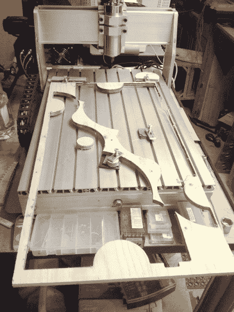

# 带有半鼻架的数控望远镜

> 原文：<https://hackaday.com/2017/01/13/cnc-telescope-with-semi-nasmyth-mount/>

[GregO29]有一个 10 英寸的 GoTo 望远镜，但是它只有 70 磅重，不太便于携带。因此，他做了任何自尊的数控爱好者都会做的事情，他将自己的数控技能用于制作自己设计的 [8″牛顿反射镜、半纳斯米思安装望远镜](http://www.instructables.com/id/CNC-Telescope-Semi-Nasmyth-Mount/?ALLSTEPS)。这也让他有机会试用他的新中国 6040 路由器/雕刻机，800 瓦水冷主轴。

你说，那些花哨的术语是什么？“牛顿反射镜”简单地说就是在一端有一个大凹面镜，它将来自天空的大量光线反射到一个较小的镜子，然后反射到你的眼睛，最好还有一些聚焦光线的方法。“半鼻镜座”意味着整个东西围绕目镜旋转，这样你就可以保持头部相对静止(“半”是因为目镜也可以旋转，在这种情况下，你必须稍微移动一下头部)。

我们真的很喜欢他想出的在垂直面旋转望远镜的机制。仔细看这张照片，你会发现望远镜安装在一块馅饼形的木头上。饼形的弯曲外圆周上有齿轮齿。移动这些齿的机制是由五金店 3/4 英寸销钉上的 1 英寸弹簧制成的蜗杆。转动蜗杆的曲柄，望远镜就会转动。

Cutting the telescope mount using the 6040 router/engraver

木头上所有的洞都被挖掉了，以使它更轻，但也给它一种蒸汽朋克的感觉。以真正的业余天文学家的风格，当你俯视两个基板上的所有孔时，它们描绘了月亮的所有相位。但出于实用目的，较小的孔大小正好可以容纳他的各种目镜。他提到其中三件对他的路由器来说太大了。正如这里的照片所示，他通过切割一半，将工件旋转 180 度，然后切割另一半来解决这个问题。

希望这能激起你的观星欲望。或者，你可以做这个恒星跟踪望远镜项目正在做的事情，即[将手动望远镜转换成电动望远镜](http://hackaday.com/2016/04/14/a-star-tracking-telescope-mount/)并向其发送 GOTO 命令。如果你想用望远镜记录图像，只需 55 美分。【Xobmo】[做了一个支架，用来装他的 iPhone](http://hackaday.com/2013/01/23/simple-iphone-telescope-mount/) 。无论哪种方式，天空都不是极限。