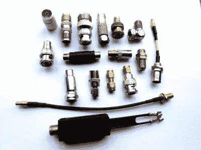
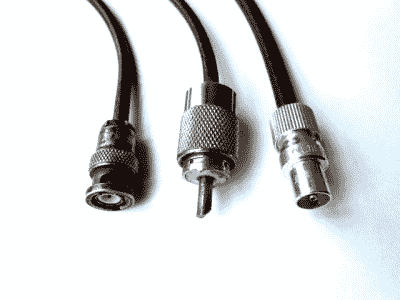
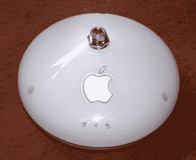
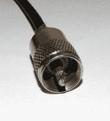

# 与同轴电缆共存:为工作选择正确的连接器

> 原文：<https://hackaday.com/2016/03/31/co-exist-with-your-coax-choose-the-right-connector-for-the-job/>

Just a selection from the author’s unholy assortment of adaptors.

如果你要处理频率高于最基本音频的模拟信号，你很可能会在某个地方找到一盒同轴适配器。您将需要它们，因为您的工作台很可能会配备带有各种连接器的仪器、设备和模块。在让所有这些不同的设备互相交谈时，你可能有一个罪恶的过去:在某个时候，你将通过把几个适配器绑在一起来实现你想要的输入和输出连接器的组合，从而创建了一个邪恶的同轴接口怪物。别担心，我会保守你的秘密。

在一台设备上选择 RF 连接器的背后有各种各样的因素。您可能认为最重要的是连接器本身的物理和电气规格，但其他因素，如公司设计政策、特定领域的公认标准以及设计者的个人偏好也会发挥作用。本文将研究一些不同类型的连接器，并尝试解释其中的一些选择。

## 形式服从功能

在讨论单个连接器之前，有必要先从更广的角度来看一下 RF 连接器的作用，以及它为何以特殊方式设计。为此，我们需要简单地讨论一下[特性阻抗](https://en.wikipedia.org/wiki/Characteristic_impedance)，而不要过于深入地探究那些困扰一年级电子工程学生的数学证明。

想象一条无限长的同轴电缆，其中有 RF 流过。如果您要非侵入式测量 RF 电压和电流，那么您就可以像计算 DC 电路中的电阻一样，用欧姆来计算阻抗。在理论上完美的同轴电缆中，无论射频频率或电压如何，该阻抗图都是相同的；它取决于同轴电缆本身的物理特性、导体的尺寸及其非导电部件的介电特性。

如果您在前一段中将任何东西连接到同轴电缆，它必须设计为呈现与同轴电缆的特性阻抗相同的阻抗。如果呈现不同的阻抗，那么一些 RF 将沿着同轴电缆反射回来，系统的总阻抗将会改变，并且会发生信号损失。从射频信号的角度来看，你连接到它的任何东西在电气上看起来应该更像同轴电缆。

Connector impedance matching illustrated in [US patent US 2540012](http://www.google.com/patents/US2540012), a precursor to the BNC, granted in 1951 to [Octavio M Salati](https://en.wikipedia.org/wiki/Octavio_M._Salati).

简而言之，RF 连接器的设计者面临着一个问题:确保产品的所有部分都具有与其连接的同轴电缆完全相同的阻抗。从电气上看，它必须看起来好像连接器不在那里:一个完整的同轴电缆在所需的工作频率。

为了实现这种完美的阻抗匹配，RF 连接器的设计者必须确保外壳的内径、中心导体的直径以及绝缘体的介电特性使得在信号路径中的所有点处，特征阻抗都是相同的。如果你把一个典型的高性能射频连接器纵向锯成两半，你就会看到它在工作，为了达到这个目的，我们已经做了很多工作。

值得一提的是，有时这个恒定阻抗的目标并没有被追求。流行的连接器习惯于使用几十年，所以你会遇到的一些连接器，比如欧洲电视机上的 Belling-Lee 天线插座，或者你会在 HF 收音机上看到的现在不恰当命名的“UHF ”,实际上是在特性阻抗机制被完全理解之前构思的旧设计。或者以“RCA”唱机连接器为例，这是一种类似的老式设计，其根源在于音频，其射频特性对其发明者来说毫无意义。

有无数种同轴连接器样式，既有过时的，也有仍在市场上销售的。其中一些有非常具体的应用，而另一些则是通用的。幸运的是，在如此庞大的目录中，只有少数几个样式变得足够流行，以至于你可能经常会遇到它们，因此，当我们详细查看单个连接器时，我们只需要考虑几个例子。

## 欢迎来到同轴连接器丛林

Left to right: BNC, UHF, Belling-Lee

从我们选择的最古老的开始， **[Belling-Lee](https://en.wikipedia.org/wiki/Belling-Lee_connector)** 始于 20 世纪 20 年代。如果你是美国人，你可能永远不会遇到这种连接器，因为它只作为欧洲和澳大利亚电视机的天线连接器存在。因此，你可以购买机顶盒，甚至安装 RTL-SDR 记忆棒。它与 UHF 电视的 75 欧姆电缆一起使用，但它不能为电缆提供恒定的阻抗。可能您使用它的唯一原因是如果您正在使用非常旧的设备、电视机或电视外围设备，所以这里主要提供信息。

相比之下， **[超高频连接器](https://en.wikipedia.org/wiki/UHF_connector)** 存在于许多地方，用于视频以及从高频到甚高频范围的无线电发射机和接收机。追溯到 20 世纪 30 年代，它采用屏蔽型香蕉插头的形式，带有螺纹环以提供安全连接。它不呈现恒定阻抗，因此建议仅在 150MHz 以下使用。“超高频”在 20 世纪 30 年代意味着比现在更低的频率。你还会看到它被称为“PL259”，这是战时美国军方对一种变体的称呼。

你会在有线电视系统、卫星电视装置中发现 **[F 连接器](https://en.wikipedia.org/wiki/F_connector)** ，并在美国电视机上用作天线连接器。F 可能是最容易安装的连接器之一，使用实芯 75 欧姆同轴电缆的中心导体作为其中心引脚。对于这样一个简单的设计，它具有令人惊讶的良好性能，带宽远远超过 1 GHz。

 

一个嫁接了 N 连接器的苹果 Airport 路由器。(【麦克·哈里斯】:[为苹果机场改装外置远程无线天线](http://mbharris.co.uk/articles/airport//))

[**N 连接器**](https://en.wikipedia.org/wiki/N_connector) 是最早的恒阻抗连接器之一，可以追溯到 20 世纪 40 年代。该连接器有 50 欧姆和 75 欧姆两种型号，能够处理高射频功率，带宽超过 10GHz，出现在各种超高频和微波发射机及其他设备上。

**[【BNC】](https://en.wikipedia.org/wiki/BNC_connector)**始于 20 世纪 50 年代初，已经无处不在，从视频系统到测试设备、手持发射机、细线以太网以及更多应用。它是一种阻抗恒定的连接器，有 50 欧姆和 75 欧姆两种版本，带宽约为 5GHz。

**[SMA 连接器](https://en.wikipedia.org/wiki/SMA_connector)** 开发于 20 世纪 60 年代，具有 50 欧姆的恒定阻抗和高达 18GHz 的带宽。设计用于设备内部射频路径上的半刚性同轴电缆，其设计不支持超过 500 个配合周期。您将在一些手持无线电和大多数 WiFi 设备上遇到它们，它们似乎也在软件定义无线电上变得常见。还有一种形状记忆合金，你也会遇到，**反向形状记忆合金**的插销在连接器的螺纹侧。这是 WiFi 设备制造商试图阻止最终用户安装 Yagis 和类似的高增益天线，从而违反无线电发射法律。

最后， [**MCX 连接器**](https://en.wikipedia.org/wiki/MCX_connector) 是 20 世纪 80 年代开发的超小型连接器。它们的带宽为 6GHz，有 50 欧姆和 75 欧姆两种型号。MCX 包括在这里，因为它通常用于 RTL-SDR USB 数字电视棒，尽管如果你有一个 RTL-SDR，你有机会使用它与另一个连接器系列的适配器。

## 选择，选择

这是常见同轴连接器的列表。现在，您应该使用哪个？当然，与任何组件选择一样，这取决于您的应用程序。但是由于我们中很少有人在最前沿工作，很可能我们的应用程序都不会如此苛刻，以至于上面的任何选择都无法完成这项工作。因此，还有一个因素:个人偏好。我的个人偏好将与你不同:例如，你可能喜欢 F 的简洁，而讨厌 BNC 的焊接中心销。

以下是我的偏好——当我想要一个同轴连接器时，我会选择什么。

 

一个超高频插头。由阿帕卢萨(自己的作品)[CC BY-SA 3.0 或 GFDL]，经由[维基共享](https://commons.wikimedia.org/wiki/File:UHF_PL_Connector.jpg)。如果你的需求是坚固的可靠性，并且你不打算研究微波或制造微小的设备，那么超高频是最好的选择。它们不太贵，非常容易布线，几乎坚不可摧，而且交配非常牢固。这是我将随身携带到山顶的连接器，我知道我可以通过手机屏幕的光用气笔烙铁固定它，并且仍然可以实现可用的 SWR。我在 1987 年制作的第一个发射机就有一个，我知道它们不是最好的连接器，但我也知道我可以完全依赖它们。

[![A BNC plug. By Swift.Hg (Own work) [CC BY-SA 3.0], via Wikimedia Commons](img/3a10c6a03730231d0e2b75ce6b4b9b05.png)](https://hackaday.com/wp-content/uploads/2016/03/592px-bnc_connector_50_ohm_male.jpg) 

一个 BNC 塞。通过斯威夫特。Hg(自己的作品)[CC BY-SA 3.0]，via [Wikimedia Commons](https://commons.wikimedia.org/wiki/File:BNC_connector_50_ohm_male.jpg) 。

我的首选连接器是 BNC。比 N 连接器更便宜，并且比我可能需要的带宽更大，我承认它们有点复杂，但它们不太大，我知道它们可以轻松地插入我放在工作台上的几乎任何东西。例如，它们直接插入我的示波器。总有一天，我会去订购合适的工具来拧紧那些螺母。[![An SMA plug. By en:User:Meggar [GFDL or CC-BY-SA-3.0 ], via Wikimedia Commons](img/50714244a90571a17e2486aa716e00da.png)](https://hackaday.com/wp-content/uploads/2016/03/sma_connector.jpg) 

一个 SMA 插头。By en:User:Meggar [GFDL 或 CC-BY-SA-3.0 ]，via[Wikimedia Commons](https://commons.wikimedia.org/wiki/File:SMA_connector.jpg?uselang=en-gb)

我更倾向于避免的连接器是 SMA。我在必要的时候使用它们，但是是通过惯例而不是偏好。例如，我用它们为 RTL SDR 做了一个上变频器[，因为 SDR 所有者的军械库中更有可能有 SMA 而不是 BNC。它们漂亮小巧，但一点也不便宜(毕竟它们通常是镀金的！)，而且我发现这些插头很难布线。再加上 500 次的配合周期，你知道将来某个时候你必须更换连接器。因此，在页面顶部的图片中，您将看到一组 SMA 适配器，当 SDR 出现在我面前时，这些适配器首先开箱，这样我就可以将 BNC 连接到系统。](https://hackaday.io/project/8486-hf-receive-converter-for-rtl-sdrs-and-similar)

重要的是要注意，在这个领域没有错误的答案。打开一本 20 世纪 50 年代的 RSGB 或 ARRL VHF 或 UHF 手册，你会看到大量的元件和技术，如果你在 2016 年惊讶地看着它们，你会被原谅。如果有什么教训的话，那就是:你的收音机的好坏取决于你如何使用它。