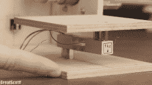

# 鸡尾酒机每次都能调制出完美的饮料

> 原文：<https://hackaday.com/2017/12/12/cocktail-machine-mixes-perfect-drinks-every-time/>

对我们很多人来说。假期即将到来，这意味着举办派对和调酒，这可能会令人厌倦。[GreatScott]提出了一个解决方案，他称之为[粗制鸡尾酒搅拌机](http://www.instructables.com/id/Make-Your-Own-Crude-Cocktail-Machine/)。但是不要被愚弄——它可能在表面上看起来很粗糙，在工作时会有点振动，但是这个机制很好，很实用。

该机器可以混合三种不同的液体，并使用三个蠕动泵进行混合。以典型的[GreatScott]风格，当他拆开水泵更换管子时，他让我们很好地一瞥它们是如何工作的。使用旋钮和 LCD 屏幕，你可以为这三种液体输入任何你想要的数量，尽管如果你想改变液体的名称，你必须编辑 Arduino 代码。

Load cell

机器如何知道何时停止泵送某种液体？每个泵都有特定的每秒流量，尽管他对每种液体都进行了测试，并发现了细微的变化，他在代码中对此进行了解释。机器打开泵后，位于玻璃下的测压元件会告诉它液体何时开始到达玻璃。一个简单的计算基于泵每秒钟的流量和所需的流量，告诉它让泵开多长时间。当时间到了，它停止泵。其结果是，这台机器肯定会成为任何黑客聚会的中心。在下面的视频中，看看他的身材和打气筒。

但是派对需要的不仅仅是饮料，他们还需要饼干。为此，看看本·克拉斯诺的[同样酷的饼干制作机](https://hackaday.com/2014/01/15/ben-krasnow-did-it-all-for-the-perfect-cookie/)。

 [https://www.youtube.com/embed/Z7GkGeZrb2Y?version=3&rel=1&showsearch=0&showinfo=1&iv_load_policy=1&fs=1&hl=en-US&autohide=2&wmode=transparent](https://www.youtube.com/embed/Z7GkGeZrb2Y?version=3&rel=1&showsearch=0&showinfo=1&iv_load_policy=1&fs=1&hl=en-US&autohide=2&wmode=transparent)

