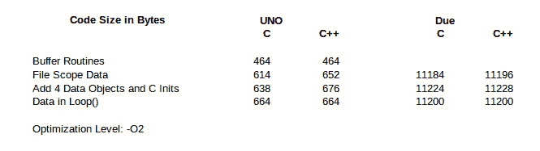

# 代码工艺——嵌入 C++:类

> 原文：<https://hackaday.com/2015/11/06/code-craft-embedding-c-classes/>

对于许多嵌入式 C 开发人员来说，C++最主要也是最有问题的特性是*类*。担心的是类是复杂的，因此会引入代码膨胀，并在时间很关键的系统中增加运行时间。这些问题暗示 C++不适合嵌入式系统。我将勇敢地断言，这些担忧是没有根据的。

当[比雅尼·斯特劳斯特鲁普]创造 C++时，他是在 C 的基础上构建的，以延续该语言的性能传统。此外，他还增加了一些功能，如果你不使用它们，就不用付费。

# 数据隐藏

大约在 90 年代早期，在面向对象的范式转变之前，结构化编程是使用的技术。随之而来的一个原则是数据或信息隐藏。

C 程序员的一个好例子是文件指针(FILE*)。关于文件，你唯一知道的是它指向库中某处的数据结构。您可以通过一组函数打开、读取、写入或操作文件。您正在使用的文件的实际数据是隐藏的。从某种意义上说，这是向面向对象编程迈出的一步。文件*指向对象，一个*结构*，函数是操作对象或实例的类方法。

[Stroustrup]采用 C 的*结构*并扩展它以创建基于类的面向对象形式。他可能采用了另一种方法，因为还有其他形式的面向对象。例如，如果你大量使用 JavaScript，你正在做[原型面向对象开发](http://javascriptissexy.com/javascript-objects-in-detail/)。

在本文中，让我们看看类和它们不存在的代码膨胀。在这个过程中，我们会遇到 C++的其他一些特性。我正在用 GNU 项目 GCC 编译器实现的 C++11 进行编译，以获得该语言的最新特性。我选择它是因为它是 Arduino 系列主板使用的编译器，可以被 Raspberry Pi 使用。它通常可用于其他处理器，非常适合黑客社区。

我将为 Uno 和 Due 板编译代码，以说明处理器的类型无关紧要。Uno 用的是 ATmega328P 8 位处理器，Due 用的是 ATSAM3X8E ARM Cortex-M3 CPU 32 位处理器，所以两者有相当大的区别。

# 声明类

类是*用户定义的* *类型(*udt)*。*在 C++ *中，类、结构、联合和枚举*都是 udt。UDT 等同于您在 C #中熟悉的数据类型:整型、字符型、浮点型、双精度型等。udt 的行为就像 C++语句中内置的数据类型一样:初始化、函数调用、函数返回值。udt 上的操作模仿内置操作:算术操作、逻辑操作。C++的设计目标是 udt 和常规数据类型的操作没有明显的区别。

[Elliot]在最近的一篇文章中讨论了环形缓冲区，*[Embed with Elliot:Going ' Round with Circular Buffer](http://hackaday.com/2015/10/29/embed-with-elliot-going-round-with-circular-buffers/)**，*所以我借用了他的 C 代码并做了一些修改，创建了这个等价的 C++类:

```

namespace had {

using uint8_t = unsigned char;
const uint8_t bufferSize = 16;

class RingBuffer {
	uint8_t data[bufferSize];
	uint8_t newest_index;
	uint8_t oldest_index;

public:
	enum BufferStatus {
		OK, EMPTY, FULL
	};

	RingBuffer();

	BufferStatus bufferWrite(const uint8_t byte);
	enum BufferStatus bufferRead(uint8_t&amp; byte);
};
}

```

代码中第一个新的 C++特性是使用关键字的*名称空间*和*。它们不是特定于类的，所以让我推迟几段时间解释它们。*

类声明以关键字 *class* 开始，后跟一个名称，就像 C 创建*结构*一样。事实上，*结构*可以在这里代替*类使用。*两者的区别在于 *struct，*默认情况下提供对数据和成员函数的公共访问，而*类*默认情况下限制访问。

接下来的三行声明了该类的数据成员，就像你在 c 语言中对一个*结构*所做的一样。因为这是一个类，所以成员是私有的，不能从类外部访问。这就是 C++支持并严格执行数据隐藏的方式。

*public* 关键字表示下面的行是公开可用的。这些可以在类外访问。你也可以像使用*公共*一样使用*私有*使下面的线路不可访问。第三个访问关键字是 *protected* ，但它用于类继承，这是一个更高级的讨论，我们现在忽略它。这些访问控制关键字可以在一个类中任意混合。

接下来，指定一个*枚举*。在这里，它就像一个 C *枚举*一样工作。

下一行声明了类*的构造函数*。用我的话来说，构造函数的目的是在创建类的时候让它保持正常。它应该将类中的所有变量设置为默认的初始值，并包含设置类以进行正确操作的代码。这可能意味着分配动态内存给类使用。例如， *RingBuffer* 可以被设置为处理选定长度的缓冲区，而不是全局定义的固定长度。长度将作为参数传递给构造函数，并用于确定动态分配内存的大小。

接下来的两行是成员函数，用于在类中的缓冲区(数组 *data* )中写入和读取数据字节。这些声明与 C 中的类似声明没有区别，除了又多了一个不是特定于类的 C++特性，即*buffer read(uint 8 _ t&byte)*的参数声明中的 ***&*** 。 ***&*** 表示参数通过引用传递。我们将把它添加到下面要讨论的附加特性列表中。

这些是 udt 类的基础。关于它们的设计和实现有很多细节，但是这些超出了本文的范围。关键的一点是，一个类封装了你在 c 语言中为一个数据结构提供的所有功能。

# 使用类

使用 *RingBuffer* 的代码只是说明如何使用类的框架:

```

had::RingBuffer r_buffer;

void setup() {
}

void loop() {
	uint8_t tempCharStorage;
	// Fill the buffer
	for (int i = 0; r_buffer.bufferWrite('A' + i) == had::RingBuffer::OK; i++) {
	}
	// Read the buffer
	while (r_buffer.bufferRead(tempCharStorage) == had::RingBuffer::OK) {
	}
}

```

代码的第 1 行是一个 *RingBuffer* 变量的定义。 *had::* 是一个作用域操作，它告诉编译器使用在 *had* 名称空间中声明的 *RingBuffer* 。类似地，在第 9 行和第 12 行，枚举 *OK* 的作用域在 *had 中。*

对类成员函数的调用使用 C 语言访问*结构成员时使用的相同的*点符号*。*调用只是 *r_buffer.bufferWrite* 和 *r_buffer.bufferRead.* 如果你想从一个指向变量的指针调用一个类成员函数，那么就使用*箭头符号*。除此之外，成员函数调用与 C 调用是一样的。

在幕后，编译器将 *r_buffer* 作为隐藏参数传递给成员函数。它作为一个指针被传递，在函数内部通过名字*这个*被访问。您可以像使用`this->newest_index`一样使用 *this* 指针来访问成员数据，但这通常是不必要的。有使用它的情况。

# 代码的 c 版本

为了完整起见，让我们看看 C 版本的代码。非常相似。以下是声明:

```

typedef unsigned char uint8_t;

enum BufferStatus {BUFFER_OK, BUFFER_EMPTY, BUFFER_FULL};
#define BUFFER_SIZE 16

struct LifoBuffer {
	uint8_t data[BUFFER_SIZE];
	uint8_t newest_index;
	uint8_t oldest_index;
};

void initBuffer(struct LifoBuffer* buffer);
enum BufferStatus bufferWrite(struct LifoBuffer* buffer, uint8_t byte);
enum BufferStatus bufferRead(struct LifoBuffer* buffer, uint8_t *byte);

```

我们用 *typedef* 代替了 *using，*和 *define* 代替了 *const。*之后 *LifoBuffer* 定义了同样的数据，函数声明也差不多。 *initBuffer* 的作用基本上与构造函数相同。我们看到的是指针而不是引用。

一个区别是指针显式地指向数据结构。这与 C++传递给成员函数的 hidden *this* 相同。

调用例程看起来也非常相似:

```

struct LifoBuffer buffer;

void setup() {
	initBuffer(&amp;buffer);
}

void loop() {
	uint8_t tempCharStorage;
	// Fill the buffer
	uint8_t i = 0;
	for (; bufferWrite(&amp;buffer, 'A' + i) == BUFFER_OK; i++) {
	}
	// Read the buffer
	while (bufferRead(&amp;buffer, &amp;tempCharStorage) == BUFFER_OK) {
	}
}

```

# 源文件

很抱歉让你失望了，但是我不打算贴完整的源文件。你不会看到比调用程序更多的区别。但是这里有一个片段可以满足你的好奇心。我将展示 *bufferRead* 函数，这样您可以看到如何处理引用参数。首先是 C++:

```

RingBuffer::BufferStatus RingBuffer::bufferRead(uint8_t&amp; byte) {
	if (newest_index == oldest_index) {
		return EMPTY;
	}

	byte = data[oldest_index];
	oldest_index = nextIndex(oldest_index);

	return OK;
}

```

现在是 C 版本:

```

enum BufferStatus bufferRead(struct LifoBuffer* buffer, uint8_t *byte) {
	if (buffer-&gt;newest_index == buffer-&gt;;oldest_index) {
		return BUFFER_EMPTY;
	}

	*byte = buffer-&gt;data[buffer&gt;oldest_index];
	buffer-&gt;oldest_index = nextIndex(buffer-&gt;oldest_index);

	return BUFFER_OK;
}

```

主要的区别是 C++版本看起来更干净，没有 C 中访问缓冲区数据结构所需的指针解引用操作符。参数*字节、*参考也更容易访问。C++版本的主要缺点是需要作用域操作符， ***::*** **，**告诉编译器函数和枚举是 *RingBuffer* 类的一部分。

在类 *RingBuffer* 中使用 *BufferStatus* 枚举有两个好处，这使得使用作用域操作符变得值得。首先，通过移除前缀 *buffer_* 来缩短枚举名称。作用域操作符告诉开发人员和编译器这些状态值何时有效。其次，它避免了可能导致混淆的名称冲突。您可能有其他使用 *OK* 或 *FAIL 状态的类。那些可能不使用相同的基础值。如果这些类隐藏在一个库中，你就没有办法改变它们的值。有人可能会说 *OK* 的值是 1，另一个是 4。作用域操作符解决了这个问题，编译器通过拒绝允许一个类的枚举用于另一个类来强制解决这个问题。*

# 附加的 C++特性

让我们回顾一下我们遇到的 C++的其他特性:命名空间、使用和引用。

## 名称空间

我并不打算在本文中介绍*名称空间*,但是在我编译 C++代码的时候，我需要用到它们。我一直在为 Uno 编译，没有任何问题；但是当我切换到 Due 时，编译器生成了一些错误，我花了一些时间才理解:我的 RingBuffer 类名与 Due 用于串行通信的 RingBuffer 类名冲突。

库和用户代码之间的名称冲突正是使用名称空间的原因。我可以把我的类的名字改成 FifoBuffer，这实际上是一个更好的名字，因为它描述了用法，而 RingBuffer 描述了实现。另一个更面向计算机科学的名字是 *queue。*我没有用，因为 FIFO 的 C++标准库实现名为 queue。我把它留在了 RingBuffer，这样我就可以讨论名称空间了。

创建名称空间很容易:

```

namespace &lt;name&gt; { 
// some code }

```

使用一个也是如此:

```

using namespace &lt;name&gt; {
// some code
}

```

我将整个头文件 *RingBuffer.h* 和源文件 *RingBuffer.cpp* 包装在用于 HackADay 的名称空间 *had、*中。

在我使用了 *RingBuffer* 类的 *Application.cpp* 文件中，我需要限定构造函数，并且带有*的 *BufferStatus* 枚举的使用具有*名称空间，因此编译器知道我需要它们，而不是库中的那些。

## 别名:*使用*和引用

使用 关键字的 ***和引用都创建别名。创建别名的能力是 C++的一个通用特性，在 C++11 中得到扩展和改进。在大多数情况下，别名允许使用更简单的名称来引用更复杂的表达式。***

### 使用

使用关键字的*为复杂数据类型创建一个别名。这里类型*无符号字符*被赋予别名 *uint8_t* 。这种用法取代了对*typ**e**def*的使用，它仍然可以不破坏遗留代码。如果这个简单的例子没有打动你，那么用一个别名来简化`const unsigned long int* const `或者用一个指针指向一个有大量参数的函数怎么样？*

下面是上面的两行代码:

```

using uint8_t = unsigned char;
const uint8_t  bufferSize = 16;

```

请注意这些语句是如何相似的。第二行创建变量 *bufferSize* ，并将其初始化为值 16。第一行创建名称 *uint8_t* ，并将其设置为数据类型 *unsigned char* 。这种结构的并行性是引入使用的*的原因。C++11 中的一大努力就是按照这些思路标准化表达式形式。*

### 参考

引用是 C++的一个特性，出现在很多地方。因为这不是 C++的教程，所以除了它们作为函数参数的用途之外，我就不再赘述了。

函数参数可以通过多种方式传递。一种方式是通过*值*。这是 C/C++中参数的常用方式:传递参数变量的值的副本。函数中的任何操作都会修改局部值，但对自变量变量没有影响。

C/C++也可以通过指针传递参数，这是引用传递的一种形式。操作会影响原始值。我们知道指针是危险的，所以 C++想尽量减少它们的使用。

引用是自变量变量的别名。就像指针一样，自变量变量的地址被传递。最大的区别是你不能操作这个地址，因为它不像指针那样公开。自变量变量的原始值受函数中任何操作的影响。

# 课程成本

我在上面取笑过使用类是没有成本的。这是 99.9999%，或者在那附近，真的。在这篇文章中，我将只关注代码大小，因为有人在关注 C++类并看到它们额外的复杂性时，会认为这是有代价的。

我在 [*代码工艺中提到的 Arduino 插件中使用了 Eclipse:使用 Eclipse 进行 Arduino 开发*](http://hackaday.com/2015/10/30/code-craft-using-eclipse-for-arduino-development/) 来编译 Arduino Uno 和 Due 的代码。结果如下:

[](https://hackaday.com/wp-content/uploads/2015/11/code-bloat.jpg)

显然，在任一处理器上使用 C++时，都不会出现重大的代码膨胀。让我们先浏览一下用于 Uno 的表格，然后再回来查看预期的结果。

线*缓冲例程*是仅 FIFO 缓冲代码和空 Arduino *设置()*和*循环()*例程的代码大小。我这样做只是为了 Uno，因为我懒得回去把到期的版本减到最少。正如我们将看到的，这并不重要。

下一行，*文件范围数据，*具有在*应用程序*源文件中文件范围的数据结构的定义。C++代码大了 38 个字节，因为调用了类构造函数。为了调用构造函数，在调用 *main()* 之前执行附加代码。在任何 C/C++应用程序中，都有特定于系统的初始化代码被执行来设置应用程序。C++只是增加了一点点来调用所有的文件范围构造函数。

下一行显示这是我建议的初始化代码。另外 4 个数据结构被添加到两个程序中，在 C 版本中插入了对它们初始化的调用。两个版本之间的差异仍然是 38。对于使用 C++的 Uno，这是一个固定的开销。

在最后一行，我将数据结构的定义和 C 版本的初始化移到了 *loop()* 中。这使它们脱离了文件范围，这意味着不需要 C++特殊的初始化代码。现在两个版本都有相同的代码大小。

所以，至少对 Uno 来说，我放弃我的案子。C++类不会导致代码膨胀。

Due 的结果是相同的，除了在文件范围内有多个数据结构的情况。在文件范围内有一个单一的数据结构需要 12 字节的开销。好吧，我假设那是 C++ pre- *main()* 初始化代码。但是当添加了额外的 3 个数据结构时，开销减少到只有 4 个字节。什么？这值得进一步调查。

我回到在文件范围内有一个数据结构，然后一次添加多个，记录代码大小的增加。C 版本交替增加 8 和 16 字节。C++版本为第二个数据结构增加了 16 个字节，之后的每个数据结构增加了 8 个字节。我可以对此进行一些猜测，但坦率地说，这不值得努力，因为这些差异很小。

与 Uno 一样，最后一行显示没有代码膨胀。这时数据结构和初始化被移到*循环()内。*

就在那里。在嵌入式系统中使用类不会导致代码膨胀。

# 包裹

在这篇文章中，我只是简单地解释了一下类。我想提供足够的解释，以便 C 开发人员能够充分理解这些概念，接受类不会增加代码大小。更多的细节只会让人困惑，而且还有更多细节。我也不想扮演语言律师，所以演示是务实的，而不是迂腐的。

软件开发是一个复杂的过程。语言开发人员的一个持续目标是提供一个在编写和执行代码时都能有效使用的工具。C++类不仅在代码大小上很有效，而且有助于避免开发过程中的常见错误。衡量开发的一个标准是修复缺陷的速度。更好的是防止错误发生。

类构造函数是一个 bug 预防器。当你实例化一个类时，构造函数将被调用来初始化变量。考虑 C 代码的情况，我多次创建了 *FifoBuffer* 。对于每一个变量，我都需要添加对 *init()的调用。*很容易忘记初始化，特别是如果你在一个文件中创建变量，而不是在初始化发生的地方，就像 Arduino 应用程序中的 *setup()* 。

# 嵌入 C++项目

在 Hackaday.io，我创建了一个嵌入 C++ 项目的 [*。项目将在项目描述中以目录的形式保留这些文章的列表。每篇文章都将有一个项目日志条目用于额外的讨论。感兴趣的人可以更深入地研究主题，提出问题，并分享更多的发现。*](https://hackaday.io/project/8238-embedding-c)

该项目也将作为我或合作者补充材料的地方。例如，有人可能想要获取代码并报告其他 Arduino 板甚至其他嵌入式系统的结果。停下来看看发生了什么事。