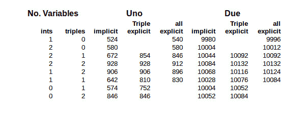

# 代码工艺——嵌入 C++:模板

> 原文：<https://hackaday.com/2015/12/18/code-craft-embedding-c-templates/>

语言 C++很大。毫无疑问。C++大的一个原因是允许解决问题的技术的灵活性。如果你有一个非常小的系统，你可以坚持使用由类封装的程序代码。一个有许多相似但略有不同的实体的项目可能最好通过[继承和多态](http://hackaday.com/2015/11/13/code-craft-embedding-c-timing-virtual-functions/)来解决。

第三种技术是使用*泛型*，它们是使用*模板*在 C++中实现的。模板与 *#define* 宏有一些相似之处，但是[它们要安全得多](http://hackaday.com/2015/10/16/code-craft-when-define-is-considered-harmful/)。编译器在宏插入源代码之前不会看到宏插入的代码。如果代码是坏的，错误消息会非常混乱，因为开发人员看到的只是宏名。第一次看到模板时，编译器会检查模板的基本语法错误，稍后在实例化代码时也会检查一次。这第一步消除了许多混乱，因为错误消息出现在问题的位置。

模板也更加强大。它们实际上是一种图灵完全语言。整个重要的程序都是使用模板编写的。生成的可执行文件所做的就是报告编译器完成的所有计算的结果。不要担心，在本文中我们并不打算这样做。

## 模板基础

您可以使用模板来创建函数和类。这两者的实现方式非常相似，所以让我们从一个模板函数示例开始:

```

template&lt;typename T, int EXP = 2&gt;
T power(const T value, int exp = EXP) {
	T res { value };
	for (; exp &gt; 1; --exp) {
		res *= value;
	}
	return res;
}

```

这是一个将 *值* 提升整数指数、 *exp* 的模板函数。关键字 *模板* 后面是尖括号中的参数。使用后跟名称的 *typename* 或 *class* 或后跟名称的整数数据类型来指定参数。你也可以使用一个函数或者类作为模板参数，但是我们不会讨论这种用法。

在类或函数体中使用参数名，就像使用任何其他类型或值一样。这里我们使用 T 作为函数的输入和返回值的类型名。整数 EXP 用于为指数设置默认值 2，即让幂计算平方。

当编译器实例化模板函数或类时，它会创建与手写版本相同的代码。数据类型和值作为文本替换插入。这将创建一个由参数的实际实参类型化的新版本。每一组不同的参数创建一个新的函数或类型。例如，整数的 *power()* 的实例与浮点的 *power()* 不同。类似地，我们马上会看到，整数的类*三元组*和浮点的类是不同的。每一个都是不同的类型，有不同的代码。

由于 *power()* 是一个模板函数，它将直接用于任何数字数据类型，整数或浮点。但是如果您想将它用于更复杂的类型，比如上一篇文章中的*三元组*类，该怎么办呢？让我们看看。

## 使用模板

下面是将*的三重*声明简化为本文所需的内容:

```

class Triple {
public:
	Triple(const int x, const int y, const int z);
	Triple&amp; operator *=(const Triple&amp; rhs);

	int x() const;
	int y() const;
	int z() const;

private:
	int mX { 0 };	// c++11 member initialization
	int mY { 0 };
	int mZ { 0 };
};

```

我将*加等于*运算符切换为*乘* *等于*运算符，因为它是*幂* *()* 函数所需要的。

下面是如何将*幂* *()* 函数用于整型、浮点型和我们的*三重*数据类型:

```

int p = power(2, 3);
float f = power(4.1, 2);

Triple t(2, 3, 4);
Triple res = power(t, 3);

```

使用用户定义的数据类型(UDT)的唯一要求是，UDT 必须定义一个 *运算符=** *()* 成员函数。

## 模板类

假设你已经在一个项目中使用 Triple 一段时间了。现在一个项目需求需要它作为浮点值。这三个类的代码都已经调试好了，而且比我们在这里看到的要复杂。为 float 创建一个新的类并不是一个令人愉快的想法。也有迹象表明可能需要一个长的或双的版本。

不需要太多的工作，Triple 就可以转换成一个通用版本，作为一个模板类。这其实相当简单。从*模板*声明开始，就像函数 *power* *()* 一样，用 *T* 替换 *int* 的所有声明。还要检查成员函数参数是否按值传递参数。可能需要将它们更改为引用，以便更有效地处理更大的数据类型或 udt。为此，我将构造函数参数改为引用。

下面是作为模板类的 Triple:

```

template&lt;typename T&gt;
class Triple {
public:
	Triple(const T&amp; x, const T&amp; y, const T&amp; z);
	Triple&amp; operator *=(const Triple&amp; rhs);

	T x() const;
	T y() const;
	T z() const;

private:
	T mX { 0 };	// c++11 member initialization
	T mY { 0 };
	T mZ { 0 };
};

```

没多大区别。下面是它的使用方法:

```

Triple&lt;int&gt; ires = power(Triple { 2, 3, 4 }, 3);
Triple fres = power(Triple(1.2F, 2.2, 3.3)); // calc square
Triple dres = power(Triple(1.2, 2.2, 3.3));// calc square
Triple lres = power(Triple(1, 2, 3.3), 2);

```

不幸的是，新的灵活性是以告诉模板用于 Triple 的数据类型为代价的。这是通过将数据类型放在类名后面的括号中来实现的。如果这是一个麻烦，你总是可以使用 *typedef* 或新的*使用*创建一个别名:

```

using TripleInt = Triple;
TripleInt ires = power(Triple { 2, 3, 4 }, 3);

```

创建这样的模板类总体上节省了调试和维护成本。一旦代码开始工作，它就适用于所有相关的数据类型。如果一个 bug 被发现并被修复，它会在所有版本中被修复。

## 模板计时和代码大小

模板生成的代码与同一函数或类的手写版本完全相同。版本之间的变化只是实例化中使用的数据类型。由于代码与手写版本相同，因此计时也将相同。因此，没有必要实际测试时序。唷！

### 模板是内联代码

模板本质上是内联代码。这意味着每次使用模板函数或模板类成员函数时，代码都是内联复制的。每个具有不同数据类型的实例都创建了自己的一组代码，但这并不比您为每个数据类型编写一个类要多。使用模板类可以节省成本，因为如果不使用成员函数，它们就不会被实例化。例如，如果从未使用过*三个*类 getter 函数——*x()、y()、z()*——它们的代码就不会被实例化。它们将用于常规类，尽管智能链接器可能会将它们从可执行文件中删除。

考虑下面使用*幂()*和*三联:*

```

int i1 = power(2, 3);
int i2 = power(3, 3);
Triple t1 = power(Triple(1, 2, 3), 2);

```

这将创建两个内联整数版本的 power，即使两者都是针对同一数据类型实例化的。为三重版本创建另一个实例。因为数据类型总是 int，所以创建了三个类的单个副本。

这里我们依赖于*隐式*实例化。这意味着我们让编译器决定何时何地生成代码。还有*显式*实例化，允许开发人员指定代码在哪里生成。这需要一点努力，并且需要了解模板使用的数据类型。

一般来说，隐式实例化意味着内嵌函数代码，有可能重复代码。这是否重要取决于功能。当调用一个函数而不是内联函数时，会产生调用开销。函数的参数和内务信息一起被推送到堆栈上。当函数返回时，这些操作是相反的。对于一个小函数，调用可能比函数体占用更多的代码。在这种情况下，内联函数是最有效的。

这里使用的 *power()* 函数很有趣，因为该函数的代码和在 Uno 上调用它的代码在大小上是相似的。当然，两者都因数据类型而异，因为大型数据类型需要更多的堆栈操作。在 Arduino Uno 上，用 int 调用 *p* *ower()* 比调用函数需要更多的代码。对于 float，调用稍微大一些。对于 Triple，要调用的代码要大得多。在其他处理器上，调用 *power()* 可能会有所不同。记住 *power()* 是一个非常小的函数。较大的函数，尤其是成员函数*、*通常会超过调用它们的成本。

指定编译器在哪里生成代码是一个*显式*实例化。这将强制一个带有相关开销的离线调用。在源文件中，你告诉编译器你需要哪些专门化。对于测试场景，我们希望它们用于 int 和 Triple:

```

template int power(int, int);
template Triple&lt;int&gt; power(Triple&lt;int&gt;, int);

```

编译器会在源文件中创建这些。然后，与任何其他函数一样，您需要创建一个 *extern* 声明。这告诉编译器不要将它们内联实例化。这些声明和上面的一样，只是增加了*extern*:

```

extern template int power(int, int);
extern template Triple power(Triple, int);

```

### 测试代码大小的场景

我花了一点时间来创建一个测试场景，以演示这两个实例化之间的代码大小差异。问题是来自 *power()* 函数的结果必须在代码的后面使用，否则编译器会优化调用。添加代码以使用该函数会以与实例化类型无关的方式改变整体代码大小。这使得比较难以理解。

我最终决定创建一个类， *Application* ，使用 *power()* 函数初始化数据成员。添加相同或不同类型的数据成员会导致最小的总大小变化，因此总的应用程序代码大小密切地反映了仅由于实例化的类型而导致的变化。

下面是*应用*的声明:

```

struct Application {
public:
	Application(const int value, const int exp);

	static void loop() {
	}

	int i1;
	int i2;
	int i3;
	Triple t1;
	Triple t2;
	Triple t3;
};

```

和构造函数的实现:

```

Application::Application(int value, const int exp) :
		i1 { power(value++, exp) }, //
				i2 { power&lt;int, 3=&quot;&quot;&gt;(value++) }, // calcs cube
				i3 { power(value++, exp) }, //

				t1 { power(Triple(value++, 2, 3)) }, // calcs square
				t2 { power(Triple(value++, 4, 5), exp) }, //
				t3 { power(TripleInt(value++, 2, 3), exp) } //
{
}

```

Arduino 的最小应用程序只有一个空的*设置*和*循环()*函数，在一个 Uno 上占用 450 字节。用于该测试的*循环()*比最小值多一点，但它只创建了一个应用程序实例，并调用其*循环()*成员函数:

```

void loop() {
	rm::Application app(2, 3);
	rm::Application::loop();	// does nothing
}

```

### 代码大小结果

以下是使用不同数量的类成员变量进行隐式和显式实例化的各种组合的结果:



第一列指定了在*应用程序*类中包含了多少变量。Uno 和 Due 下面的列是这些处理器的代码大小。它们显示了隐式实例化的大小， *power()* 对于 *Triple* 类的显式实例化，以及对于 int 和 *Triple* 数据类型的显式实例化。

代码大小取决于许多因素，因此只能提供从隐式模板实例化切换到显式模板实例化时的变化的大致想法。实际结果取决于工具链编译器和链接器。其中一些是使用 Arduino 的 GCC 工具链实现的。

在所有使用一个变量的 Uno 的情况下，代码大小随着显式实例化而增加。在这种情况下，函数的代码加上调用函数的代码，如预期的那样，大于内联函数的代码。

现在看表的 Uno 一边，那里有 2 个整数和 2 个*三元组*，也就是第四行。前两个代码大小保持不变，仍为 928 字节。编译器在没有被明确告知的情况下，通过离线创建 *power()* 来优化两个*三元组()*的代码。在第三列中，当整数版本的 *power()* 被显式实例化时，代码大小有所减少。当只有 2 个*三元组*时，它在下面几行做了同样的事情。通过检查在 ELF 文件上运行 *objdump* 的汇编代码来验证这些。

一般来说，Due 的代码大小不会随着显式实例化而提高。Due 的字长越大，调用函数所需的代码就越少。在这种情况下，需要一个大于 *power()* 的函数才能使显式实例化有效。

正如我提到的，不要对这些代码大小下太多结论。我反复需要使用 *objdump* 来检查 ELF 文件的内容，以验证我的结论。作为一个恰当的例子，看看 Due side，有两个整数和一个*三元组*，两个代码大小为 10092。他们只是巧合。在一个例子中， *power()* 的整数版本是内联的，而在另一个例子中，是显式的非内联的。同样的情况发生在 Uno 下的第一行，这里只有两个整数，没有*三元组*。

您可以找到影响代码大小的其他因素。当涉及三个*三元组*时，编译器从*幂()，*中提取乘法代码，但不是整个函数。这并不是因为 *power()* 是一个模板函数，而是一个普通的优化，即从循环内部提升代码。

## 包裹

模板是 C++令人着迷的一部分，具有极其强大的功能。如上所述，你可以用模板写一个完整的程序，这样编译器就可以真正地进行计算。现实是，你可能不会在每天的编程中创建模板。它们更适合开发库和通用工具。无论是*力量()*还是*三重*都属于或接近于那一类。这就是为什么 C++库包含这么多模板类的原因。创建一个库需要注意常规编码之外的细节。

即使你不写模板，理解模板也是很重要的。我们已经讨论了一些用法和技术的含义，以优化模板的使用，因为它们是语言固有的一部分。由于它们是 C++的重要组成部分，我们将再次讨论它们，以解决它们可以被使用的地方。

# 嵌入 C++项目

在 Hackaday.io，我创建了一个嵌入 C++ [项目](https://hackaday.io/project/8238-embedding-c)的 *[。项目将在项目描述中以目录的形式保留这些文章的列表。每篇文章都将有一个项目日志条目用于额外的讨论。感兴趣的人可以更深入地研究主题，提出问题，并分享更多的发现。](https://hackaday.io/project/8238-embedding-c)*

该项目也将作为我或合作者补充材料的地方。例如，有人可能想要获取代码并报告其他 Arduino 板甚至其他嵌入式系统的结果。停下来看看发生了什么事。