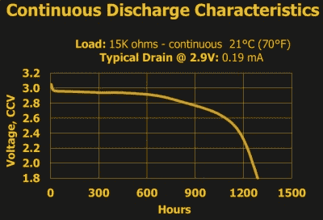
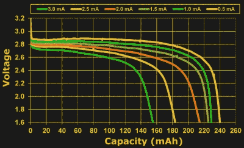
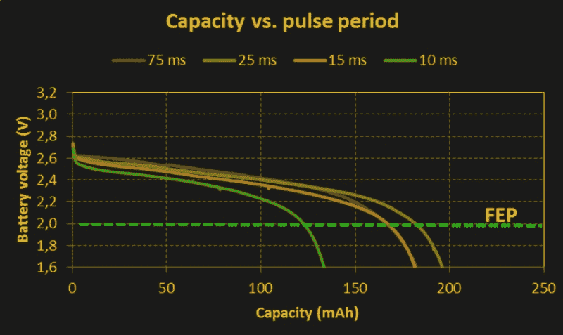

# 硬币电池:神秘的毫安时

> 原文：<https://hackaday.com/2017/12/22/coin-cells-the-mythical-milliamp-hour/>

硬币电池中有多少隐喻能量？事实证明，这个看似简单的问题是不可能回答的——至少在没有大量额外信息的情况下是不可能的。问题是，电池中的总可用能量取决于你如何获取能量，尤其是硬币电池。

Energizer specs its 2032s at 0.2 mA

例如，问任何一家普通的 3 V 锂 2032 电池制造商，他们都会告诉你它有 230 毫安时。这个数字在各个品牌和各个电池中基本上是恒定的，如果你在室温和常压下从电池中取出一个恒定的 0.2 mA，你会得到比预期多一点的 1，150 小时，然后它会下降到 2.0 V 的任意电压阈值以下，正如它在罐头上所说的那样。

如果你想用硬币电池做其他事情呢？经营一个 LED 十年？现在把所有能量都拿出来*并尝试发动一辆车？当我们创建[硬币电池挑战](https://hackaday.com/2017/11/29/coin-cell-challenge-use-coin-cell-win-prizes/)时，我们已经想到了这些极端的滑稽动作，但即使你只是想做一些平凡的事情，如运行低功率无线电传感器节点超过一天，你也需要了解一些硬币电池在现实世界中的行为方式。要做到这一点，你需要超越毫安小时的额定值。让我们看看这个兔子洞有多深。*

 *## 能量和内阻

硬币电池本质上是一个化学物质的金属罐子，一面想要释放电子，另一面想要吸收电子。你可以想象通过计算想要交换位置的电子的数量来测量容量，在他们移动的意愿下降到某个阈值以下之前，用伏特来测量。这将是一个很大的数字，但这就是为什么我们有库仑，一个电荷单位，大约相当于 6.24 x 10 ^(18) 个电子的价值。或者你可以使用安培，一个等于每秒一库仑的电荷流量的测量单位，乘以时间就可以得到总电荷。一安培小时正好是 3600 库仑。

无论物理学家决定哪个定义是主要的，毫安时都是一个不错的方式来考虑硬币电池的电荷量。对于 230 毫安的电池，在半毫安的电流下，你可能会获得 460 小时的工作时间，在 1 毫安的电流下，你也可能会获得接近 230 小时的工作时间。但是在 23 毫安时你能得到 10 个小时吗？1 A 时 0.23 小时？答案是“没有”。很快，毫安小时的额定值就要突破了，原因是内部电阻。

230 mAh at 0.5 mA, but 150 mAh at 3 mA

电池不愿意过快地交易太多的电子，这反映为一种阻力。试图从一个电池中拉出太多的电流，它遵守欧姆定律:。对于恒定的内阻，我们发现随着电流的增加，电压下降。具有非零内阻也意味着电池将在更高的电流下失去容量。它将更快地终止，这不仅是因为更高的电流消耗，还因为克服内部电阻时产生的额外热量:。

因此，如果你慢慢取出电池，你将能够从电池中获取更多的总能量，打破简单的乘法毫安-小时关系。并非巧合的是，制造商倾向于将电池的平均电流定在相当低的水平:从五分之一毫安到半毫安。

但是在我们结束之前，内部阻力的故事还有两个问题。在内部电阻上升之前，电池可以支持电流输出的短脉冲。等效地，它们可以在电压下降到稳态值之前提供短脉冲电流。这意味着，如果在高电流脉冲之间给电池一些时间来恢复，你将从电池中获得更多的总能量。这篇由 Nordic Semiconductor 和 Energizer 撰写的[优秀白皮书(PDF)](https://www.dmcinfo.com/Portals/0/Blog%20Files/High%20pulse%20drain%20impact%20on%20CR2032%20coin%20cell%20battery%20capacity.pdf) ，有一些很棒的实验数据。如果可以的话，让你的电池在两次脉冲之间休息 25 毫秒或更长时间。【T2

最后，内阻也是充电状态的函数，开始时较低，随着电池中可移动电子的耗尽而增加。接近电池的最大额定容量时，随着内部电阻的增加，您可能无法在没有电压下降和潜在损坏您的设备的情况下拉出以前可行的数毫安峰值电流。这进一步缩短了更高电流的使用寿命。

物理和化学的课程到此结束。正如你所看到的，从硬币电池中获得每盎司最大反弹有很多因素；毫安小时额定值来自一个简单的使用模式，可能与您的应用没有任何关系，并且有大量的设计权衡。我们敢打赌，在一些黑暗的角落里还隐藏着更多奇怪的行为。

## 长远来看还是光明的

如果你想最大限度地利用硬币电池，你就要走得低而慢。如果这是不可能的，峰值之间停顿时间较长的峰值电流模式几乎一样好，但你应该考虑电池寿命结束时的限电。无论哪种方式，将额定容量视为仅在额定电流下指定的最大值绝对是值得的。如果你是为了可靠性而设计，你还是会想做一些[最坏情况分析和测试](https://www.embedded.com/electronics-blogs/break-points/4429960/How-much-energy-can-you-really-get-from-a-coin-cell-)，并注意不同的制造商规定不同的额定电流，一定要查看数据手册。当然，对电池容量来说最好的可能并不一定对你的项目来说是最好的，而且要让它工作，效率见鬼去吧。

但这就是我们认为使用硬币电池的乐趣所在。他们提供的资源非常有限，所以每个选择都很重要。使用硬币电池迫使你专注于你的电力预算，而将可充电的锂离子电池组扔进盒子里则不会。我们希望在硬币电池游乐场学到的经验将会更广泛地应用，并且你们都将分享你们的发现。如果您发现任何有趣的事情，请参加挑战或告诉我们。*