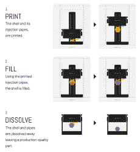

# 对撞机打印空心外壳，填充它们

> 原文：<https://hackaday.com/2016/12/21/collider-prints-hollow-shells-fills-them/>

3D 打印充满了小公司的创新，他们对相同的基本想法稍作调整，但得出了完全不同的结果。位于田纳西州查塔努加的小型初创公司 Collider 正在生产一种 DLP 树脂打印机，这种打印机可以打印空心模具，然后填充这些模具。

 真的就是这么回事。兰花机器使用光固化树脂打印出一个薄壳，并使用这个壳作为各种两部分热固性材料的模具:想想环氧树脂、聚氨酯和硅树脂。零件固化，壳溶解，留下具有您选择的材料属性的实体成型零件。

出于几个原因，这是一个好主意。基于 DLP 的树脂打印机可以拥有非常精细的功能，但当大量表面区域需要固化时，它们就像灰尘一样慢。通过制造薄壁模具，这个阶段可以走得更快。树脂打印机中使用的紫外线固化树脂的类型受到光固化需求的限制，而双组分塑料材料的范围要广得多。最后，树脂打印机非常适合打印单个拓扑简单的对象，模具本质上只是花瓶。

虽然我们确信这种机器在小规模制造中有市场，但这也是一个非常 DIY 的过程。我们个人甚至制作了一些中空的 3D 部件，并用环氧树脂填充以加强它们，但从未采取最后的概念飞跃，将 3D 打印部件视为一次性的一次性模具。我们甚至已经用 3D 打印的模具铸造了巧克力，获得了不同程度的成功。我们也看到了《迷失》中的[伟大作品](http://hackaday.com/2016/07/20/metal-casting-with-single-shelled-pla-masters/)。3D 打印和制模是天生一对。构建一个单一的机器来运行所有的步骤，并处理这些混乱的细节，这是一个好主意。

[via[Engineering.com](http://www.engineering.com/3DPrinting/3DPrintingArticles/ArticleID/13943/New-Fast-Programmable-Tooling-Tech-Rivals-Continuous-DLP-3D-Printing.aspx)，感谢[RandyKC]的提示！