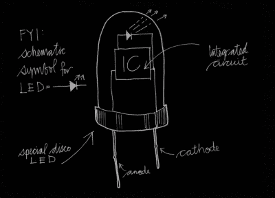
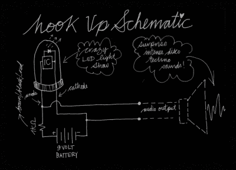

# 变色 LED 制造电子音乐

> 原文：<https://hackaday.com/2016/04/23/color-changing-led-makes-techno-music/>

尽管我们喜欢可寻址 led 的服从性，但为什么我们总是要控制一切呢？至少音乐制造商 Hacklab 的参与者们已经了解到，有时候我们应该坐下来听听我们的电子产品。

随着[人工制品节](http://www.artefact-festival.be/en)的结束，他们仍然有这个从其他拾荒玩具混响麦克风剩余的变色 LED。当由 9 V 电池供电时，LED 将开始一个微小的灯光表演，闪烁，褪色和混合三原色中最好的颜色。然而在听觉上，它大部分时间都是在沉默的尊严中度过的。

你可能知道，这种 LED 包含一个微小的集成电路。这种集成电路以预编程的模式对流经发光结的电流进行脉宽调制，从而产生多彩的灯光效果。

为了让 LED 发出声音，参与者在 LED 的“阳极”上添加了 1kω串联电阻，有效地将流经 LED 的电流变化转化为可测量的电压变化。这个信号可以被输入到一个小扬声器或者调音台。LED 通过唱自己的迪斯科歌曲来表达对改变生活的改造的感激之情。

这种特殊的 IC 似乎工作在约 1.1 kHz 的开关频率，由此产生的方波信号明显在混频中占主导地位。然而，并不是我们在那里听到的所有事情都可以仅仅用 PWM 来解释。有那些有节奏的“砰砰”噪音，声音的音高和振幅的变化，以及更多需要分析和学习的东西。不想破坏你理解哔哔声和裂缝的乐趣(在评论中尽情破坏吧！)，我们只想说，欣赏视频，感谢比利时 STUK 的人们分享他们的发现。

[https://player.vimeo.com/video/162940820](https://player.vimeo.com/video/162940820)