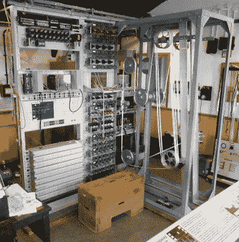
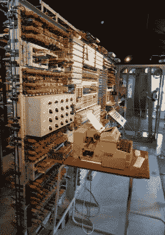
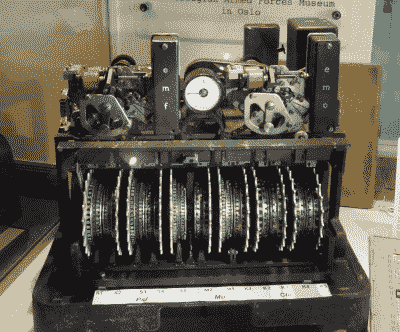

# 巨像:直面第一台电子计算机

> 原文：<https://hackaday.com/2016/08/23/colossus-face-to-face-with-the-first-electronic-computer/>

当一项发明的故事作为年轻一代的公认观点被重复时，它往往被描述为一个单独的一次性事件，由一个有名的发明者来完成。在事件发生之前没有发明，然后它就像变魔术一样出现了。苹果落在艾萨克·牛顿的头上，或者阿基米德溢出他的浴缸，这些故事你都听过。发明者的名字有时会有所不同，这取决于当你听到这个故事时你在哪个国家，这提供了对简单发明故事中的缺陷的洞察。事实是，在很多情况下，一项发明并没有一个灵光乍现的时刻，相反，被命名的发明者是建立在很多前人工作的基础上的，他是一个幸运的工程师或科学家，他的想法先于其他任何人带来了神奇的突破。

计算的历史也不例外，沿着这条道路的许多步骤给了我们今天如此依赖的设备。布莱士·帕斯卡在 17 世纪发明的法国机械计算器、查尔斯·巴贝奇和艾达、洛夫莱斯伯爵夫人在 19 世纪英国的工作、赫尔曼·何乐礼在 19 世纪末发明的美国制表机，或者康拉德·楚泽在战前德国的工作只是其中的一部分。

因此，如果我们要在这个领域寻找一个发明家，我们必须比“谁发明了第一台计算机”更具体一点，因为候选人太多了。如果我们把问题限制在“谁发明了第一台可编程电子数字计算机？”我们有一个更简单的答案，因为我们有足够的证据证明这台机器有问题。因此，公认的答案是“第一台可编程电子数字计算机是巨像，由艾伦·图灵于第二次世界大战期间在布莱奇利公园发明，用于破解纳粹的恩尼格玛密码，并一直保密到 20 世纪 70 年代”。

这是一段充满勇气和胆量的诱人的完美音乐片段，很容易从 20 世纪 50 年代的《鹰》[*漫画*](https://en.wikipedia.org/wiki/Eagle_(British_comics))*中摘取，不是吗。不幸的是，它包含如此重大的谎言，以至于变得毫无用处。巨像就是你要找的电脑，它是在二战中研发出来的，之后保密了很多年，但是其余收到的意见答案都是假的。它不是布莱奇利发明的，它的工作也不是谜一样的工作，最令人惊讶的是艾伦·图灵的直接参与只是外围的。真实的故事要有趣得多。*

 *## 去布莱切利，奇迹发生的地方

General Heinz Guderian overlooking the operation of an Enigma machine during the Battle of France. Bundesarchiv, Bild 101I-769-0229-11A / Borchert, Erich (Eric) / CC-BY-SA 3.0, via [Wikimedia Commons](https://commons.wikimedia.org/wiki/File:Bundesarchiv_Bild_101I-769-0229-11A,_Frankreich,_Guderian,_%22Enigma%22.jpg?uselang=en-gb)

现在，我们将带你去布莱奇利，去现代的布莱奇利公园和占据一角的国家计算机博物馆。这个博物馆有令人着迷的收藏品，其中有两个画廊是我们感兴趣的。第一个是他们的 Tunny 画廊，解释了导致巨像的事件的背景和顺序，第二个是他们的巨像画廊，其中包括他们的 MkII 巨像计算机的全功能复制品。

最著名的纳粹编码系统是“谜”,其类似打字机的便携式机器成为无处不在的密码破译工作的象征。这是德国军事战斗单位的代码，各军种的形式略有不同，照片显示他们在前沿阵地或移动通信单位进行操作。

然而，英格玛并不是盟军使用和截获的唯一德国编码系统，也绝不是布莱奇利公园工作人员使用的唯一系统。博物馆的 Tunny gallery 的第一部分解释了 Lorenz 密码，这种密码用于德国最高统帅部之间更高层次的安全通信，对电传打字机通信进行实时编码。它与英格玛的表面相似之处在于它采用了一个转子系统，但它的转子产生了一个伪随机二进制序列，与二进制电传打字机通信进行异或运算，产生一个加密输出，而不是英格玛的有线接触系统。同样与英格玛不同的是，直到战争即将结束时，密码破译者才从缴获的机器中受益并进行研究，所以他们理解它的唯一方法来自于使用它截获的信息。

## 缩短战争的鱼

The museum’s Tunny machine.

博物馆带领游客通过监听站，了解移频键控电传打字机的流量是如何被记录在纸带上并进行手动转录的，然后将它们传输给布莱奇利公园的密码分析师，以及他们收集系统工作情况的努力。1941 年 8 月，一个幸运的突破出现了。当时，雅典的一名操作员在他的洛伦兹机器上用相同的设置发送了两次同样的 4000 个字符的信息，提供了布莱奇利工作人员最终解码所需的降低的解密几率。利用这两种密文和它们的解码机制，数学家比尔·泰特被赋予了推断机器运行的任务，他在 1942 年初完成了这项任务。由此产生的工作被命名为“Tunny ”,以提供突破的雅典通信线路的代号命名。所有这些链接的代号都来自不同种类的鱼。

在博物馆的 Tunny 画廊的中心是他们重建的 Tunny 机器，这是由伦敦 Dollis Hill 的邮局电话研究设施生产的 Lorenz 密码机的英国机电复制品。它可以用与 Lorenz 的转子设置和解码信息相当的插板来设置，但它仍然需要这些转子设置可用。1943 年中期，人们致力于自动发现这些转子装置，制造出了一台名为“希斯·罗宾逊”的机器，这是以英国漫画家的名字命名的，他画出了执行简单任务的错综复杂的机器。如果你没听说过他，但你知道鲁比·戈德堡，那你就对了。

The rebuilt Heath Robinson machine.

博物馆在他们的 Tunny 旁边重建了一个 Heath Robinson，像原来一样，它用一个滑轮系统将一对长穿孔纸带环拉紧。一个保存密文，而另一个具有一组转子的一系列可能的设置，并且从 Tunny 机器中导出的一组逻辑可以与每个转子设置一起依次被自动馈送密文。由此产生的输出然后被用来产生转子设置的集合，这可以大大缩短密码分析师团队的胜算。

一旦游客已经看到两个机器在运行，导游显示了一段磁带已被损坏的希思罗宾逊的机制，并解释说，机器是缓慢和不可靠的。特别是，两个磁带之间的紧密同步对其操作至关重要，这是他们很容易丢失的东西。然后，他讲述了艾伦·图灵是如何向希斯·罗宾逊团队推荐这位曾与他合作过《谜》的工程师的，这是图灵对《巨像》唯一的直接贡献。

Tommy Flowers 是 Dollis Hill 开关组的负责人，他的想法是如何使用闸流管电子生成 Heath Robinson 的 Tunny 转子设置纸带序列，这将导致机器成为庞然大物。密码文本仍然是从穿孔纸带上读出的，但它被输入到一个可编程的功能中，可以根据闸流管产生的转子设置对其进行电子操作。它还不是我们今天所知的通用存储程序计算机，但如果符合可编程全电子数字计算机的描述。

## 在伟大面前

The front of the museum’s Colossus MkII.

作为第一批周末游客走进博物馆的巨像画廊，我们有幸看到它被赋予了生命。他们的庞然大物是 2007 年完成的 MkII 机器的复制品，它独自站在房间的中央，唯一的入侵者是一套小心放置的安全屏障，使公众远离高压。如果不是在没有平天花板的战时小屋中，有两个平行的长货架将接近天花板的高度，两者都镶嵌着数千个八进制管。在远端是一个纸带阅读机，类似于 Heath Robinson 的纸带阅读机，靠近中间的是插板和开关，通过它们机器被编程，在最靠近你的一端是记录结果的电传打字机。

机器缓慢通电，以减少热冲击并延长其管子的寿命。我们的导游告诉我们，在一个典型的年份里，它只需要一位数的管子更换，考虑到它有多少，这是令人印象深刻的。一旦它开始运行，房间里轻微的早晨寒意被所有这些管状灯丝的显著热量所取代，尽管机器比你想象的更安静，但磁带阅读器会发出呼呼声和循环的咔嗒声。

对一个工程师来说，和你艺术的创新机器站在同一个房间里是一种有趣的体验，即使它是复制品。其他一些参观者似乎是因为它与战争的联系而不是因为它的技术意义，但有趣的是，我们不是唯一明显挥舞着一两个烙铁的人。这是一个反思我们在过去 70 年中取得了多大成就的时刻，是一个默默地赞美建造它的人们的记忆的时刻，也是一个赞美他们的工作对后来的机器的影响的时刻——尽管巨像本身被蒙上了神秘的面纱。

下面是一个绕着机器行走的简短视频，如果你不介意手机视频质量的话，我们希望你能对它的大小和复杂性有个印象。

 [https://www.youtube.com/embed/xR7tNoJHab0?version=3&rel=1&showsearch=0&showinfo=1&iv_load_policy=1&fs=1&hl=en-US&autohide=2&wmode=transparent](https://www.youtube.com/embed/xR7tNoJHab0?version=3&rel=1&showsearch=0&showinfo=1&iv_load_policy=1&fs=1&hl=en-US&autohide=2&wmode=transparent)

The genuine Lorenz machine at Bletchley, on loan from the Norwegian Armed Forces Museum. The codebreakers did not see one of these machines until the end of the war, which is why we have placed this picture at the bottom of our write-up.

国家计算机博物馆收藏了大量迷人的老式和历史计算机，除了这里介绍的战时机器，如果你在布莱奇利附近，非常值得一游。它由一个慈善信托机构经营，依靠其非常低廉的入场费和自愿捐款继续存在。马上把它列入你的行程！*