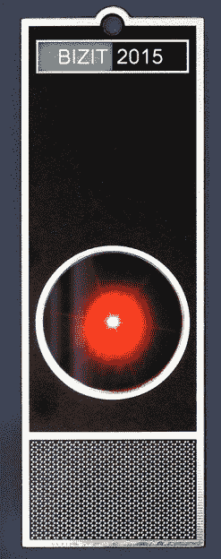
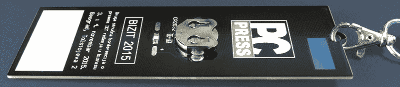

# 会议徽章是硬件艺术的最新形式

> 原文：<https://hackaday.com/2015/10/07/conference-badges-are-the-newest-form-of-hardware-art/>

大约四十年前，许多欧洲卡车司机开始在挡风玻璃上放置电子 LED 徽章。大多数都很简单；只不过是一颗被箭射穿的活生生的心。这在当时的高速公路夜景中成为一种常见的干扰，至少在它成为非法之前是如此。大多数驾车者已经习惯了看到它们，卡车司机用电子设备发表声明的想法一直萦绕在我的脑海中。现在我有机会帮助人们做出类似的声明。会议徽章不仅仅是一种识别注册者的方式，也是一种时尚宣言和会议组织者的骄傲标志。它们已经成为一种艺术形式，工程师们总是想拓展可能的极限。

每年九月，我们都会在塞尔维亚诺维萨德举办 balcon T1 国际黑客大会。我被要求为 2016 年的活动设计一个徽章，这是第一次(嗯，第二次)发布。它基于 PIC18LF24K50，由一圈随机显示预定义模式的 led 组成。每个徽章都有自己的红外收发器(LED 接收器对)，所以当两个或更多的徽章发现对方时，乐趣就开始了:它们在回旋曲上从慢板到全板，失去了默认的沉闷视觉模式，成为更动态、更引人注目的模式，但最重要的是，它们同步。这意味着，在一群人里，所有的徽章会一起打出相同的图案。每个徽章都可以传播模式代码，因此整个群体，无论有多大，都会很快变得同步。但是如果它们中的一个不知何故“迷路”了，它会试图从邻居那里学回来，或者它甚至会发射到自己的随机生成的一个中。有时它会设法把它传播得更远，你会目睹一场争夺灯光秀主导权的战斗。

这不仅仅是一个设计徽章的故事，而是一个设计选择的故事，既符合预算，又能让那些最终佩戴该硬件的人感到高兴。

 [https://www.youtube.com/embed/IFifeMkfip8?version=3&rel=1&showsearch=0&showinfo=1&iv_load_policy=1&fs=1&hl=en-US&autohide=2&wmode=transparent](https://www.youtube.com/embed/IFifeMkfip8?version=3&rel=1&showsearch=0&showinfo=1&iv_load_policy=1&fs=1&hl=en-US&autohide=2&wmode=transparent)

到这段视频拍摄时为止，在 9 月 11 日至 13 日举行的 BalCCon 2K15 上，仅建造了八个原型并进行了预览。接待非常积极！算法很简单:每个徽章都有自己的图案，同时保持其红外眼睛对其他人的代码开放。如果它收到并验证了校验和，它将停止当前模式，通过红外 LED 发送特殊确认码，并开始播放接收到的模式。如果没有收到任何东西，它会随机生成一个新的模式代码，发送它，看看是否有人承认它，然后运行该模式。如果有应答，它将切换到“快速”模式。就是这样。

### 更多功能

微控制器设计的美妙之处在于，你可以随时添加新功能，而不会影响成本。在这种情况下，红外发射器支持是在硬件中实现的，因此徽章通过[米奇·奥特曼的] [TV-B-Gone](https://en.wikipedia.org/wiki/TV-B-Gone) 功能进行了升级。我从 Mitch 的数据库中找到了几百种不同型号电视机的关机代码，并编写了一个 PIC 驱动程序来传输这些代码。

第一个徽章是大约两个月前发布的——就是照片中的红色那个。我决定给它另一个特性，只需要在物料清单上添加一个 USB 连接器。所以，这个徽章现在的功能相当于一个[硬件密码管理器](https://hackaday.io/project/5588-hardware-password-manager)，成本几乎相同。它还提高了徽章的视觉趣味。它看起来像是有目的的东西，而不仅仅是挂在脖子上的表链。

在明年 9 月到来之前，我们有足够的时间来集思广益，开发更多的功能。我肯定会添加的一件事是联系信息交换——一种坚定的会议硬件徽章，如[Parallax’徽章](http://hackaday.com/2015/09/14/the-open-hackable-electronic-conference-badge/)。当然，这个功能不会影响成本，因为红外收发器和 USB 接口都已经存在。我儿子还建议加入某种形式的石头剪刀布游戏。当两个玩家连接时，它会自动播放。

每个徽章都将有其唯一的序列号，该序列号将根据请求进行传输。我们还没有定义如何使用这个功能，以及将建立哪种外部单元，因为我们不想打扰任何人的隐私。

### 低预算作为灵感

我总是开放的，对任何新想法都心怀感激。唯一的限制是成本，因为项目已经达到了预算限制。只有不需要任何新硬件的功能才是可接受的。你可以看到没有显示器，没有大电池，也没有收音机或音响设备。

这种简单的设计具有某些有助于舒适的优点。PCB 上有足够的空间来放置元件，它们之间有一些呼吸空间，为 3 mm 厚的丙烯酸挡板留出粘合空间，PCB 上的每个零件都有激光切割孔。您可以舒适地将徽章拿在手中，放在口袋里，甚至可以让它掉在地板上，而不用担心它会被损坏。此外，所有组件都在上层，使徽章的背面平整干净。所有的电子部件看起来都很吸引人，所以没有必要藏起来。如果有人想玩固件(当然是开放的)，背面只有几个焊盘用于在线编程连接器。

最初，硬件是不可扩展的，但我可能会使用底部 PCB 层，目前是空白的，为 SMD 外设添加走线和足迹。话又说回来，我很好奇有多少用户真的黑掉或者扩充了自己徽章的硬件？

我喜欢用有限的预算设计这样的小玩意。有了很多钱，任何设计师都可能被诱惑去压制系统，用所有能想到的特性来膨胀设计。但是谁知道呢，也许有一天我会改变我的态度，当我们有钱的时候，我会为 BalCCon 3K45 设计一个徽章…或者这样。

### 你怎么能设计一个单位预算为 2€的徽章呢

为另一场会议 [BIZIT 2015](http://bizit.rs/) 设计徽章更具挑战性。它是由我们的计算机杂志出版商 [PC 出版社](http://pcpress.rs/)在 11 月 3 日和 4 日组织的。这不是一个黑客会议，而是一个商业会议，但它是基于信息和通信技术。基于 500 个单位，徽章的预算严格到 2€/单位(约 2.25 美元)。

我不得不挖掘一种更常见的对技术的热爱，因为我不能指望对 DIY 或摆弄微控制器的热情。我转向科幻小说，或者更准确地说，我抄袭了库布里克的《2001:太空漫游》，我想大多数人都看过。我把徽章做成类似于 [HAL 9000 的](https://en.wikipedia.org/wiki/HAL_9000)终端的标志性图像。非常重要的是，它优雅的设计只需要几个部件就可以模仿。

为了不超出预算，我尽可能简化了徽章。幸运的是，几乎所有的物理设计都可以通过现有的 PCB 实现。正面应该是黑色的，所以我订了黑色的 2 层 PCB。HAL 9000 的终端上闪亮的金属表面是由 HAL PCB 模拟的(不要混淆——它不代表 HAL 9000，它是热风整平的缩写)。白色字母(BIZIT 2015 而不是 HAL 9000)被打印为顶部覆盖层，下面的烧烤区域由许多没有孔的小型 PCB 焊盘组成。“HAL”文本最初是在浅蓝色背景上，在这种情况下是去除了铜层和阻焊层的 PCB 基底，因此它是半透明的。当你用蓝色记号笔画背面时，你会得到你需要的准确的蓝色调！

所有这些都是通过 PCB 实现的。还剩下一些必须临时准备的项目，必须做出一些妥协。500 块 5×15 厘米的双层印刷电路板的价格是 1.5€，所以我只剩下 0.5€可以花了。

库布里克最初为 HAL 9000 的眼睛使用了尼克尔鱼眼 8 毫米镜头。目前它需要几千美元，远远超过 0.5€，所以我不得不做出不同的选择。我再次使用激光切割丙烯酸挡板，并将其粘在 PCB 上。就这么简单！它是平的，所以看起来不如原来的尼克尔镜头好，但它符合预算。我还想实现红点周围的红色模糊光环效果，为此我通过一个 15 毫米的孔在一块距离 PCB 约 10 毫米的纸板上喷了一些红色油漆。看起来还挺过得去的。

我必须做对的一件事是让 HAL“活”起来，这意味着把红色 LED 放在中间。我用了一个 3528 外壳的 SMD LED，放在 PCB 上的方孔中间，焊接在底层。它由背面的 CR2032 锂硬币电池供电，并添加了 SMD 电阻来限制电流，使预期的电池寿命达到几周，没有开关。它的作用类似于 [LED 投掷器](https://en.wikipedia.org/wiki/LED_art)。

最后，我只超出预算几个欧分，每个人都很高兴。我没有足够的钱让它说话、下棋或唱雏菊，但我会小心翼翼地不让它独自呆在我的飞船上。

* * *

沃佳·安东尼克是一名自由微控制器工程师。他的第一个基于 Z80 的微处理器项目可以追溯到 1977 年，就在第一个英特尔 4004 出现的几年后。他用笔和纸手工组装固件。1983 年，他发表了自己的原创 DIY 微型计算机项目，名为 [Galaksija](http://en.wikipedia.org/wiki/Galaksija_(computer)) ，由前南斯拉夫大约 8000 名爱好者建造。到目前为止，他已经发表了 50 多个项目，大部分都是基于微控制器的，并且都是在公共领域发布的。