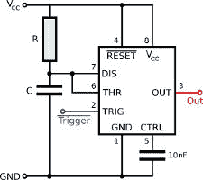

# 辉煌的老鼠和 555 定时器之间的冲突升级

> 原文：<https://hackaday.com/2017/05/08/conflict-escalates-between-brilliant-rat-and-555-timer/>

在凯西·康纳(Casey Connor)用市售活捉器捕捉并安置了家中一些不受欢迎的啮齿动物后，他遇到了一个问题:一只老鼠学会了躲避它们。

在一段史诗般可爱的冲突视频(见下图)中，他记录了所使用的设计，以及老鼠是如何通过识别陷阱或纯粹的敏捷逃脱的。我们只能对双方的决心表示敬意。

所有陷阱机制都基于一个 555 单稳态螺线管触发电路  ，该电路确保向螺线管发送足够持续时间的脉冲以正确触发陷阱。这样，即使是间歇性接触也会触发陷阱，而不仅仅是导致螺线管在没有完全启动的情况下抽动。这与使用 555 定时器对开关进行[去抖的技术相同。](http://learn.digilentinc.com/Documents/324)

Raspberry Pi Zero 使用红外摄像机拍摄有趣的部分来检测运动。这也是一个很好的指标，表明你何时困住了你的猎物——如果你想表现得人道一点，那么把它放在陷阱里几天会适得其反。

随着我们花费时间和精力建造更好的捕鼠器和更复杂的捕鼠器，我们有时会想谁聪明地困住了谁。

 [https://www.youtube.com/embed/XlNHuk59MjM?version=3&rel=1&showsearch=0&showinfo=1&iv_load_policy=1&fs=1&hl=en-US&autohide=2&wmode=transparent](https://www.youtube.com/embed/XlNHuk59MjM?version=3&rel=1&showsearch=0&showinfo=1&iv_load_policy=1&fs=1&hl=en-US&autohide=2&wmode=transparent)

