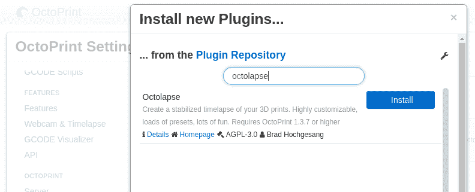
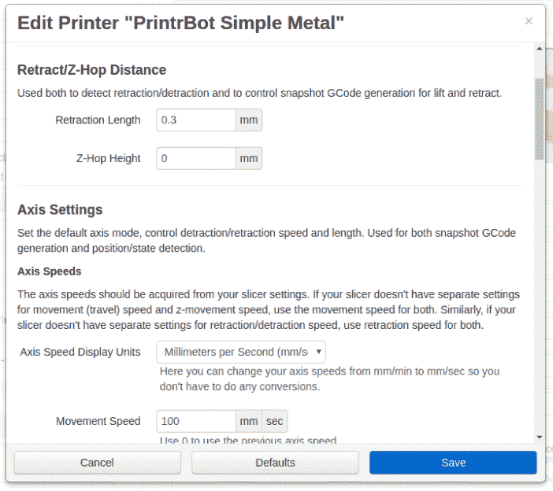
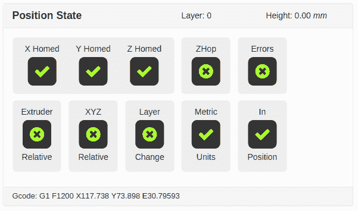
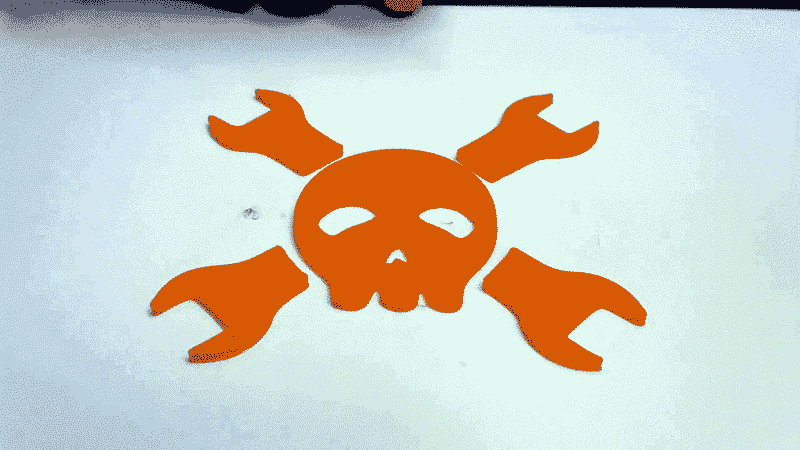

# 观看 3D 打印的最酷方式:灯、照相机、Octolapse！

> 原文：<https://hackaday.com/2018/07/02/coolest-way-to-watch-3d-printing-lights-camera-octolapse/>

Octoprint 是一个家喻户晓的名字，任何人都喜欢 3D 打印，任何人都经常阅读 Hackaday。Octoprint 被创造者 Gina hage 描述为“3D 打印机的时髦网络界面”，它允许你通过本地网络或互联网有效地控制任何桌面 3D 打印机。它甚至有网络摄像头支持，这样您就可以在打印机工作时观看它，这意味着您最终可以将视频婴儿监视器放回小床。

虽然 Octoprint 的核心功能本身就很棒，但它真正的力量是通过插件系统和围绕它涌现的社区释放出来的。通过插件，Octoprint 可以做任何事情，从控制打印机外壳中的 RGB 灯条到通过 Discord 发送状态信息。最近流传的一个特别受欢迎的插件是【前潜行者】的 [Octolapse。这个插件提供了一个全面的*智能*系统，用于创建照片的延时视频。](https://github.com/FormerLurker/Octolapse)

那是什么意思？嗯，Octolapse 不是像传统的那样每隔几秒钟就简单地拍一张照片，而是在打印机运行时跟踪它的运动。然后，它可以在合适的时机拍摄照片，以创建一些用户选择的效果。更重要的是，它甚至可以直接控制打印机；拍照前将照片从照片上移开。其效果是，打印只是简单地从床上“生长”出来。

我认为近距离观察 Octolapse，看看如何制作出一个令人敬畏的延时视频会很有趣。这比我预想的要复杂一些，但是最终的结果是如此的奇妙，我认为这是一项值得掌握的技术。

## 相机选择

除了你的 3D 打印机和运行 Octoprint 的设备(可能是树莓 Pi，但这实际上并不重要)，你还需要一个兼容的相机。请记住，Octolapse 本身不对相机兼容性负责，它只是使用由操作系统配置的相机。如果你在 Octoprint 的“控制”标签中看到一个视频源，那么你应该准备好了。否则，在找出问题所在之前，不要试图让 Octolapse 工作。

使用默认的 Octoprint 延时模式运行打印也是一个很好的测试，以确保你的相机工作正常，你已经将它聚焦在打印上，床足够亮，等等。在你真正深入研究之前，最好使用更简单的集成延时功能将所有这些分类。

就我个人而言，我使用了罗技 C270 相机，这是很好的支持，可以得到大约 25 美元。它只有 1280×720，没有变焦功能(至少可以说，让紧凑的拍摄变得很尴尬)，但它是一个很好的入门相机。如果你想提升到更高的分辨率，请记住，如果你在旧的 Raspberry Pi 模型上进行渲染，最终的视频可能会有点痛苦。

## 安装 Octolapse

使用 Octoprint 中的插件管理器，安装 Octolapse 再简单不过了。只需按名称搜索，点击“安装”，它就可以运行了。你需要完全更新你的 Octoprint 来安装它，但是使用自动更新功能也很容易。

[](https://hackaday.com/wp-content/uploads/2018/06/octolapse_install.png)

安装完成后，您需要从配置文件列表中选择您的打印机。这是让我有点措手不及的地方。我以为 Octolapse 网站上列出的兼容打印机只是他们测试过的打印机，但事实并非如此。这些打印机实际上是它开箱即用的唯一打印机，因为 Octolapse 需要一些关于你的打印机的相当详细的信息，才能安全地接管。

在撰写本文时，Octolapse 支持的打印机如下:

| Octolapse 支持的打印机: |
| 铬-10 |
| Anet A8 |
| 伊拉克黑 |
| 达戈玛涅瓦 |
| Anycube I3 Mega |
| 垄断制造商选择 v2/万豪复印机 i3 |
| 正品 Prusa–Mk2、Mk2S、Mk2 w 多材料、Mk3 |

如果你有一台这样的打印机，你就万事俱备了。如果你不这样做，那么你并没有完全退出游戏，但是你需要做一些手工工作。在一台“不受支持”的打印机上运行 Octolapse 当然是可能的，正如我将要向您展示的那样，但这确实需要您非常了解您的打印机的硬件，并愿意在事情开始失控时拔掉电源线。

## 添加新打印机

[](https://hackaday.com/wp-content/uploads/2018/06/octolapse_newprinter.png) 一般来说，只要你有一台笛卡尔打印机(换句话说，不是 delta)，Octolapse 只要稍加按摩就能工作。您需要为您的特定打印机手动添加一个配置文件，这主要包括从您的切片器配置中复制数据。

它问你的第一件事是关于收缩:有多少灯丝收缩，如果你使用 Z-Hop。Octolapse 使用这些值来确保在拍照时正确地将热端从打印位置移开。如果它没有足够的收缩，或者没有正确匹配需要多少 Z 调整，它会留下字符串到处都是，或者可能完全破坏打印。

您还需要从您的切片器配置中获取不同的速度限制，以便 Octolapse 知道在拍照时移动打印机的速度。除非你有一个非常细长的机器，否则你不太可能把它移动得如此之快以至于成为一个问题，但是在正常打印过程中获得你使用的精确值仍然是明智的。

通读一遍以确保正确，但是缺省值对于其他选项来说应该足够合理。

## 修改 g 代码

设置过程中最耗时、也是最危险的部分是可能需要修改您的启动 GCode。Octolapse 要求打印机处于绝对定位模式，它*可能*已经处于绝对定位模式，但是 Octolapse 希望查看 GCode 文件中的命令以确保万无一失。在我的打印机上，下面的启动代码很容易就启动了，但是请记住，您的代码很可能看起来会有所不同:

```
G21       ; Metric values
G90       ; Printer absolute mode
M82       ; Extruder absolute mode
G28 X0 Y0 ; Home X/Y
G28 Z0    ; Home Z
G92 E0    ; Zero extruded length
G29       ; Start bed leveling

```

为了检查一切是否按预期运行，Octolapse 有一个状态面板，如果有任何异常，它会提醒你。只要您在显示中没有任何问号，您应该可以开始了。有些令人困惑的是，通常看起来像错误的“X”并不表示有问题:

[](https://hackaday.com/wp-content/uploads/2018/06/octolapse_status.png)

## 看起来很酷需要时间

[](https://hackaday.com/wp-content/uploads/2018/06/octolapse_bench_hd.gif) 如果一切配置得当，你会很快注意到启用 Octolapse 的打印是多么的不同。对于每个新图层，它会将 hotend 移动到一个预定的位置(这是可以改变的，但默认为后中心)，等待一秒钟，拍照，然后继续下一层。

如你所料，这个*确实会增加总打印时间。这个小小的舞蹈会给你的印刷增加多少时间取决于许多因素，但假设每层至少增加几秒钟。如果你的印刷品有数百层，那会很快增加。*

例如，如果以 0.2 毫米的层高度打印，则 Hackaday 3D 基准记录为 107 层。以每张快照三秒钟计算，打印时间会增加五分半钟。这意味着该型号的总打印时间增加了大约 25%。

## 最后的想法

这仅仅是一个简单的概述，Octolapse 有大量的设置、选项和模式供你选择。从各种动画模式到视频渲染模式，这里有太多的可配置参数，无法在这样的文章中一一列举。一旦你有了基本的 Octolapse 功能，你就应该真正地投入到设置中并开始实验。

如果你的打印机没有得到官方支持，就需要花点时间来配置它，而且它确实给已经很慢的 3D 打印过程增加了相当多的时间。但看到最终渲染的视频后，就很难再去敲打 Octolapse 了。看着这些像魔法一样形成的印迹是非常令人满意的，你可以找到这方面的很好的例子，比如[看到这些齿轮钳形成](https://youtu.be/bgHoQ_5dT2M?t=2m2s)。我不会一直用它打印，但这绝对不是我最后一次使用它。

我们已经讲述了 Octoprint 的基础知识，讨论了[如何从你的移动设备上控制它](http://hackaday.com/2018/03/05/controlling-octoprint-on-the-go/)，现在我们来看看如何使用它来创建你最喜欢的印刷品的精美动画。Hackaday 的读者还想让我们仔细看看其他 Octoprint 插件或功能吗？请在下面的评论中告诉我们。

