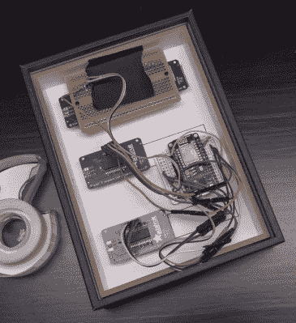

# 借助这款时尚的 ESP8266 显示屏，数一数您的粉丝

> 原文：<https://hackaday.com/2018/02/08/count-your-fans-with-this-stylish-esp8266-display/>

持续的自我肯定是现代生活方式的重要组成部分。你当然知道这个世界爱你，但是他们到底有多爱你呢？每隔几分钟检查一下你的手机，看看你是否有了追随者，这是笨拙的，也许更重要的是，当你有访客时，这不会让你炫耀。在当今时代，这位崭露头角的社交媒体明星需要一种时尚的方式来向全世界展示他们有多受欢迎。

 这是由【贝基·斯特恩】创造的[非常巧妙的社交媒体计数器背后的想法。内置于一个标准的阴影盒框架中，并使用发光二极管显示器通过一张印刷的纸，成品看起来更像现代艺术，而不是通常的黑客票价。](http://www.instructables.com/id/Social-Stats-Tracker-Display-With-ESP8266/)

该计数器由 NodeMCU 驱动，但您可以放入您最喜欢的 ESP8266 变体，事情会或多或少地相同。对于显示器，[Becky]使用了四个 Adafruit 7 段 LED 模块，通过 I2C 可以轻松控制，从而将布线降至最低。

有趣的是，由于她在 Twitter 上的关注者数量已经达到了五位数，所以有两个显示模块被紧挨着用于这项特定的服务。然而，她的 Instructables 和 Instagram 计数器各只有一个显示屏，这使得她在这些服务上的计数限制在 9999 个。如果你把你的内容定位于黑客和创造者人群，在不同的社交网络上，你可能会从相对追随者数量方面学到一些东西，但我们会把分析留给那些更好地处理这些问题的人。

撇开硬件不谈，[Becky]在视频中花了很多时间谈论她想出的代码，这些代码从各种服务中提取统计数据，并以固定的间隔将它们推送到 LED 显示器上。很高兴看到对这样一个项目的软件方面给予了如此多的关注和解释，因为通常情况下，您需要自己去弄清楚源代码在做什么。

这个项目与我们几个月前报道的 YouTube 播放按钮黑客非常相似，但是在一个设备中增加多个社交网络是对基本概念的一个很好的改进。

 [https://www.youtube.com/embed/3Q2JZhgOsG4?version=3&rel=1&showsearch=0&showinfo=1&iv_load_policy=1&fs=1&hl=en-US&autohide=2&wmode=transparent](https://www.youtube.com/embed/3Q2JZhgOsG4?version=3&rel=1&showsearch=0&showinfo=1&iv_load_policy=1&fs=1&hl=en-US&autohide=2&wmode=transparent)

