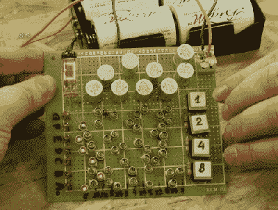

# 不用晶体管计数

> 原文：<https://hackaday.com/2018/04/22/counting-without-transistors/>

Hackaday 奖是关于建立希望的。我们希望看到硬件创造者用微控制器和试验板改变世界。这是一个崇高的目标，但这也不意味着你不能享受乐趣。这正是[Yann]用一堆剩余的苏联元件、一束博奇线和零晶体管所做的事情。他只用继电器和二极管构建了一个十六进制显示模块。这很荒谬，但仍然非常非常酷。

 这个建筑的灵感来自于自制计算。因此，显示总线的状态是一个反复出现的问题。当然，一排发光二极管可以工作，但是你必须数到 f，更好的解决方法是十六进制显示。这个问题的最佳解决方案是使用 num itron——基本上是七段 Nixies——并且全部使用继电器和二极管控制。

该模块接受四位作为输入，并使用二极管的巧妙排列将这四个信号转换为数字 0-F。是的，它是十六进制的，但这只是你在构建自己的计算机时所做的事情。

现在，[Yann] [在一个超薄的原型板上有一个模块](https://hackaday.io/project/26068/log/144831-and-it-works)，它应该很容易堆叠成 8 甚至 16 位宽的总线。对于 16 位版本来说，这是四个电子管和数百个二极管，但好消息是所有这些模块都是相同的，大大简化了自制计算机显示面板的结构。

The [HackadayPrize2018](https://hackaday.io/prize) is Sponsored by:     