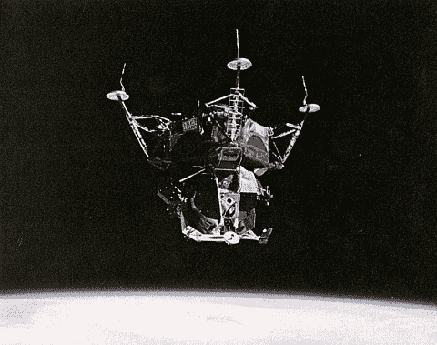
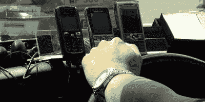

# 盖上你的杯子:设计行业的一课

> 原文：<https://hackaday.com/2016/02/12/cover-your-glass-a-lesson-in-design-trades/>

佩恩和特勒曾经有一个节目是关于“什么是最好的？”工程师知道这不是一个完整的问题。想想一辆车。什么造就了“最好”的汽车？看你为什么要车了。对于一名赛车手来说，速度可能是最重要的因素。一个母亲可能重视安全。一天通勤四小时的人可能喜欢舒适的车。青少年想要买得起的东西。

但是，如果你仔细想想，事情要比这复杂得多。例如，几乎每个人都想要一辆安全的汽车。可靠性也非常重要。所以现实是，大多数人想要一辆拥有多重属性的车。更糟糕的是，他们有时会发生冲突；让一个更好会让其他一些更差。妈妈想要一辆安全的车，但不是那种要花半天时间才能开到街角市场的车。她也不想为一辆安全的汽车支付 50 万美元。

## 去月球

您的系统越复杂，您需要处理的考虑事项就越多，它们之间的相互影响也就越大。艰难的设计交易是工程中最具创造性的时刻的驱动力。例如，考虑将宇航员从月球轨道运送到月球表面的月球游览舱(LEM)。从来没有任何东西像它一样，格鲁曼公司的工程师们面临许多挑战，让它进入工作状态。

 左边的模型是 1963 年人们认为登月舱可能的样子。你可能会注意到四个相对较大的窗口。早期艺术家的再现甚至有更多的玻璃，看起来几乎像一架直升机的驾驶舱，无畏的宇航员坐在高科技仪表板前。最初的概念车有大约 24 平方英尺的玻璃。

这张图至少有两个问题。首先，穿着太空服的宇航员需要很大的空间来坐下。座椅也很重，航天器上的每克质量都要耗费 100 克燃料才能到达月球。另一个问题是玻璃。为了保持气压并提供足够的结构，你需要非常厚的玻璃。玻璃出奇的重。除此之外，玻璃还能吸收大量的太阳辐射。

因此，工程师们不断缩小窗户，但这需要座位更靠近窗户，并以不同的方式倾斜，以便宇航员可以看到外面。但是如果座位离这些小窗户太近，穿着笨重的 1960 年代太空服就很难挤进去。

这里有相当多的设计行业。宇航员必须设法着陆。记住，视频技术不是今天的样子，电子可靠性也不是。因此，虽然今天你可能不装窗户，而是依靠一些多余的摄像头，但这在当时并不是一个合理的选择。其他一些交易包括重量、保持加压环境、防止宇航员在飞行器内弹跳以及控制辐射暴露。

 随着设计的窗户变得越来越小(最后，它们的玻璃面积从 24 平方英尺减少到了 3 平方英尺)，有人意识到，在接近零重力的情况下，也许宇航员根本不需要坐着。如果他们站起来，他们几乎可以把鼻子贴在玻璃上，获得极佳的视野。这需要一点工作来确保他们在着陆期间安全站立，但这一切都解决了，最后的登月舱(见右)使用了小窗户和站立的宇航员。

最终结果是重量减轻了 90 磅，着陆视野比当时大多数直升机都要宽。顺便说一句，很难从这些照片中得到比例，但是如果你亲眼看到一个登月舱，你可能会发现它比你想象的要大。幽闭恐怖症 CM(指令舱)对三名宇航员来说要小得多，但是它有不同的设计行业。

## 做交易

事实证明，即使这不是一个工程问题，也很难在几十个不同因素的影响下做出决定。这就是商学院教授运筹学和多标准决策的原因。有几种方法试图将主观的直觉方法转化为理性的数学方法。

我总是怀疑这些过程，因为它们首先都依赖于人类赋值。如果你没有注意，这些方法让决策过程看起来像是纯科学的。但正如一句古老的计算机谚语所说:垃圾进，垃圾出。您猜测算法的输入值意味着输出也是猜测的。

不管怎样，如果你记住这一点，并努力做到公平，这些方法中的一些可能是组织你的思维的有用方法。请记住，您通常可以通过这些工具游戏数字来获得您想要的任何答案。让我们兜一圈。

 假设你想买一部手机。有很多选择，所以你写下做出决定的标准。比如(排名不分先后):价格、重量、续航、屏幕尺寸、网络类型、前置摄像头、后置摄像头、存储。当然，前提是你会买一部手机，不像右边的出租车司机，他显然拿不定主意。

当然，你的清单可能会有所不同。这里的一个困难是确保这些项目实际上是可比较的。例如，CPU 速度不在我的列表中。具有两个运行在 1 GHz 的品牌 X 核心的电话可能比具有四个运行在 900 MHz 的品牌 Y 核心的电话慢(反之亦然)。因此，选择内核或时钟速度可能没有太大意义，除非所有的选择都有相同类型的 CPU。

## 处理列表

一旦你有了清单，你需要给每一个分配权重。有些标准非常重要，必须满足它们，否则候选人就会出局。这些是选通标准。例如，我可能需要一部支持 GSM 卡的手机，因此任何支持 CDMA 网络类型的手机都不适用，不管它们有什么其他积极的特性。

有些门更有条件。有预算并不罕见。因此，价格超过 400 美元的手机可能会被淘汰。另一个标准获得权重。您可以用不同的方法来实现这一点，但最常用的方法是设置权重，使它们的总和为 1。下面是我的表第一次通过时的样子:

| **标准** | **重量** | **哈卡风** | **Makeaphone** | **橙色手机** | **注释** |
| 价格 | Zero point one five | – | – | – | 必须低于 500 美元；越少越好 |
| 重量 | Zero point one | – | – | – | 越轻越好 |
| 电池 | Zero point two five | – | – | – | 测试运行时间的比率 |
| 屏幕 | Zero point two | – | – | – | 越大越好 |
| 网络 | 不适用的 | – | – | – | 一定是 GSM |
| 前凸轮 | Zero point one | – | – | – | MP 越多越好 |
| 后凸轮 | Zero point one | – | – | – | MP 越多越好 |
| 储存；储备 | Zero point one | – | – | – | 越多越好 |

重要的是要认识到，每部手机的评级(破折号在上表中)并不是实际值。它们是一个相对等级(通常在 1 到 10 的范围内)。所以 400 美元的手机价格不是 400 美元。这取决于价格相对于其他选择有多好。因此，如果 Hackaphone 是 400 美元，其他两部手机是 495 美元，你可能会给 Hackaphone 打 9 分(因为你希望它更便宜)，给其他手机打 5 分。另一方面，如果另外两部手机是 200 美元，那么 Hackaphone 可能会得到 2 美元。

你可以试着用数学方法来计算，确定剩余预算的百分比，然后调整它，这样最低分数就是 1。例如:

> Int(10*(1-价格/预算))+1 或 Int(10*(1-400/500))+1 = 3

这将使 495 美元的手机评级为 1。您也可以计算预算的百分比，并分配一个负权重。然而，用数学方法将事物分成数字等级并不总是可能的。例如，供应商的可靠性必须是一个主观的数字。

在网格中填入分数后，将每个条目乘以行权重，然后将各列相加。最高分获胜。请记住，虽然这有点主观，78 分和 79 分可能是平局，即使技术上 79 分是赢家。

## 玩弄系统

你或许可以看到如何操纵这个系统。如果你想确保得到一部 iPhone，你可以把 FaceTime 作为一个门槛标准。当然，也许真的有必要，但 Skype 或 Google Hangouts 也可能满足你的需求。相反，如果我强制要求 iPhone 必须有一个微型 USB 充电端口，我就可以排除它。

即使没有门控标准，也很容易对分数进行加权，以支持我们的直觉选择，即使是潜意识的。如果我知道我最喜欢的手机有一个高分辨率的后置摄像头，并且我非常重视它，它会增加我最喜欢的摄像头获胜的几率。除非你的主要任务是拍出好照片，否则这可能会导致不好的结果。再说一遍，垃圾进，垃圾出。

尽管如此，如果你需要在一堆晶体管、一系列运算放大器或一系列无线电路板之间做出选择，经历上述过程至少会组织你的想法，并迫使你考虑什么是最重要的。只是不要陷入自以为是的陷阱。

## 回到月球

 美国在 20 世纪 60 年代的太空计划简直令人惊叹。美国直到 1958 年才发射了一颗卫星。艾伦·谢泼德在 1961 年做了一次亚轨道飞行，约翰·格里恩在 1962 年做了几次轨道飞行。到 1969 年，两个人在月球表面行走。在大约十年的时间里，这是一项巨大的工程。他们做的很多事情，我们今天可能会认为是黑客。

我多年来一直听说关于登月舱设计的故事，但我在格鲁曼公司的罗伯特·斯迈思发表的一篇论文中找到了最好的参考。你可以从阅读关于十年内从一无所有到月球漫步的经历中学到很多东西。你可以在[大卫·明德尔的] [*数字阿波罗*书](http://web.mit.edu/digitalapollo/)中找到更多，这是一本很棒的读物。即使你不想读这本书，【明德尔的】[来源也是有趣的阅读](http://web.mit.edu/digitalapollo/additional.html)。另一个很好的来源是美国宇航局的历史页面。

你对 LEM 这样的案例读得越多，就越能明显看出工程既是一门科学也是一门艺术。结构化方法可以帮助你思考问题。但有时获得最佳设计需要创造性的飞跃，这是你无法用一张数字表或一个数学方程式来概括的。你可以使用工具来确保你覆盖了所有的基础或者帮助定义问题。你可能需要数学或测试来证明这个疯狂的设计想法(就像登月舱工程师测试站立位置的安全性一样)。但是疯狂的——通常也是最好的——想法不会从过程中消失。它们来自创造性的灵感。

韦斯利·弗莱尔的手机出租车照片